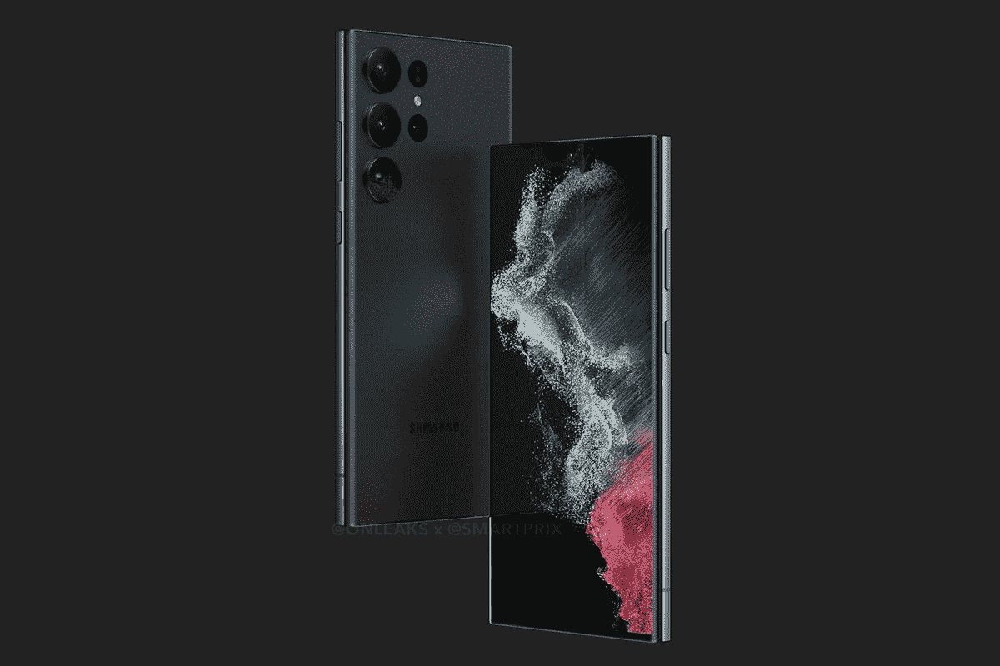

# 三星 Galaxy S23 系列可能会在二月的第一周上市

> 原文：<https://www.xda-developers.com/samsung-galaxy-s23-series-launch-date-rumor/>

# 三星可能会在 2 月的第一周推出 Galaxy S23 系列

新的旗舰系列最早可能于 2 月 17 日上市。

 <picture></picture> 

Samsung Galaxy S23 Ultra leaked render.

与苹果和谷歌不同，三星通常会在年初推出最新的 Galaxy S 系列旗舰产品。该公司在今年 2 月的第二周发布了 Galaxy S22 系列，而 Galaxy S21 系列将于 2021 年 1 月底上市。我们预计三星将为即将到来的 Galaxy S23 系列遵循类似的发布时间表，一份新的报告称，这些设备可能会在明年 2 月的第一周到来。

一位熟悉三星计划的消息人士告诉韩国出版物 *Chosun* 该公司将于 2023 年 2 月的第一周在旧金山的发布会上宣布 Galaxy S23 系列。由于三星旗舰产品将在官方宣布后两周左右上市，Galaxy S23 系列最早可能于 2 月 17 日上市。

尽管三星尚未就其即将推出的旗舰产品阵容做出任何官方宣布，但最近的泄露表明，它将包括三款设备——香草 Galaxy S23、Galaxy S23 Plus 和 Galaxy S23 Ultra。过去几周发现的泄露的设备渲染图显示了一种熟悉的设计，Galaxy S23 和 Galaxy S23 Plus 采用了与 Galaxy S22 Ultra 相同的相机模块设计。据报道，顶级 Galaxy S23 Ultra 将会有更多微小的设计变化，比如略大的摄像头，更高的金属框架和更低的侧面曲率。

就硬件而言，Galaxy S23 阵容中的三款机型都应该采用高通即将推出的骁龙 8 Gen 2 SoC。虽然我们可能不会在 Galaxy S23 和 Galaxy S23 Plus 上看到任何其他重大改进，但据报道，Galaxy S23 Ultra 将配备升级的 200MP 主摄像头。

*你期待三星下一个旗舰阵容吗？您希望在设备上看到哪些改进？请在下面的评论区告诉我们。*

* * *

**来源:** [朝鲜](https://www.chosun.com/economy/tech_it/2022/11/04/446CQVXPERHRVFMNPXZ6Y25IDE/)

**Via:** [Sammobile](https://www.sammobile.com/news/galaxy-s23-launch-first-week-february-2023/)