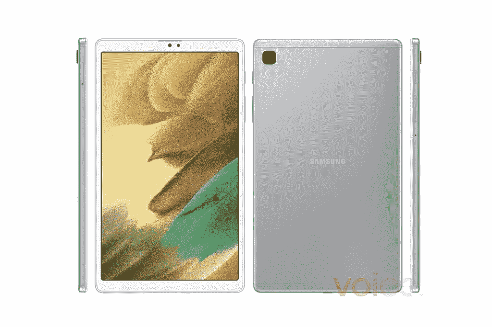

# 三星 Galaxy Tab A7 Lite 在新的非官方媒体渲染中泄漏

> 原文：<https://www.xda-developers.com/samsung-galaxy-tab-a7-lite-leaked-renders/>

# 三星的 Galaxy Tab A7 Lite 在上市前再次泄露

即将到来的三星 Galaxy Tab A7 Lite 通过非官方媒体渲染再次泄露，这些渲染已经由 Evan Blass 分享。

预计三星将很快推出一款新的平价平板电脑，名为 Galaxy Tab A7 Lite。顾名思义，它应该是去年推出的 Galaxy Tab A7 的低调版本。知名消息人士 Evan Blass 分享了更多即将推出的设备的渲染图以及一些规格。

这并不是我们第一次报道 Galaxy Tab A7 Lite。之前在二月份的一次泄露暗示这款平板电脑将在六月份与 Galaxy Tab S7 Lite 一起发布。事实上，这款平板电脑的支持页面已经出现在三星针对各个欧洲市场的网站上。根据 Blass 分享的新渲染图[，我们可以看到新的 Galaxy Tab A7 Lite 看起来与最初的](https://www.voice.com/post/@evan/heres-samsungs-galaxy-tab-a7-lite-in-silver-1618572622-288903144) [Galaxy Tab A7](https://www.xda-developers.com/samsung-unveils-galaxy-a42-5g-galaxy-tab-a7-galaxy-fit-2-wireless-charger-trio-life-unstoppable-virtual-experience-event/) 相当相似，背面采用金属抛光，显示屏周围有厚厚的边框。我们还可以看到后面有一个方形摄像头(但没有 LED 闪光灯)，前面有一个摄像头，值得注意的是，没有指纹扫描仪的迹象。这意味着它将通过 PIN 或模式锁提供安全性，并可能面临解锁。

 <picture></picture> 

Image: Evan Blass

Blass 声称，Galaxy Tab A7 Lite 将采用 8.4 英寸的液晶面板，分辨率为 FHD+ (2400 x 1080 像素)。为该设备提供动力的将是联发科 Helio P22T SoC，其中包括一个八核 CPU 和一个 IMG PowerVR GE8320 GPU。它可能只有 3GB 的内存，5100 毫安时的电池，开箱即可在 Android 11 上运行。

三星 Galaxy Tab A7 Lite 预计将与 Galaxy Tab S7 Lite 一起推出，后者是三星当前旗舰平板电脑 Galaxy Tab S7 的更实惠版本。[传言称](https://www.xda-developers.com/samsung-new-laptops-and-tablet-leaked-galaxy-unpacked/)这款平板电脑将配备 12.4 英寸液晶显示屏，5G 连接，支持 S-Pen，以及两个由 AKG 调谐的立体声扬声器。