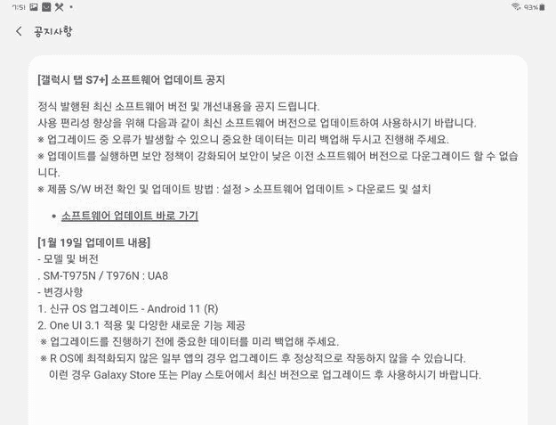

# 三星向 Galaxy Tab S7 推出了带有一个 UI 3.1 的 Android 11 更新

> 原文：<https://www.xda-developers.com/samsung-galaxy-tab-s7-android-11-one-ui-3-1/>

回到 2020 年 8 月，三星[推出](https://www.xda-developers.com/samsung-galaxy-tab-s7/)Galaxy Tab S7([我们的回顾](https://www.xda-developers.com/samsung-galaxy-tab-s7-review/))。凭借高通骁龙 865 Plus SoC、流畅的 120Hz 显示屏和高达 8GB 的 RAM，Galaxy Tab S7 系列过去是、现在仍然是韩国 OEM 厂商最强大的 Android 平板电脑产品。Galaxy Tab S7 系列在 Android 10 之上推出了三星的 One UI 2.5 皮肤，但现在，Android 11 的更新正在推出。令人惊讶的是，更新还带来了最新的 UI 3.1 软件，具有过多的新功能。

**[三星 Galaxy Tab S7 / S7 Plus XDA 论坛](https://forum.xda-developers.com/c/samsung-galaxy-tab-s7-s7-plus.11247/)**

据 *SamMobile* 报道[，韩国 Galaxy Tab S7 LTE ( **SM-T875** )、S7 Plus LTE ( **SM-T975N** )和 S7 Plus 5G ( **SM-T976N** )设备的更新正在推出。新版本的软件版本是 **TxxxNKOU1BUA8** ，它配备了](https://www.sammobile.com/news/galaxy-tab-s7-receiving-one-ui-3-1-update-android-11/)[2021 年 1 月 Android 安全补丁级别](https://www.xda-developers.com/january-2021-android-security-patches-update-google-pixel-samsung-galaxy/)。

 <picture></picture> 

Thanks to Samsung Korea Community Member [Paul](https://r1.community.samsung.com/t5/user/viewprofilepage/user-id/40898) for the screenshot!

三星第一个基于 Android 11 的软件版本是 [One UI 3.0](https://www.xda-developers.com/one-ui-3-0-beta-galaxy-s20-samsung-android-11-update/) ，但正如你所见，它已经被 Galaxy Tab S7 跳过，取而代之的是 One UI 3.1。小版本仍然基于 Android 11，就像[为许多其他 Galaxy 设备](https://www.xda-developers.com/tag/samsung-one-ui-3-0/)推出的一个 UI 3.0 更新一样，但它包括了三星做出的一些最新变化，因为它是新推出的 [Galaxy S21 系列](https://www.xda-developers.com/samsung-galaxy-s21/)随附的最新版本的软件。

前述更新的完整变更日志可在[这里](https://doc.samsungmobile.com/SM-T976N/KOO/doc.html)(韩语)获得，它突出了刷新的 UI 设计、股票应用程序改进、内存分配增强等。这次更新还[带来了](https://meeco.kr/mini/30917227)三星在发布会上宣布的承诺的第二屏幕功能。此功能可让您将平板电脑用作 Windows PC 的辅助显示器。

如果你有 Galaxy Tab S7 的韩国版本，但还没有收到更新通知，你可以前往设置应用程序的软件更新部分，检查 OTA 提示是否适用于你的设备。考虑到最近的趋势，三星可能会在未来几周内在其他地区发布更新。