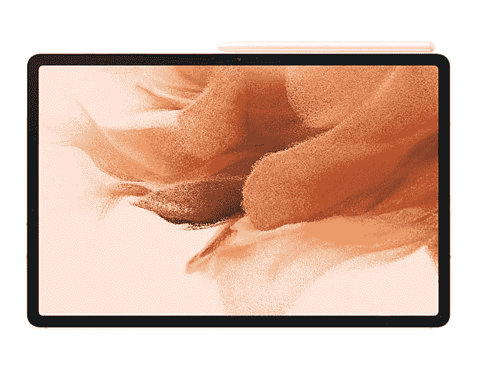

# 三星在印度推出 Galaxy Tab S7 FE 和 Galaxy Tab A7 Lite

> 原文：<https://www.xda-developers.com/samsung-galaxy-tab-s7-fe-galaxy-tab-a7-lite-india-launch/>

三星刚刚为印度市场推出了两款新平板电脑:Galaxy Tab S7 FE 和 Galaxy Tab A7 Lite。这两款搭载安卓系统的平板电脑[于 5 月份在欧洲市场](https://www.xda-developers.com/galaxy-tab-s7-fe-quietly-launched/)亮相，现在韩国正将它们带到印度。Galaxy Tab S7 FE 是价格更高的 Galaxy Tab S7 的平价变体。与此同时，Galaxy Tab A7 Lite 是一款硬件适中的入门级平板电脑。

## Galaxy Tab S7 FE

首先，Galaxy Tab S7 FE 配备了一个巨大的 12.4 英寸 TFT 显示屏，屏幕分辨率为 2560 x 1600。这款平板电脑采用骁龙 750G SoC，配有 4GB 或 6GB 内存和 64GB/128GB 可扩展内部存储。您还可以获得 800 万像素的后置摄像头和 500 万像素的前置摄像头，以满足基本的照片拍摄和视频通话需求。该平板电脑还支持手写笔输入——事实上，S-Pen 就包含在盒子里。

一块 10，090 毫安时的电池保证了演出的进行。支持快速充电，但你需要单独购买 45W 或 25W 的充电器。在其他地方，Galaxy Tablet S7 FE 具有 LTE 连接、由 AKG 调谐的双立体声扬声器、USB Type C 端口、蓝牙 5、Wi-FI 5 和内置 GPS。该平板电脑开箱运行 Android 11。

## Galaxy Tab A7 Lite

另一方面，Galaxy Tab A7 Lite 是一款入门级产品，具有入门级规格。它提供了 8.7 英寸的 TFT 面板，1340 x 800 的屏幕分辨率，联发科 Helio P22T SoC，3GB RAM，32GB 存储，5,100mAh 电池，支持 15W 充电。这款平板电脑的其他亮点包括双立体声扬声器、USB Type C 端口、3.5 毫米音频插孔、内置 GPS 和可选的 LTE 支持。

### 定价和可用性

三星 Galaxy Tab S7 FE 有四种颜色:黑色、银色、绿色和粉色。基本 4GB/64GB 型号在₹46,999 定价，6GB/128GB 型号在₹50,999 定价。另一方面，Galaxy Tab A7 Lite 的纯 Wi-Fi 版本[从₹11,999](https://shop-links.co/1743765112427186742?u1=f4fad9aa-9483-44f8-a7cd-c5d915ad0da3)开始，LTE 版本将推广到₹14,999.这两款平板电脑将于 6 月 24 日在 Samsung.com、三星专卖店以及主要的线下和在线零售商处开始在 T2 销售。

 <picture></picture> 

Samsung Galaxy Tab S7 FE

##### 三星 Galaxy Tab S7 FE

三星 Tab S7 FE 有一个巨大的 12.4 英寸屏幕，骁龙 750G SoC，6GB RAM，盒子里有 S-Pen。