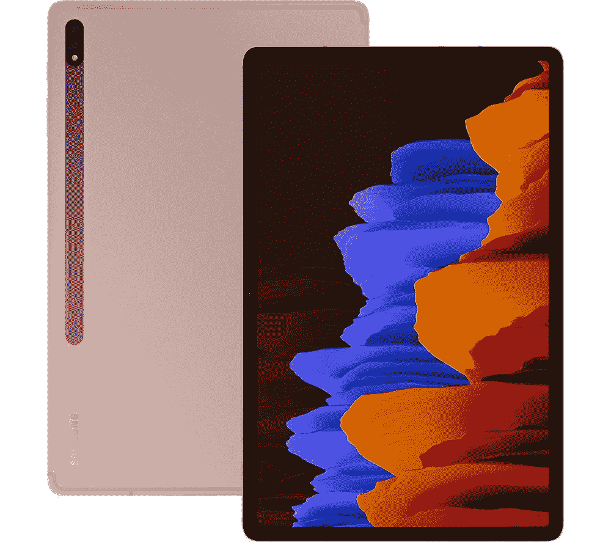
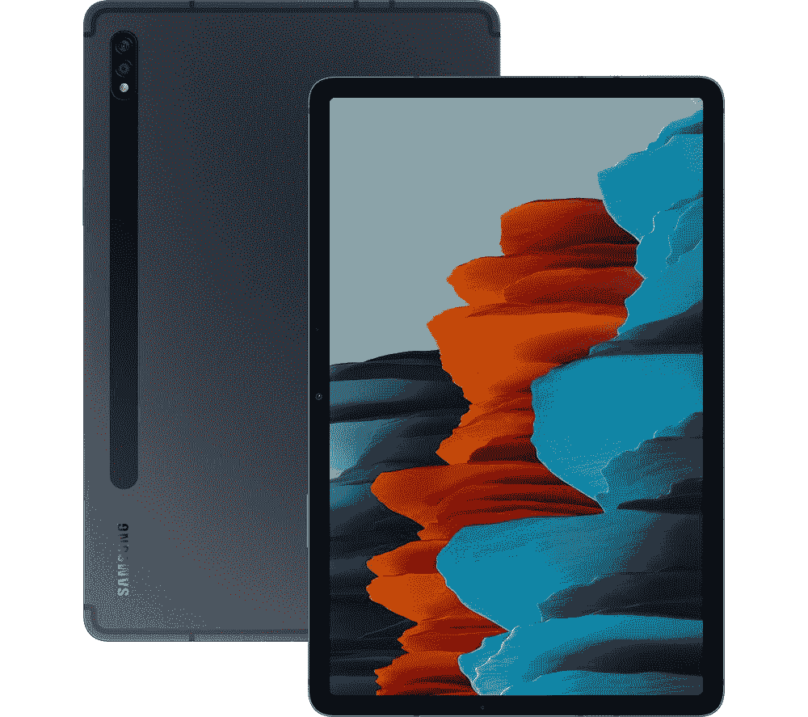

# 获得三星 Galaxy Tab S7 Plus 150 美元的额外奖励！

> 原文：<https://www.xda-developers.com/samsung-galaxy-tab-s7-plus-best-buy/>

我喜欢平板电脑的想法，但我从来没有真正使用过。它们很酷，但我发现它们通常不够强大，无法完成我躺在沙发上想做的事情，所以我倾向于购买笔记本电脑。但是，事实证明我只是拿错了平板电脑，因为在大多数情况下，高端平板电脑可以很容易地取代笔记本电脑。当然，像[三星 Galaxy Tab S7 Plus](https://www.xda-developers.com/best-galaxy-tab-s7-plus-deals/) 这样的高端平板电脑在大多数时候也非常昂贵。

但这不是那种时候！百思买目前以 150 美元的价格出售 256GB 型号的 Tab S7 Plus，使其价格降至 780 美元。这听起来可能仍然很贵，但如果你看看非 Chromebook 笔记本电脑的价格，你就会知道这个价格与一台像样的笔记本电脑相当。但是，Galaxy Tab S7 Plus 拥有比普通笔记本电脑更多的功能，它配有触摸屏和 S Pen。256GB 的内存应该也适用于这款平板电脑所需的大多数应用程序。

这也不仅仅是一个统一的折扣。如果您从百思买购买 Galaxy Tab S7 Plus，您将获得一张价值 50 美元的百思买礼品卡，以及免费的杀毒软件！我知道百思买礼品卡下周肯定会派上用场。

 <picture></picture> 

Samsung Galaxy Tab S7 Plus (256GB)

##### 三星 Galaxy Tab S7 Plus

三星 Galaxy Tab S7 Plus 拥有漂亮的显示屏、令人惊叹的 S Pen 和 256GB 的空间，绝对不会出错。以 150 美元的价格购买，并获得 50 美元的 Best Buy 礼品卡！

不过，我明白 780 美元对一台平板电脑来说是不是有点太贵了。如果你真的不需要像 Galaxy Tab S7 Plus 那样强大的东西，但仍然想要平板电脑系列中更高端的东西，那么普通的 Galaxy Tab S7 也要便宜 150 美元，也就是说只要 580 美元。你仍然可以用 S Pen 和 50 美元的礼品卡得到一个功能强大的平板电脑，但比 Tab S7 Plus 少 200 美元肯定更容易接受。

 <picture></picture> 

Samsung Galaxy Tab S7

##### 三星 Galaxy Tab S7

三星 Galaxy Tab S7 拥有漂亮的显示屏、令人惊叹的 S Pen 和 256GB 的空间，绝对不会出错。以 150 美元的价格购买，并获得 50 美元的 Best Buy 礼品卡！

这笔交易只是百思买早期黑色星期五交易之一。如果你正在寻找更多的优惠，在他们的网站查看所有的优惠！