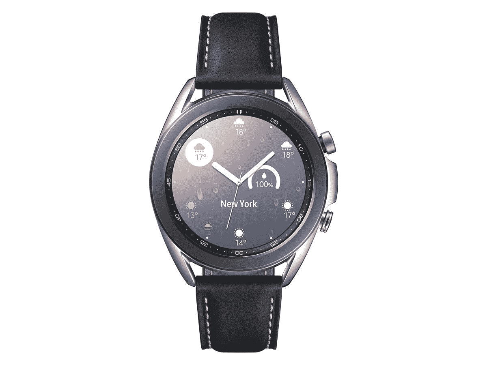
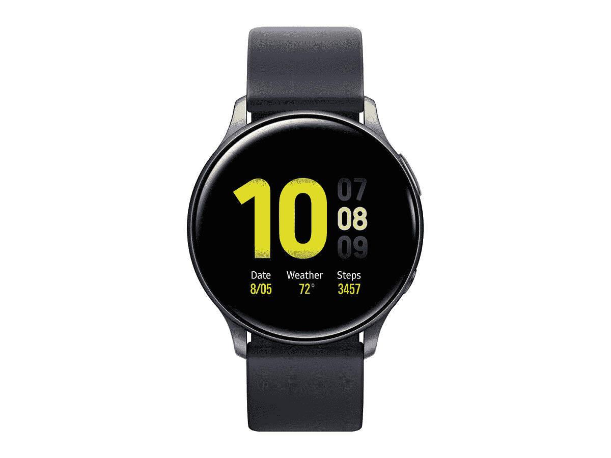

# 三星 Galaxy Watch 3 和 Watch Active 2 目前处于最低价格

> 原文：<https://www.xda-developers.com/samsung-galaxy-watch-3-watch-active-2-deal/>

至少可以说，在 2020 年尝试坚持健身是一个挑战。即使你是那种喜欢在户外活动中锻炼的人，你也比平时更难在任何事情上保持动力。智能手表对此有很大帮助，因为不断提醒你一天的运动和进展可以推动你从办公桌或沙发上站起来散步。

不过，三星已经覆盖了你！现在，你可以在 [Galaxy Watch 3](https://shop-links.co/1722382422423500297) 和 [Galaxy Watch Active 2](https://shop-links.co/1722382423415828635) 上省下一大笔钱，让自己有动力再次前进。正常情况下 400 美元的手表 3 可以低至 140 美元起售，手表 Active 2 可以低至 30 美元起售。只要 30 美元！这是一笔令人难以置信的交易，甚至击败了三星的小预算智能手表 Galaxy Fit 2。

有什么问题吗？你需要以旧设备折价才能获得全额折扣。不过，以旧换新的折扣相当大，给了老款三星和苹果手表大量的退款。如果你要升级，你还需要旧型号做什么？

如果你没有智能手表或其他设备进行交易，不要担心，因为这些仍然在打折。Galaxy Watch 3 售价 340 美元，比建议零售价低 60 美元，Galaxy Watch Active 2 售价 180 美元，是建议零售价的 70 美元。

至此，只剩下一个问题——买哪只手表？Galaxy Watch 3 绝对是这里的优质选择，它有一个大的表盘，但整体上仍然比大多数智能手表更薄。你的手腕上没有大块的技术！Galaxy Watch 3 还可以跟踪你的心跳和血氧水平，以及一系列其他事情。另一方面，Galaxy Watch Active 2 更适合健身，具有先进的传感器和[语音指导](https://www.xda-developers.com/samsung-galaxy-watch-active2-voice/)来提供个性化的反馈。当然，这是两种手表中较便宜的一种。

 <picture></picture> 

Samsung Galaxy Watch 3

##### 三星 Galaxy 手表 3

在三星商店购买符合条件的以旧换新产品，享受 Galaxy Watch 3 的优惠！如果你没有智能手表、手机或平板电脑以旧换新，你仍然可以为这款智能手表节省 60 美元的建议零售价。

 <picture></picture> 

Galaxy Watch Active 2

##### 三星 Galaxy Watch Active 2

在三星商店购买符合条件的以旧换新产品，享受 Galaxy Watch Active 2 的优惠！如果你没有智能手表、手机或平板电脑以旧换新，你仍然可以为这款智能手表节省 70 美元的建议零售价。

三星商店里有大量的交易正在进行，所以给他们看看吧！