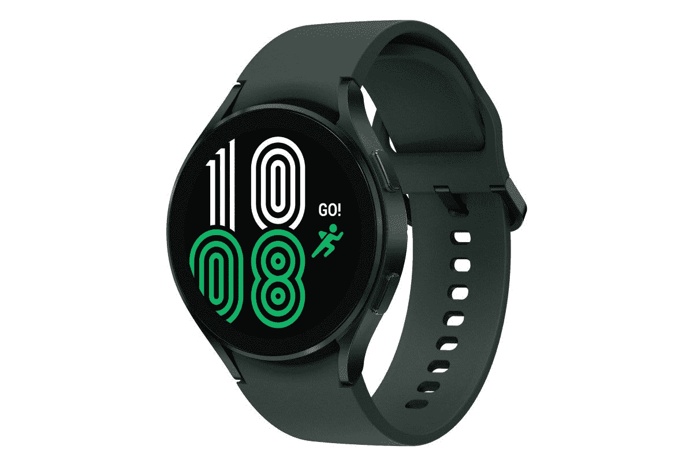
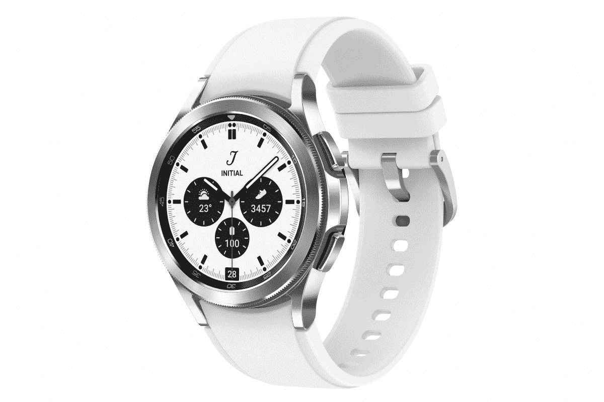

# 三星 Galaxy Watch 4 和 Watch 4 Classic 有旋转表圈吗？

> 原文：<https://www.xda-developers.com/samsung-galaxy-watch-4-classic-rotating-bezel/>

# 三星 Galaxy Watch 4 和 Watch 4 Classic 有旋转表圈吗？

旋转表圈已经成为 Galaxy 手表系列的一个公认特征。Galaxy Watch 4 和 Watch 4 Classic 有吗？

三星 Galaxy Watch 系列最容易识别的功能之一是显示屏外部的物理旋转边框，它为用户提供了一个物理输入设备，用户可以通过它与手表进行交互。但是新的 [Galaxy Watch 4 系列](https://www.xda-developers.com/samsung-galaxy-watch-4/)结合了 Watch 系列和以前的 Watch Active 系列的功能，后者没有旋转表圈。那么 Galaxy Watch 4 有旋转挡板吗？答案是有也没有。

Galaxy Watch 4 本身没有旋转表圈，但 Watch 4 Classic 有。相反，Galaxy Watch 4 有一个数字表圈。

Galaxy Watch 4 有铝制外壳和 40 毫米和 44 毫米的有机发光二极管显示屏。它的显示屏周围有一个触摸电容边框。在这方面，它类似于 Galaxy Watch Active，而 Watch Active 已经更名为(常规)手表系列。

 <picture></picture> 

Samsung Galaxy Watch 4

##### 三星 Galaxy 手表 4

Galaxy Watch 4 是三星智能手表系列的最新版本，其光滑纤薄的设计类似于一款主动手表。

另一方面，Watch 4 Classic 有一个旋转表圈。这两款手表中更豪华的是 Watch 4 Classic，它有不锈钢底盘，有 42 毫米和 46 毫米两种型号。旋转表圈一直是 Galaxy 智能手表的标志性功能，也是 Watch 3 的一个突出特点。任何错过它的用户应该更喜欢 Watch 4 Classic 而不是 Watch 4。

 <picture></picture> 

Samsung Galaxy Watch 4

##### 三星 Galaxy Watch 4 经典版

Galaxy Watch 4 Classic 看起来像一款经典时计，并将拥有标志性的 Galaxy Watch 旋转表圈。

分割两款手表之间的差异有助于吸引两种用户——那些习惯于更轻薄智能手表的用户和那些欣赏原始设计上的物理表圈的手表粉丝。Watch 4 Classic 比 Watch 4 略重，外壳也更大，所以如果你的手腕更薄，请记住这一点。

也就是说，这两种模式有几个共同的特点。例如，它们有 1.5GB 内存和 16GB 内部存储空间。它们都有许多传感器，旨在帮助用户监测他们的健康。