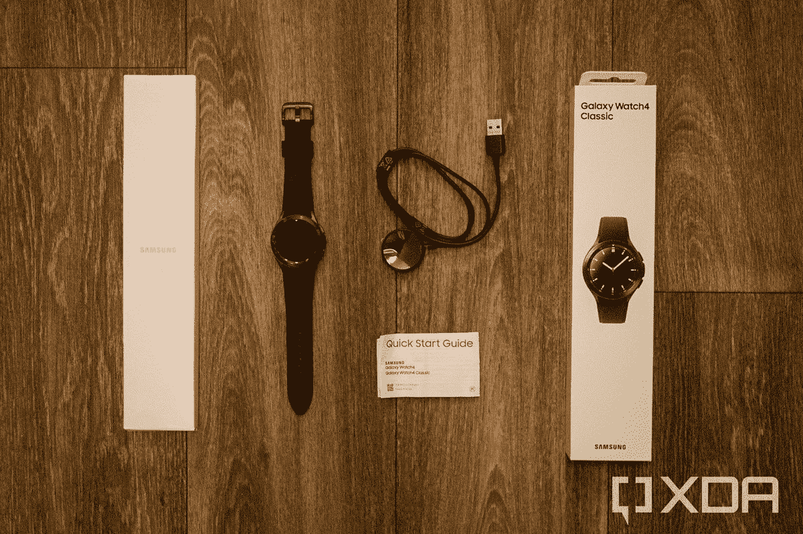
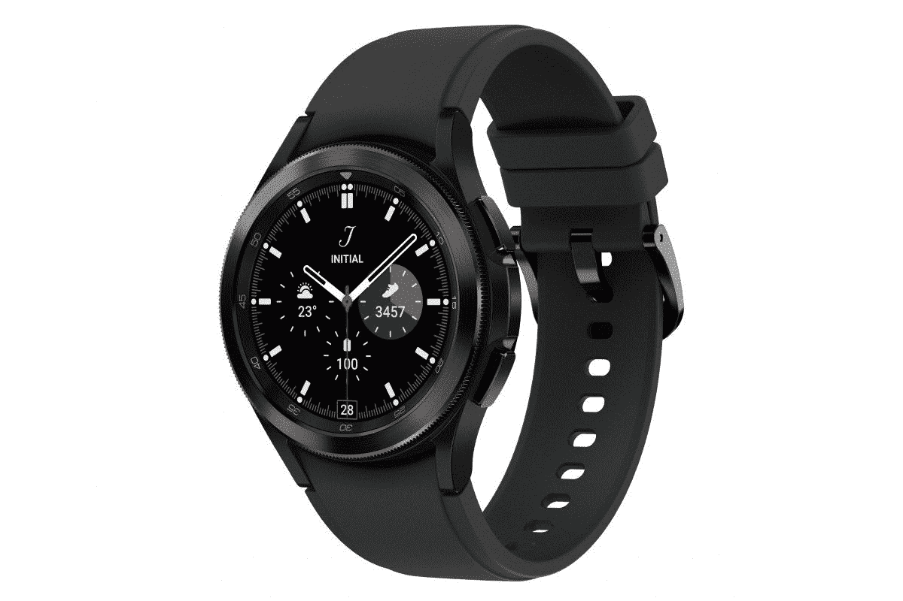

# 三星 Galaxy Watch 4 经典拆箱:盒子里是什么？

> 原文：<https://www.xda-developers.com/samsung-galaxy-watch-4-classic-unboxing/>

# 三星 Galaxy Watch 4 经典拆箱:盒子里是什么？

以下是您购买三星 Galaxy Watch 4 Classic 时在包装盒中得到的东西，以防您感到好奇。没多少。

三星的 [Galaxy Watch 4](https://www.xda-developers.com/samsung-galaxy-watch-4/) 系列终于到来了，经过了几个月的猜测和一系列*的泄露。这可能是三星多年来最重要的可穿戴产品，因为它使用的是谷歌的 Wear OS 软件，而不是三星所有其他手表上的 Tizen 平台。这也是三星首次同时更新经典和现代设计。*

我们已经对 Galaxy Watch 4 Classic 进行了评估，但在我们花几天时间全面测试手表的功能之前，我们认为一个简单的拆箱操作可能会对那些有兴趣预购产品的人有所帮助。如果您想知道 Watch 4 和 Watch 4 Classic 的包装盒内有什么，那么您来对地方了。我们还总结了[最佳 Galaxy Watch 4 bands](https://www.xda-developers.com/best-galaxy-watch-4-bands/) ，以及 [Galaxy Watch 4 Classic 与 Apple Watch Series 6](https://www.xda-developers.com/samsung-galaxy-watch-4-classic-vs-apple-watch-6/) 的对比。

Galaxy Watch 4 Classic 的盒子又高又窄，类似于早期三星手表(和苹果手表)的盒子。手表平放在盒子里，里面有一个较小的部分容纳其他所有东西。没什么好惊讶的。除了手表之外，包装盒中唯一的其他物品是充电座。

 <picture></picture> 

Everything in the box (and the box).

充电器有一个 USB Type-A 连接器，以最大 5W (5V/1A)为手表充电。你在旅行时肯定需要随身携带这个充电座，除非你有其他三星官方充电器 Galaxy Watch 4 Classic 不能使用传统的 Qi 无线充电板。盒子里没有 USB 墙上适配器，但你可能已经有几个(十几个)备用适配器可以完美地工作。不过，如果你有一部带无线 PowerShare(也就是反向无线充电)的三星 Galaxy 手机，那么你可以完全不用充电器。

还有一个小的快速入门指南，其中有一个关于使用 Galaxy Wearable app 进行设置和各种法律声明的说明。就是这样。

 <picture></picture> 

Samsung Galaxy Watch 4 Classic

##### 三星 Galaxy Watch 4 经典版

Galaxy Watch 4 是三星最新的可穿戴设备，采用传统设计(和旋转表圈)。