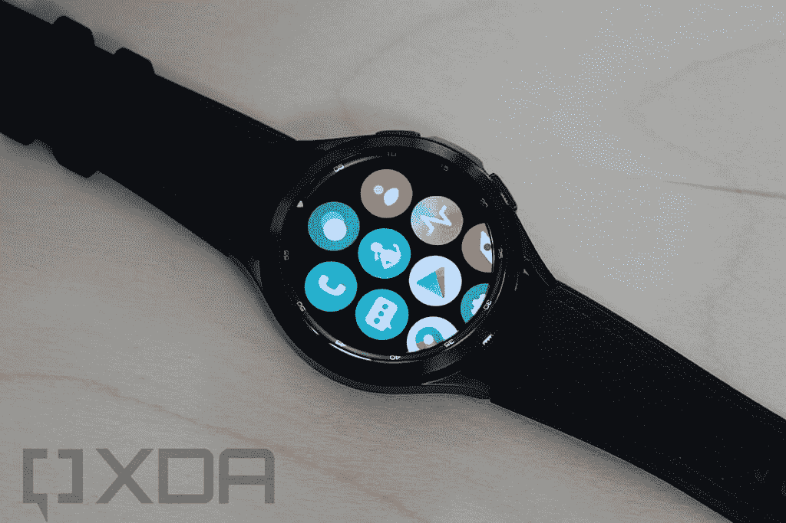
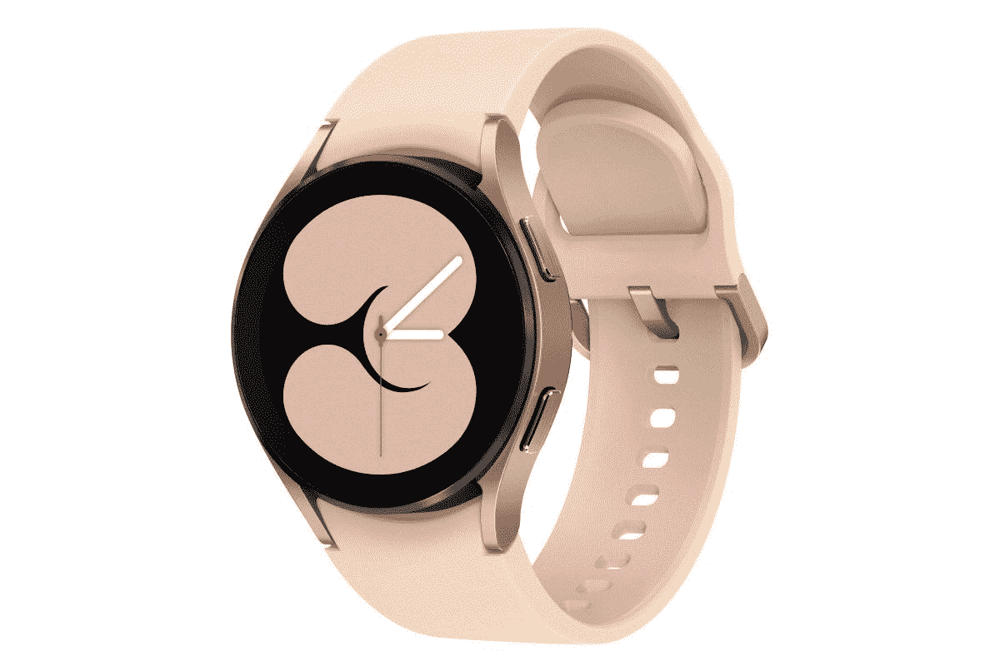
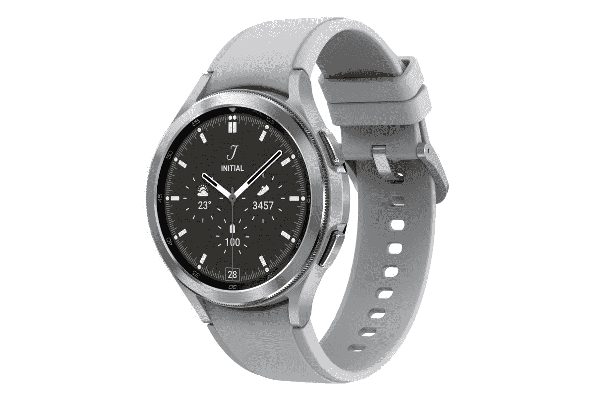

# 三星 Galaxy Watch 4 和 Watch 4 Classic 有 eSIM 支持吗？

> 原文：<https://www.xda-developers.com/samsung-galaxy-watch-4-esim/>

# 三星 Galaxy Watch 4 和 Watch 4 Classic 有 eSIM 支持吗？

想知道三星 Galaxy Watch 4 是否支持 eSIM？我们在这篇文章中解释了关于 Galaxy Watch 4 eSIM 支持的一切。

三星在其可穿戴产品组合中增加了两款新的智能手表。基于谷歌和三星的统一平台——由三星支持的 Wear OS——新的 [Galaxy Watch 4 和 Galaxy Watch 4 Classic](https://www.xda-developers.com/samsung-galaxy-watch-4/) 配备了一系列健康功能和智能手机配套产品。如果你想知道这家韩国科技巨头是否会发布这些手表的 eSIM 供电 LTE 版本，你很幸运。Galaxy Watch 4 和 Galaxy Watch 4 Classic 都有仅支持蓝牙和 LTE 的版本。

## 三星 Galaxy Watch 4 系列上的 LTE

 <picture></picture> 

Samsung Galaxy Watch 4 Classic

Galaxy Watch 4 和 Watch 4 Classic 的 LTE 版本将携带 eSIM 功能，以连接到您的电信运营商的网络。作为发布公告的一部分，三星宣传了其在 eSIM 技术方面的领先地位，因此你可以预期在这些智能手表上使用 4G LTE 不会有任何问题。

对于门外汉来说，eSIM 是一种数字 SIM 卡，允许您从运营商那里激活蜂窝计划，而不需要物理 SIM 卡。

该公司还表示，在与 LTE Galaxy Watch 4 型号的初始配对过程中，你需要一部带 GMS 的 Android 手机，以获得独立的语音通话和独立的文本消息。它还警告说，一些运营商可能不支持独立的语音通话或将其限制在某些地区，因此您应该向您的运营商了解更多信息。

## 定价和可用性

Galaxy Watch 4 LTE 型号在美国的起价为 299.99 美元。它将有 40 毫米和 44 毫米两种尺寸。另一方面，Galaxy Watch 4 Classic LTE 型号的零售价格将为 399.99 美元。它还有两种尺寸——42 毫米和 46 毫米。

这两款智能手表将于 8 月 26 日开始在美国销售，并选择其他市场。

 <picture></picture> 

Samsung Galaxy Watch 4

##### 三星 Galaxy 手表 4

三星 Galaxy Watch 4 是由 Samsung 智能手表支持的新操作系统。它有 40 毫米和 44 毫米两种尺寸。

 <picture></picture> 

Samsung Galaxy Watch 4 Classic

##### 三星 Galaxy Watch 4 经典版

三星 Galaxy Watch 4 Classic 有 42 毫米和 46 毫米两种尺寸。它还运行在由 Samsung 平台支持的新的 Wear 操作系统上。

两款三星 Galaxy Watch 4 智能手表你打算买哪一款？请在评论区告诉我们。同时，如果你确实打算购买 Galaxy Watch 4，我们已经为它选择了[最佳表带](https://www.xda-developers.com/best-galaxy-watch-4-bands/)，这样你就可以根据自己的喜好对它进行个性化定制。此外，别忘了阅读我们对新款 [Galaxy Watch 4 Classic 和 Apple Watch Series 6](https://www.xda-developers.com/galaxy-watch-4-classic-vs-apple-watch-6/) 的对比。