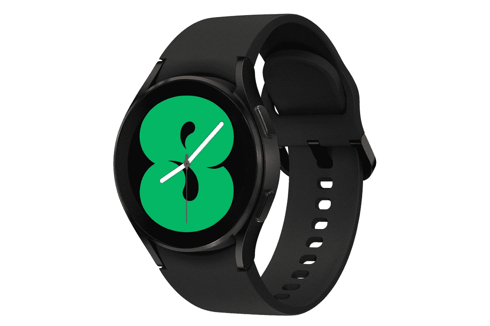

# 三星 Galaxy Watch 4 有内置摄像头吗？

> 原文：<https://www.xda-developers.com/samsung-galaxy-watch-4-inbuilt-camera/>

三星在其年度 Galaxy Unpacked 2021 活动上发布了全新的智能手表系列。有两种款式可供选择， [Galaxy Watch 4](https://www.xda-developers.com/samsung-galaxy-watch-4/) 是一款时尚简约的智能手表，而 Galaxy Watch 4 Classic 则是为喜欢传统手表设计的客户设计的。基本上，Galaxy Watch Active 系列现在将作为 Galaxy Watch 继续推出。

新的智能手表系列由三星新的 5 纳米芯片组驱动，具有 1.5GB 的内存和 16GB 的内部存储。三星表示，新款 Galaxy Watch 4 的 CPU 速度提高了 20%，RAM 增加了 50%，GPU 提高了 10 倍，过渡更加流畅。

客户还可以期待更亮的显示屏，部分型号的 LTE (eSIM)连接，以及支持 10 小时使用和两个半小时充电时间的快速充电。Galaxy Watch 4 还配备了三星的生物活性传感器，该传感器运行在单个芯片组上，包括三个健康传感器，用于测量光学心率、电心率和生物电阻抗分析传感器(PPG +心电图+ BIA)。这些传感器将视地区而定。

手表还首次引入了身体成分测量，包括骨骼肌、脂肪量、身体质量指数、身体水分和基础代谢率。其他功能包括 VO2 Max 传感器、高级睡眠管理、持续血氧跟踪，以及支持在三星智能电视上查看锻炼和其他生命体征(目前在加拿大、韩国、英国和美国提供)。

对于智能手表来说，这无疑是一个很大的硬件，如果你问自己，**Galaxy Watch 4 有内置摄像头吗，答案是没有**。三星还没有设想我们使用智能手表与其他人交谈，但希望这可能在不久的将来成为现实。

新款 Galaxy Watch 4 有 40 毫米和 44 毫米两种尺寸，将有黑色、银色、绿色(仅 44 毫米)和玫瑰金(仅 40 毫米)四种颜色可选，起价 249.99 美元。Galaxy Watch 4 Classic 将有 42 毫米和 46 毫米两种尺寸，有黑色和银色两种颜色，起价为 349.99 美元。这两款机型预计将从 8 月 27 日开始在特定市场上市，从 8 月 11 日开始预购。如果你正在寻找定制，请查看 Galaxy Watch 4 的[最佳表带。我们还对](https://www.xda-developers.com/best-galaxy-watch-4-bands/) [Galaxy Watch 4 和 Apple Watch Series 6](https://www.xda-developers.com/samsung-galaxy-watch-4-classic-vs-apple-watch-6/) 进行了对比。

 <picture></picture> 

Samsung Galaxy Watch 4

##### 三星 Galaxy 手表 4

新款 Galaxy Watch 4 是三星最新推出的智能手表，具有各种健康监测传感器和集成谷歌 Wear OS 的新操作系统。

 <picture></picture> 

Samsung Galaxy Watch 4

##### 三星 Galaxy Watch 4 经典版

新的 Galaxy Watch 4 Classic 提供了与常规 Galaxy Watch 4 相同的功能和特性，采用了更传统的时钟设计，具有厚的旋转表圈。