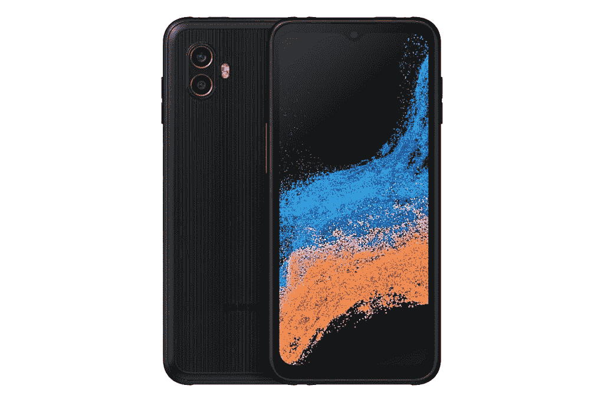

# 三星分享了 Galaxy XCover 6 Pro 和 Galaxy Tab Active 4 Pro 在美国的定价和供货细节

> 原文：<https://www.xda-developers.com/samsung-galaxy-xcover-6-pro-galaxy-tab-active-4-pro-us-launch/>

在今年早些时候推出 Galaxy XCover 6 Pro 和 Galaxy Tab Active 4 Pro 之后，三星终于公布了将加固设备引入美国的计划。该公司宣布，新的 Galaxy Tab Active 4 Pro 将于今天开始在该地区销售。它将通过三星的网站、亚马逊业务和一/二级 It 渠道合作伙伴提供，起价为 649 美元。另一方面，Galaxy XCover 6 Pro 将于 10 月 20 日开始通过相同渠道购买。

如果你错过了我们之前对这两款设备的报道，这里有你需要知道的关于 Galaxy XCover 6 Pro 和 T2 Galaxy Tab Active 4 Pro 的一切。

## 三星 Galaxy XCover 6 Pro

三星 Galaxy XCover 6 Pro 是一款加固型智能手机，采用中档硬件。它配备了一个 6.6 英寸的 FHD+ 120Hz 显示屏，灵敏度更高，使其在潮湿或戴手套时易于使用。在内部，你得到了一个高通骁龙 778G 芯片组，6GB 内存，128GB 的内部存储，以及一个 4,050mAh 的可移动电池，支持 15W 有线充电。

摄影方面，Galaxy XCover 6 Pro 背面采用了双摄像头设置，由 50MP 主传感器和 8MP 超宽传感器组成。此外，该设备正面配备了一个 1300 万像素的自拍摄像头。

虽然基于这些规格，Galaxy XCover 6 Pro 似乎并不令人印象深刻，但其坚固的外观有助于它与目前市场上的其他 Android 智能手机区分开来。这款手机的防尘防水等级为 IP68，通过了 MIL-STD-810H 认证，甚至还为显示屏提供了 Gorilla Glass Victus+保护。

 <picture></picture> 

Samsung Galaxy XCover 6 Pro

此外，Galaxy XCover 6 Pro 配备了两个可编程按钮，可以用来快速触发任何功能。它还支持一些特定于企业的功能，使您可以通过 Knox Capture 将其用作企业级条形码扫描仪，或通过其一键通功能将其用作对讲机。

三星还为该设备提供了一些独特的配件，以满足特定的企业需求，如智能外壳、POGO/多设备电池组充电器、充电座、皮带夹和 PTT 耳机。如前所述，Galaxy XCover 6 Pro 将于 10 月 20 日开始在美国销售。三星尚未透露该设备的定价细节，但它可能会在 600 美元左右，因为它已经在全球几个市场以类似的价格出售。

## 三星 Galaxy Tab Active 4 Pro

与 Galaxy XCover 6 Pro 一样，三星 Galaxy Tab Active 4 Pro 也是一款加固型平板电脑，采用中端硬件。它采用 10.1 英寸 TFT 显示屏，分辨率为 1920x1200p，支持 S Pen 和 Gorilla Glass 5 保护。在内部，它装有骁龙 778G SoC、6GB RAM 和 128GB 内部存储，以及用于进一步扩展的 microSD 卡插槽。

Galaxy Tab Active 4 Pro 由 7,600mAh 可拆卸电池支持，一次充电可提供长达 16 小时的连续视频播放。在摄像头方面，该平板电脑配备了 1300 万像素的后置摄像头和 800 万像素的自拍摄像头。

三星还在 Galaxy Tab Active 4 Pro 上提供了许多相同的耐用性功能，包括防尘防水的 IP68 等级和 MIL-STD-810H 认证。其他值得注意的功能包括可编程按钮、三星 DeX 支持、NFC 和 IP68 等级的加固型 S Pen。

与 Galaxy XCover 6 Pro 不同，您不必等待就可以获得 Galaxy Tab Active 6 Pro。这款平板电脑已经可以通过各种渠道购买，起价为 649 美元。

*如何看待新款 Galaxy XCover 6 Pro 和 Galaxy Tab Active 4 Pro？你会得到其中一个设备吗？请在下面的评论区告诉我们。*