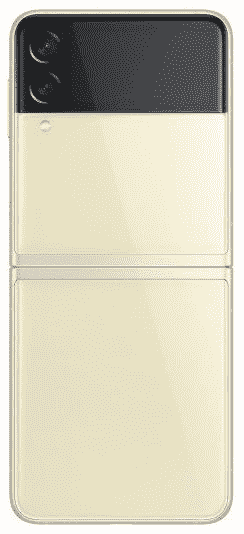
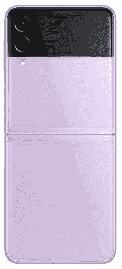

# 三星 Galaxy Z Flip 3 有 5G 支持吗？

> 原文：<https://www.xda-developers.com/samsung-galaxy-z-flip-3-5g-support/>

三星刚刚推出了其最新的可折叠手机，具有顶级规格的 [Galaxy Z Fold 3](https://www.xda-developers.com/samsung-galaxy-z-fold-3/) 和 [Galaxy Z Flip 3、](https://www.xda-developers.com/samsung-galaxy-z-flip-3/)。这些是三星最新的旗舰手机，正在取代 Note 系列，并将推动用户转向可折叠手机。考虑到这一点，这些可折叠的价格也比以前略低。

如果你打算购买更便宜、更紧凑的翻盖手机 Galaxy Z Flip 3，你可能会想知道这款手机是否有 5G 功能。5G 是电信领域的下一件大事，如果你生活在 5G 覆盖的地区，为了适应未来，你的新手机必须具备 5G 功能。Galaxy Z Flip 3 有 5G 吗？简而言之答案是肯定的，Galaxy Z Flip 3 确实有 5G。

 <picture></picture> 

Samsung Galaxy Z Flip 3

Galaxy Z Flip 3 支持 5G，这意味着如果您所在地区有 5G 网络，您可以使用它。不过，5G 支持可能会有所不同，这取决于您从哪家运营商获得支持。所有变体都将有 5G，但支持的波段或技术可能不同。例如，有两种不同类型的 5G 网络——毫米波 5G 和亚 6GHz 5G。如果您从一家运营商处购买了 Galaxy Z Flip 3，并且该运营商同时支持这两个网络，那么该手机也将同时支持这两个网络。

在某些地区，可能不存在毫米波 5G，或者少数运营商可能不支持超宽带 5G 网络。在这种情况下，Galaxy Z Flip 3 将只能连接到低于 6GHz 的 5G 网络。同样重要的是要知道，在不同地区销售的同一款手机可能有不同的 5G 频段。如果你在美国买了一部手机，并打算在美国国内使用，这部手机将拥有所有相关的频段。

 <picture></picture> 

Lavender

然而，如果你留在美国，但从欧洲或韩国购买了 Galaxy Z Flip 3，那么美国现有的 5G 频段很可能与你购买手机的国家不同。在这种情况下，5G 可能不适合你所在的国家。因此，最好在你居住的国家购买 Galaxy Z Flip 3，或者如果你从国外购买，请确保该设备具有支持你所在地区 5G 所需的频段。

以下信息来自监管文件。三星尚未自行透露该设备的波段信息。

## Galaxy Z Flip 3 - USA 变型(SM-F711U)上的网络带

在美国销售的 Galaxy Z Flip 3 型号支持这些网络频段:

*   CDMA/EVDO BC10
*   CDMV/EVDO BCO
*   PCS CDMA/EVDO
*   GSMGPRS/EDGE 850
*   GSM/GPRS/EDGE 1900
*   UMTS 850
*   UMTS 1750
*   UMTS 1900
*   LTE 频段 71
*   LTE 频段 12
*   LTE 频段 13
*   LTE 频段 14
*   LTE 频段 26(小区)
*   LTE 频段 5(蜂窝电话)
*   LTE 频段 66 (AWS)
*   LTE 频段 4 (AWS)
*   LTE 频段 25 (PCS)
*   LTE 频段 2 (PCS)
*   LTE 频段 30
*   LTE 频段 7
*   LTE 频段 48
*   LTE 频段 41
*   LTE 频段 38
*   第 71 卷
*   卷# 12
*   NR 波段 n5(细胞)
*   NR 带 n66(自动气象站)
*   NR 带 n25(件)
*   NR 带 n2(件)
*   卷号 n30
*   第 n41 卷
*   NR 波段 n77 DoD
*   第 77 卷
*   卷# 260
*   卷# 261

## Galaxy Z Flip 3 - Indian 变体(SM-F711B)上的网络带

在印度销售的 Galaxy Z Flip 3 型号支持以下网络频段:

*   GSM/GPRS/EDGE 850
*   GSM/GPRS/EDGE 1900
*   UMTS 850
*   UMTS 1750
*   UMTS 1900
*   LTE 频段 12
*   LTE 频段 17
*   LTE 频段 13
*   LTE 频段 26(小区)
*   LTE 频段 5(蜂窝)
*   LTE 频段 66 (AWS)
*   LTE 频段 4 (AWS)
*   LTE 频段 25 (PCS)
*   LTE 频段 2 (PCS)
*   LTE 频段 41
*   NR 波段 n5(细胞)
*   NR 带 n66(自动气象站)

请注意，这些频段是我们从 FCC 列表中获得的，而不是三星官方提供的。我们已经要求三星确认，但还没有收到。如果将来有任何变化，我们将更新信息。你可以向你所在地区的运营商咨询他们使用的 5G 频段，以确保 Galaxy Z Flip 3 可以与 5G 网络兼容。

 <picture></picture> 

Pink

三星 Galaxy Z Flip 3 是最新的折叠式翻盖手机，采用了新的内部结构和更大的翻盖显示屏。

如果你打算买 Galaxy Z Flip 3 或者你已经买了一个，考虑买一个[保护你昂贵的投资。可折叠手机通常比传统手机更脆弱，你肯定不想花更多的钱来维修一部已经很贵的手机。如果你还没有买手机，但有兴趣买一部，看看](https://www.xda-developers.com/best-galaxy-z-flip-3-cases/)[最好的 Galaxy Z Flip 3 交易](https://www.xda-developers.com/best-galaxy-z-flip-3-deals/)来节省一些钱。