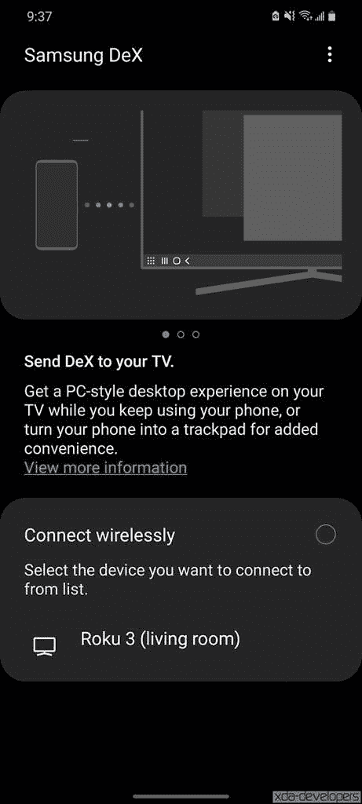

# 三星 Galaxy Z Flip 3 和三星 DeX 配合使用吗？

> 原文：<https://www.xda-developers.com/samsung-galaxy-z-flip-3-dex/>

三星最新的可折叠手机, [Galaxy Z Fold 3](https://www.xda-developers.com/samsung-galaxy-z-fold-3/) 和 [Galaxy Z Flip 3](https://www.xda-developers.com/samsung-galaxy-z-flip-3/) 对于任何想要购买拥有所有最新技术的高端旗舰手机的人来说都是很好的选择。与传统手机相比，可折叠手机是独一无二的，可以提供优质的体验。虽然 Galaxy Z Fold 3 是更昂贵的多功能生产力机器，可以展开成为平板电脑，但 Galaxy Flip 3 是面向大众的可折叠手机。999 美元并不便宜，但与其他旗舰手机处于同一价格区间。

回到生产力方面，三星 DeX 是三星手机上已经存在了一段时间的功能。如果你不知道 DeX，这是一个可以让你在连接到显示器或任何外部显示器时将手机用作电脑的功能。只需将你的手机连接到显示器上，加上键盘和鼠标，你的手机将会模拟桌面体验。如果你是旧手机上 DeX 的经常用户，并且想知道新的 Galaxy Z Flip 3 是否能与 DeX 一起工作，这就是你的答案！**三星 Galaxy Z Flip 3 与三星 DeX** 不兼容。

 <picture></picture> 

Wireless Samsung DeX

不幸的是，由于某种原因，三星已经在 Galaxy Z Flip 3 上删除了使用 DeX 的功能。设备上没有快速切换，设置中也没有启用它的选项。这令人失望，因为 Galaxy Z Flip 3 是一款旗舰手机，在内部设计方面也绝不逊色。它与 Galaxy S21 Ultra 和 Galaxy Z Fold 3 上的骁龙 888 SoC 相同，都支持 DeX。USB 端口也是 USB 3.1，因此没有真正的硬件限制。

由于这款手机在技术上能够处理 DeX，因此排除该功能更多的是三星区分这两种可折叠产品的一种方式。这看起来像是试图推动高级用户购买 Galaxy Z Fold 3，而不是更实惠的 Galaxy Z Flip 3。Galaxy Z Flip 3 被定位为更多的风格和时尚图标，而不是生产力机器。

如果 DeX 支持对你来说不重要，Galaxy Z Flip 3 是一款试图民主化可折叠手机的好手机。如果你有兴趣得到一个，请查看[最佳 Galaxy Z Flip 3 交易](https://www.xda-developers.com/best-galaxy-z-flip-3-deals/)，如果你已经购买了手机，你可以使用[最佳 Galaxy Z Flip 3 保护套之一](https://www.xda-developers.com/best-samsung-galaxy-z-flip-3-cases/)来保护它。

 <picture></picture> 

Samsung Galaxy Z Flip 3

三星 Galaxy Z Flip 3 是最新的折叠式翻盖手机，采用了新的内部结构和更大的翻盖显示屏。

DeX 对你有多重要，Galaxy Z Flip 3 缺乏 DeX 支持会影响你的购买决定吗？请在下面的评论中告诉我们。