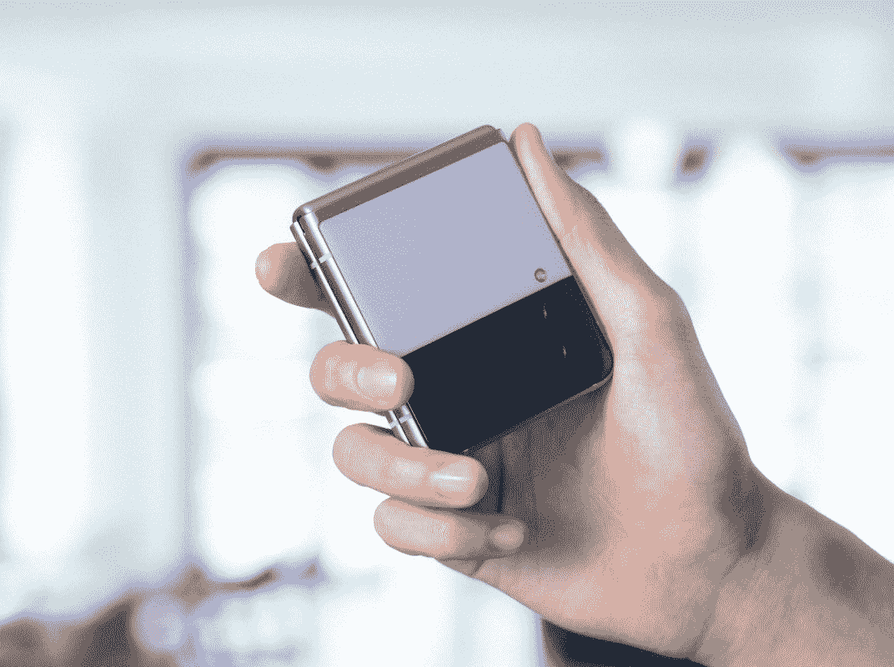

# 三星 Galaxy Z Flip 3 有指纹传感器吗？

> 原文：<https://www.xda-developers.com/samsung-galaxy-z-flip-3-fingerprint-sensor/>

三星最近推出了最新一代的可折叠手机，包括 Galaxy Z Flip 3。通过最新的 Z Flip，三星在价格上使该系列产品更接近标准旗舰产品，因为它现在的起价为 999 美元。它的前身 Galaxy Z Flip 5G 的售价为 1449 美元，所以你可能想知道三星是否做出了巨大牺牲来降低价格。Galaxy Z Flip 3 的一个简单牺牲就是指纹传感器，但谢天谢地，事实并非如此。

是的，三星 Galaxy Z Flip 3 确实有指纹传感器，就像以前的版本一样。这是一个电容式指纹传感器，而不是其他三星 Galaxy 旗舰上看到的超声波指纹传感器。指纹传感器安装在侧面，它还兼作电源按钮。其中一个原因是，你可能想使用只有外接屏幕的手机。你不太可能想用它做很多事情，但你可以在手机折叠时访问快速设置、查看通知和使用 Samsung Pay。在这些情况下，能够在手机折叠时解锁可能会有所帮助，所以显示屏下的指纹传感器并不理想。

如果你喜欢，你可以选择面部识别，但请记住，这不是最安全的身份验证方法。三星只使用标准摄像头进行面部识别，没有花哨的 3D 扫描或任何东西。因此，这比 iPhone 上的 Face ID 更容易被愚弄。为了最安全起见，你应该使用指纹识别器。

 <picture></picture> 

Pre-order the Samsung Galaxy Z Flip 3

##### 预购三星 Galaxy Z Flip 3

预购三星最新的可折叠产品，可获得高达 150 美元的三星积分和其他优惠。三星 Galaxy Z Flip 3 采用了更耐用的设计，更大的覆盖屏幕，略小的机身。

三星 Galaxy Z Flip 3 可以使用下面的链接立即预订，或者您可以[查看这里立即提供的最佳交易](https://www.xda-developers.com/best-galaxy-z-flip-3-deals/)。如果你想买三星最新的可折叠翻盖手机，你可能会想用[这种保护套](https://www.xda-developers.com/best-samsung-galaxy-z-flip-3-cases/)来保护它。三星确实提高了 Z Flip 3 的耐用性，但最好还是格外小心。