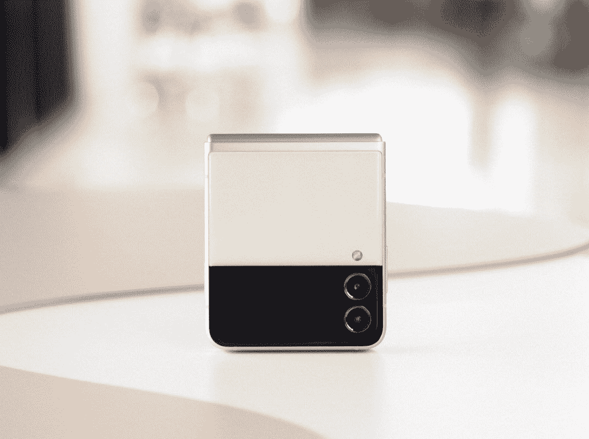

# 三星 Galaxy Z Flip 3 有耳机插孔吗？

> 原文：<https://www.xda-developers.com/samsung-galaxy-z-flip-3-headphone-jack/>

三星终于发布了新一代可折叠手机，包括[三星 Galaxy Z Flip 3](https://www.xda-developers.com/samsung-galaxy-z-flip-3/) 。现在，这些手机正式设置为在几周内发布，我们有很多关于它们的官方信息。如果你是一个音乐爱好者，你可能会想知道 Galaxy Z Flip 3 是否会有耳机插孔。答案很简单——不会。

这真的不应该是一个惊喜，因为耳机插孔早就从大多数旗舰手机中消失了。另外，Galaxy Z Flip 3 比上一代产品更薄更小，所以如果说以前没有耳机插孔的话，现在就更少了。除了没有内置，这款手机也没有 USB Type-C 到 3.5 毫米的适配器。开箱即用，任何你刚有的 3.5mm 耳机都不行。除非你买了转接头或者 USB-C 耳机，否则你就没运气了。三星[出售自己的适配器](https://shop-links.co/1748595704572758475?u1=27cb46fc-8680-465c-b341-1c000d60641c)，如果你需要的话。

当然，另一个解决方案是购买无线耳塞，比如三星与 Galaxy Z Flip 3 一起推出的 [Galaxy Buds 2](https://www.xda-developers.com/samsung-galaxy-buds-2/) 。新的 Galaxy Buds 2 具有噪音消除功能，更好的通话语音隔离，是迄今为止最轻的 Galaxy Buds。如果你有兴趣购买，它们的价格是 149.99 美元。自然地，其他无线耳塞也可以工作，尽管体验可能不是无缝的。

你可以使用下面的链接预购 Galaxy Z Flip 3，或者在这里找到最优惠的价格。最新的可折叠手机起价为 999 美元，比其前身 Galaxy Z Flip 5G 的发布价格低了一大步，后者的发布价格为 1449 美元。新型号还具有更高的耐用性、更大的屏幕和其他改进。如果你想保护你的新手机，查一查 Galaxy Z Flip 3 的[最佳案例列表。](https://www.xda-developers.com/best-galaxy-z-flip-3-cases/)

 <picture></picture> 

Pre-order the Galaxy Z Flip 3

三星 Galaxy Z Flip 3 采用了更紧凑的设计，更大的覆盖屏幕，并提高了耐用性。它也比它的前辈更实惠，你可以通过预购获得 150 美元的三星信用。