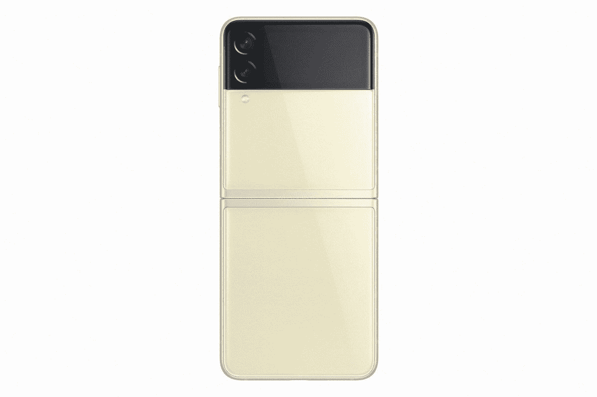

# 三星 Galaxy Z Flip 3 有 SD 卡槽吗？

> 原文：<https://www.xda-developers.com/samsung-galaxy-z-flip-3-sd-card/>

三星刚刚在其 Galaxy Unpacked 2021 活动上宣布了其新的设备系列。这家科技巨头推出了两款新的折叠智能手机——Galaxy Z Fold 3 和 T2 Galaxy Z Flip 3，以及新的 T4 Galaxy Buds 2 真正的无线耳机和 Galaxy Watch 4 系列。

新的 Galaxy Z Flip 3 是最新的翻盖风格可折叠智能手机，是对最初的 Galaxy Z Flip 和 Galaxy Z Flip 5G 的更新。它采用了改进的设计，具有更大的外部显示屏，而内部显示屏升级为动态 AMOLED 2X，支持 120Hz 的刷新率。最重要的是，这款新智能手机还具有 IPX8 等级，这意味着它还具有防水功能，这是所有可折叠智能手机中的第一款。

至于存储和内存，Galaxy Z Flip 3 将提供 256GB 或 512GB 的内部存储。三星没有增加升级存储的功能，这意味着智能手机上没有 SD 卡插槽，因此不支持 SD 卡或其他可扩展存储方式。因此，如果你对这款设备感兴趣，最好买一款能让你在预期使用期内使用的存储变体，因为没有办法无缝增加设备的板载存储。

当然，您可以选择云存储解决方案，甚至可以通过 USB C 端口连接其他存储设备。然而，这些并不是完全无缝的解决方案。因此，我们强烈建议您选择一种储物方案，不仅能满足您目前的需求，还能满足未来两年的需求。对于大多数用户来说，基本的 256 GB 版本应该是可行的。但如果你喜欢拍很多照片和视频，或者喜欢在手机上安装很多应用程序，那么就选择 512GB 的版本。

 <picture></picture> 

Samsung Galaxy Z Flip 3

三星 Galaxy Z Flip 3 是该公司最新的可折叠翻盖智能手机，运行骁龙 888 处理器，8GB 内存和 256GB 或 512GB 的固定存储选项。

新的 Galaxy Z Flip 3 将以 999 美元的起价上市，8 月 11 日开始预售。此外，查看 Galaxy Z Flip 3 的一些[最佳交易，以及](https://www.xda-developers.com/best-galaxy-z-flip-3-deals/)[最佳案例](https://www.xda-developers.com/best-galaxy-z-flip-3-cases/)的综述。