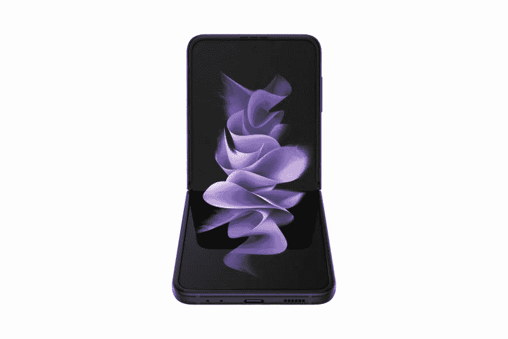

# 三星 Galaxy Z Flip 3 会获得多少软件更新？

> 原文：<https://www.xda-developers.com/samsung-galaxy-z-flip-3-software-updates/>

已经过去了很长时间，但三星终于宣布了其最新一代可折叠手机，即 [Galaxy Z Flip 3](https://www.xda-developers.com/samsung-galaxy-z-flip-3/) 和 [Galaxy Z Fold 3](https://www.xda-developers.com/samsung-galaxy-z-fold-3/) 。随着这些手机即将正式发布，现在可以预订，一些问题需要回答。比如三星最新的可折叠产品会支持多久？具体来说，Galaxy Z Flip 3 会获得多少软件更新？

近年来，三星在为其智能手机提供软件支持方面一直是最好的之一，至少与其他安卓原始设备制造商相比是如此。所以，如果你想让你的手机支持几年，你可以放心使用三星。

## Galaxy Z Flip 3: Android 操作系统更新

与之前的三星旗舰产品非常相似，Galaxy Z Flip 3 将推出最新版本的 Android，即 Android 11。最重要的是，它将运行三星的 OneUI 软件，该软件增加了许多功能。OneUI 目前的版本是 3.1，基于 Android 11。但随着 Android 12 的到来，我们应该不会太久，直到我们看到基于它的新版本 OneUI。

当然，这不是 Galaxy Z Flip 3 将获得的唯一更新。去年，在三星 Galaxy Note20 发布会上，三星[承诺对 Android 软件进行三代](https://www.xda-developers.com/samsung-3-years-android-os-updates-galaxy-note-20/)升级。这适用于它的所有旗舰产品——S、Note 和 Z 系列——也适用于这里。因此，尽管 Galaxy Z Flip 3 将推出 Android 11，但随着它们的发布，你应该预计能够获得 Android 12、13，并最终获得 14。

## 安全更新

三星保证 Galaxy Z Flip 3 的消费者型号将获得至少四年的安全更新。对于使用 Galaxy Z Flip 3 企业版的商业客户，三星保证至少五年的安全更新。大多数企业客户会希望在支持结束前很久就进行升级，这意味着您应该在手机的生命周期内享受服务。

 <picture></picture> 

Samsung Galaxy Z Flip 3

Galaxy Flip 3 是三星新推出的翻盖式可折叠手机。它采用 6.7 英寸 120Hz 柔性屏幕和骁龙 888 SoC。

如果你有兴趣购买三星 Galaxy Z Flip 3，你可以使用上面的链接预购，或者在这里找到最优惠的价格。如果你想保护你的可折叠手机，我们还收集了你能得到的[最好的案例](https://www.xda-developers.com/best-galaxy-z-flip-3-cases/)。三星已经提高了其可折叠产品的耐用性，但你永远不能太小心。