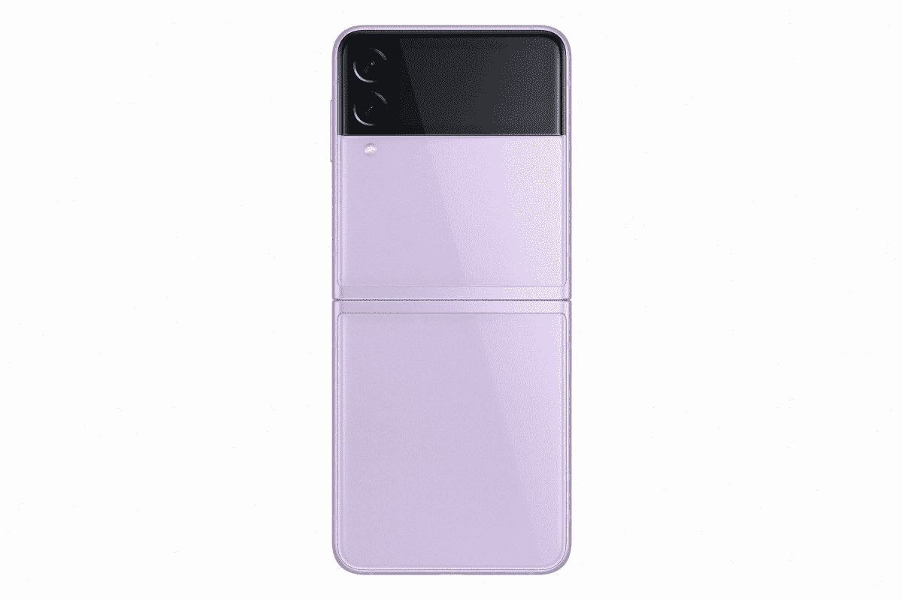

# 三星 Galaxy Z Flip 3 拆箱:盒子里是什么？

> 原文：<https://www.xda-developers.com/samsung-galaxy-z-flip-3-unboxing/>

Galaxy Z Flip 3 终于正式发布，三星最新的翻盖智能手机也是迄今为止最便宜的可折叠手机。起价仅为 999 美元，这是我们第一次看到主流可折叠智能手机跌破 1000 美元大关。尽管如此，该公司已经做了大量的改进，以确保它不只是降价，而是你所购买的东西实际上是值得的。

\ r \ nht TPS://www . YouTube . com/watch？v=BbWPKyEYXGY\r\n

我们已经在我们的 [Galaxy Z Flip 3 动手预览](https://www.xda-developers.com/samsung-galaxy-z-flip-3-hands-on/)中详细介绍了这些改进，当我们开始全面审查时，这里是我们对 Galaxy Z Flip 3 的开箱！

## Galaxy Z Flip 3 拆箱:箱子里装的是什么？

在 Z Flip 3 框中，您会发现以下内容:

与 Galaxy S21 系列和 Galaxy Z Fold 3 非常相似，Galaxy Z Flip 3 的包装盒中没有充电器。它只支持高达 15W 的充电，虽然三星确实提供了一个官方充电器，但你可能会想看看我们的[最佳 Galaxy Z Fold 3 充电器列表](https://www.xda-developers.com/best-galaxy-z-fold-3-chargers/)以找到最佳兼容充电器，因为它们都支持 15W max(即使它们的评级更高)。

Galaxy Z Flip 3 可能是三星对可折叠手机能否成为主流的回答。我在很长一段时间内使用了最初的 Z Flip，1500 美元的价格对大多数客户来说绝对是难以接受的。然而，价格为 999 美元的 Z Flip 3 是一个非常值得购买的产品，特别是考虑到它现在具有 IPX8 防尘防水功能，配备了 120Hz 高刷新率显示屏，并由优秀的骁龙 888 处理器驱动。还有双摄像头和一个 4 倍大的覆盖显示屏，这意味着您可以使用它来阅读完整的通知，访问快速设置，控制音乐等等！

**[三星 Galaxy Z Flip 3 论坛](https://forum.xda-developers.com/f/samsung-galaxy-z-flip-3.12351/)**

请继续关注我们在未来几天和几周内对 Galaxy Z Flip 3 的全面评估，同时，如果您有任何问题，请在下面的评论中告诉我们！准备好预订了吗？查看我们更新的[最佳 Galaxy Z Flip 3 交易列表](https://www.xda-developers.com/best-galaxy-z-flip-3-deals/)，一旦你订购了，不要忘记购买一个 [Galaxy Z Flip 3 外壳](https://www.xda-developers.com/best-galaxy-z-flip-3-cases/)，因为三星自己也有一些很棒的外壳可供选择！

 <picture></picture> 

Samsung Galaxy Z Flip 3

Galaxy Z Flip 3 是三星最新的可折叠翻盖手机，提供更大的外部显示屏、高刷新率的内部显示屏和顶级的硬件。