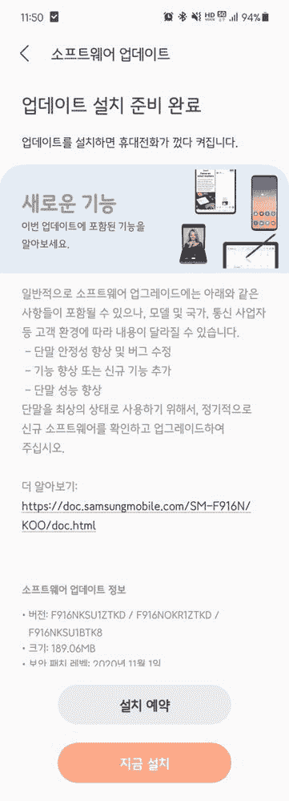

# One UI 3.0 测试版开始在韩国向三星 Galaxy Z Fold 2 推出

> 原文：<https://www.xda-developers.com/samsung-galaxy-z-fold-2-one-ui-3-0-beta/>

# One UI 3.0 测试版开始在韩国向三星 Galaxy Z Fold 2 推出

三星已经开始在韩国为 Galaxy Z Fold 2 5G 推出基于 Android 11 的 One UI 3.0 公开测试版更新。请继续阅读！

2020 年是三星可折叠手机最辉煌的一年。Galaxy Fold 系列的最新产品比第一代产品更好，韩国 OEM 厂商对 Galaxy Z Flip 的反馈大多是积极的。对我们来说更重要的是，软件更新部分没有被忽略。Android 11/One UI 3.0 测试程序的加入让事情变得更好。现在，看起来 One UI 3.0 测试版已经开始向 Galaxy Z Fold 2 推出。

**[三星 Galaxy Z 折 2 XDA 论坛](https://forum.xda-developers.com/samsung-galaxy-z-fold-2)**

今天，三星在韩国发布了基于 Android 11 的 One UI 3.0 公共测试版，用于 Galaxy Z Fold 2 的 5G 版本(型号为 **SM-F916N** )。该更新带有内部版本号 **F916NKSU1ZTKD** 和【2020 年 11 月安全补丁。当然，这个版本在通常的 Android 11 的基础上包括了一系列新功能和改进的 UI 皮肤组件。

 <picture></picture> 

Thanks to Samsung Korea Community user [너도밤나무](https://r1.community.samsung.com/t5/user/viewprofilepage/user-id/33035) for the screenshot!

所有测试版的标准免责声明在这里也适用，即测试版软件往往包含错误。如果你正在为你闪亮的新 Galaxy Z Fold 2 寻找一个稳定的操作系统，完美地满足你的所有需求，你应该远离测试程序。三星的公共测试版通常比内部测试固件包更加完善，但仍有可能出现一些关键问题。

如果你有 Galaxy Z Fold 2 这样的合格设备，但你还没有加入 One UI 3.0 测试版计划，你必须在三星会员应用程序中加入。当你进入应用程序时，点击“通知”按钮后，你应该会看到一个注册测试程序的选项。在接下来的屏幕上，点击“注册”按钮，然后等待几分钟，让应用程序处理您的注册。之后，前往设备上的软件更新页面，点击“检查更新”下载开放测试版。

[app box Google play " com . Samsung . Android . VOC "]