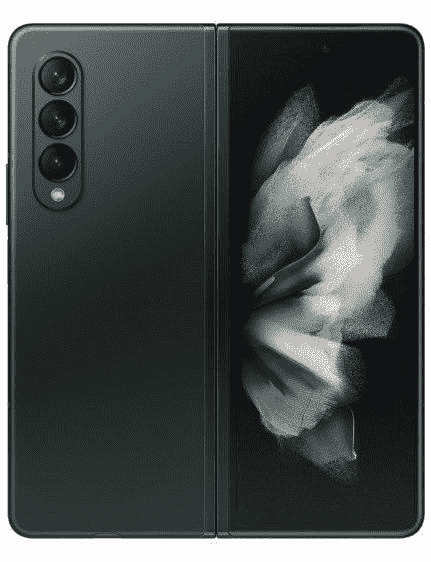
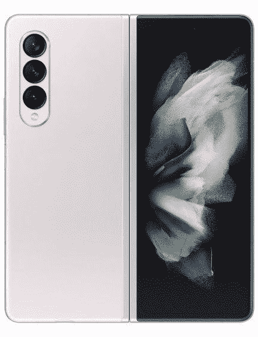

# 三星 Galaxy Z Fold 3 有哪些颜色？

> 原文：<https://www.xda-developers.com/samsung-galaxy-z-fold-3-colors/>

Galaxy Z Fold 3 是三星推出的一款令人兴奋的新型可折叠智能手机。它对其前身 Z Fold 2 进行了大量改进，包括更快的刷新率屏幕，更轻薄的机身，更新的 SoC，增强的铝制框架，以及对 S Pen 的[支持。因此，如果你打算购买 Z Fold 3，你可能会想知道它的颜色选择。三星从上一代开始增加了颜色选择，Galaxy Z Fold 3 有三种诱人的颜色——幻影黑、幻影绿和幻影银。](https://www.xda-developers.com/s-pen-pro-vs-s-pen-fold/)

## Galaxy Z Fold 3 色

三星没有对颜色太着迷，但它提供了一个很好的选择。虽然黑色和银色的选择会吸引更保守的买家，但绿色的选择会激发人们寻找不同的东西。

 <picture></picture> 

Phantom Black

##### 三星 Galaxy Z Fold 3

如果你喜欢基本款，这款 Galaxy Z Fold 3 的幻影黑色变体将正合你的胃口。由于黑色边框和相机环，颜色变体完全是黑色的。

 <picture></picture> 

Phantom Green

##### 三星 Galaxy Z Fold 3

Z Fold 3 的幻影绿变体看起来像胡克绿、亨特绿或深俄罗斯绿。如果你想要不同于典型的智能手机颜色，这种幻影绿是你唯一的选择。

 <picture></picture> 

Samsung Galaxy Z Fold 3

##### 三星 Galaxy Z Fold 3

喜欢浅色的人会喜欢 Z Fold 3 的幻影银颜色选项。它看起来很漂亮，尤其是对比鲜明的黑色边框和相机环。

* * *

## 三星 Galaxy Z Fold 3:规格

谈到 Galaxy Z Fold 3 的规格，它采用了 7.6 英寸 QXGA+柔性 AMOLED 主显示屏和 6.2 英寸高清+ AMOLED 覆盖屏幕，采用大猩猩玻璃 Victus。这款手机由高通的骁龙 888 SoC 驱动，加上 12GB 的内存和高达 512GB 的 UFS 3.1 存储。

你在外面有四个相机，其中一个可以作为自拍相机。折页内侧还有一个自拍相机。此外，三星还打包了一块 4,400mAh 电池，带有 [25W 快速有线充电](https://www.xda-developers.com/best-galaxy-z-fold-3-chargers/)和 [10W 无线充电](https://www.xda-developers.com/best-galaxy-z-fold-3-wireless-chargers/)。

Z Fold 3 在 Android 11 上运行，只有一个用户界面，三星已经包括了几个软件定制，以更好地利用可折叠的外形。它将在四年内获得三个主要的 Android 更新和软件补丁。

* * *

三星 Galaxy Z Fold 3 三种颜色你打算买哪一种？请在评论区告诉我们。同时，查看我们的 [Z Fold 3 deals](https://www.xda-developers.com/best-galaxy-z-fold-3-deals/) 文章，寻找省钱的方法。我们还选出了[最佳 Galaxy Z Fold 3 保护套](https://www.xda-developers.com/best-samsung-galaxy-z-fold-3-cases/)，可以帮助保护您的新可折叠手机。