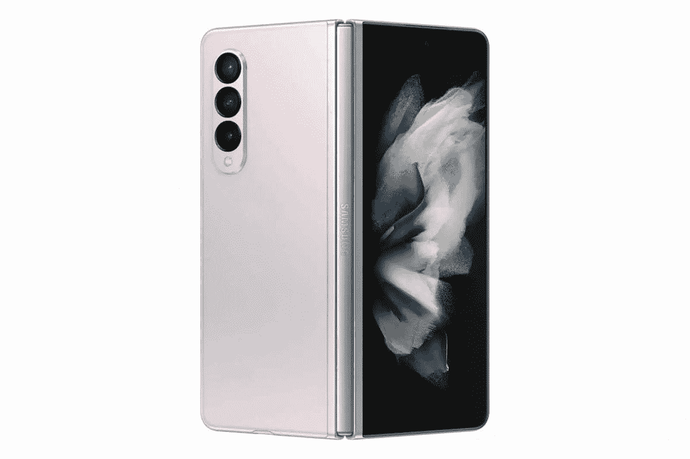

# 三星 Galaxy Z Fold 3 耐用吗？它能经受住日常使用吗？

> 原文：<https://www.xda-developers.com/samsung-galaxy-z-fold-3-durability/>

不可否认, [Galaxy Z Fold 3](https://www.xda-developers.com/samsung-galaxy-z-fold-3/) 和 [Galaxy Z Flip 3](https://www.xda-developers.com/samsung-galaxy-z-flip-3/) 是目前最有吸引力的两款智能手机，尤其是如果你喜欢拥有最新的小玩意。可折叠手机是独一无二的，在众多普通智能手机中脱颖而出。如果你打算从三星购买一款新的可折叠手机，请查看[最佳 Galaxy Z Fold 3 交易](https://www.xda-developers.com/best-galaxy-z-fold-3-deals/)，了解如何节省一些额外费用。如果你仍然在考虑是否要购买 Galaxy Z Fold 3，你怀疑的原因之一可能是耐用性。Galaxy Z Fold 3 有多耐用？能维持日常使用吗？

## Galaxy Z Fold 3:耐用性

以前的可折叠手机，不仅仅是三星的，在耐用性方面没有最好的记录。折叠式显示器非常薄，因此很脆弱。此外，手机内部的铰链等活动部件并不总是给人一种安心的感觉，更不用说折叠动作发生时通常也会有间隙。但凭借 Galaxy Z Fold 3，三星在耐用性方面做出了一些重大声明。

据三星称，Galaxy Z Fold 3 是迄今为止最耐用的可折叠手机。Galaxy Z Fold 3 在外部屏幕上使用了大猩猩玻璃 Victus，比 Galaxy Z Fold 2 上的大猩猩玻璃 6 坚固 50%。根据三星的说法，内层屏幕有一层重新设计的新保护膜，可将结构完整性提高 80%。这是最大的改进之一，因为内部显示器有更多的失败机会。Galaxy Z Fold 3 上的金属铰链和框架由一种称为装甲铝的新材料制成，比前几代产品坚固 10%。

另一个巨大的改进是防水。Galaxy Z Fold 3 通过了 IPX8 认证，这意味着它可以在 1.5 米的淡水中浸泡长达 30 分钟。请注意，三星不建议在游泳池或海滩上使用手机。这款手机防水，但不防尘，所以沙子和其他小颗粒仍然会损坏手机。

考虑到所有这些改进，可以肯定地说，新的 Galaxy Z Fold 比其前身更加耐用，并接近传统直板手机的耐用性。

## Galaxy Z Fold 3 还会出现折叠折痕吗？

不幸的是，是的。看起来这条折痕至少还会存在一年，直到三星在下一次迭代中解决它，可能是 Galaxy Z Fold 4。不过，折痕在很大程度上并不显眼。只有从某些角度看手机时，它才是可见的，对大多数人来说应该不是问题。

 <picture></picture> 

Samsung Galaxy Z Fold 3

##### 三星 Galaxy Z Fold 3

Galaxy Z Fold 3 是三星最新的可折叠手机，支持 S Pen。

虽然 Galaxy Z Fold 3 在制造质量和耐用性方面确实有所改善，但我们总是建议使用一个好的外壳来保护手机免受刮擦和跌落。