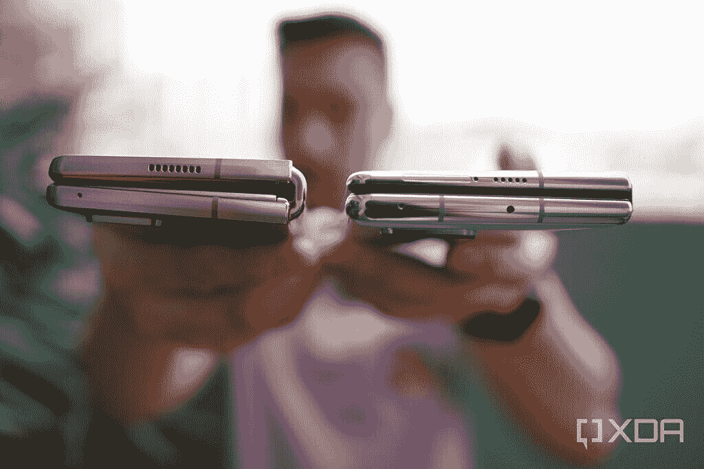
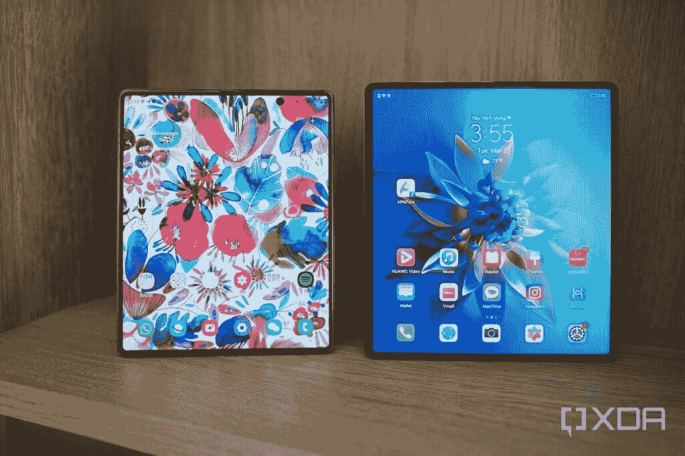
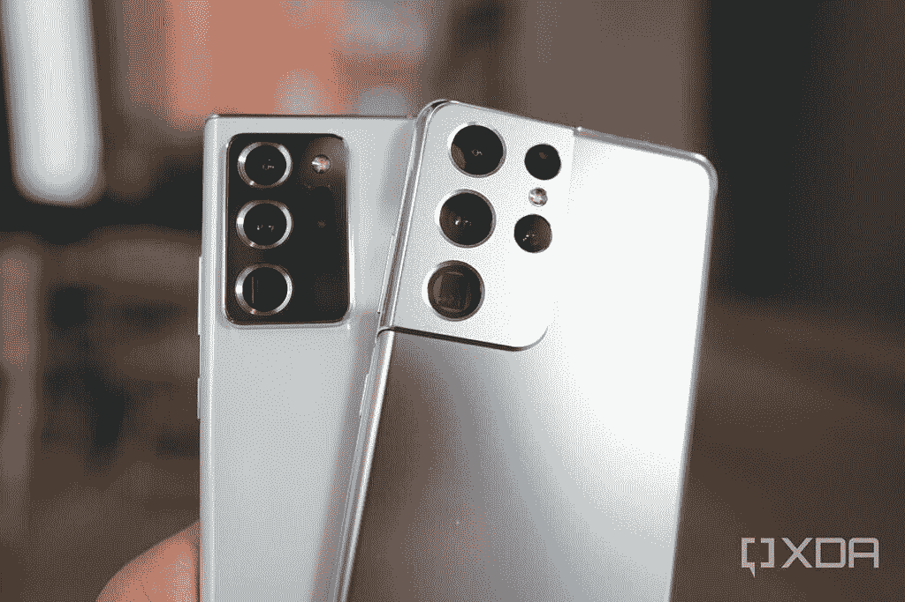
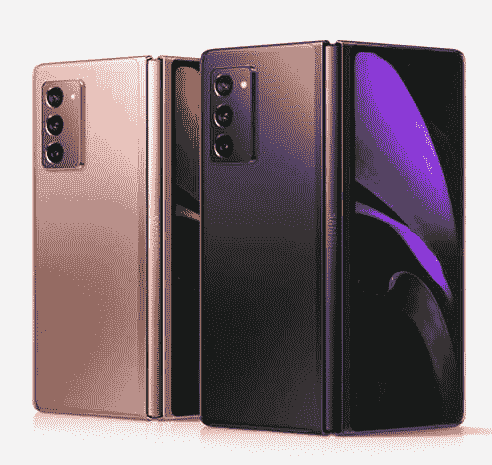

# Galaxy Z Fold 3 可能缺少一个过度杀伤的相机系统，但这可能是一个明智的举动

> 原文：<https://www.xda-developers.com/samsung-galaxy-z-fold-3-overkill-camera-system-smart-move/>

自从三星推出可折叠手机的概念以来，消费者和媒体对产品类别的看法一直存在分歧。一些人认为可折叠是未来，而另一些人认为这是一个定价过高的噱头。我从第一天起就坚定地站在前一阵营。事实上，我非常喜欢可折叠手机，在 Galaxy Fold 上市的第一周，我花了高于零售价 800 美元的价格进口了这款手机，当时这款手机只在韩国销售。当第一部华为 Mate X 供不应求时，我为它支付了类似的加价。

从那以后，我接触并广泛测试了上市的每一款可折叠手机，包括像 Royole FlexPai 2 这样真正不知名的手机。所以我认为可以说我是一个对可折叠物品的状态有着深刻见解的狂热爱好者。

目前，最令人印象深刻、最前沿的可折叠硬件是[华为 Mate X2](https://www.xda-developers.com/huawei-mate-x2-review/) ，因为它设法做了一些被认为是优秀的 [Galaxy Z Fold 2](https://www.xda-developers.com/samsung-galaxy-z-fold-2/) 的缺点。华为成功地将一个真正的旗舰相机系统(包括一个 10 倍潜望镜变焦镜头)塞进了 Mate X2，并制造了一个可以完全折叠而不留缝隙的铰链。相比之下，Galaxy Z Fold 2 的 2 倍长焦变焦镜头较弱，关闭时有明显的差距。

 <picture></picture> 

The Galaxy Z Fold 2 (left) and the Mate X2 (right) when folded.

当然，将 Mate X2 与 Galaxy Z Fold 2 进行直接比较并不公平，因为三星的设备是 2020 年的手机，而 Mate X2 是 2021 年的设备。我认为，当 Galaxy Z Fold 3 出现时，三星会将这些硬件改进融入到设备中，并夺回作为最前沿可折叠硬件的领先地位。

 <picture></picture> 

Galaxy Z Fold 2 (left), Mate X2 (right).

但到目前为止，情况似乎并非如此。感谢*非常可靠的*泄密者[埃文·布拉斯](https://twitter.com/evleaks)，Galaxy Z Fold 3 的[三星官方渲染图公开给所有人看，视觉效果显示 Galaxy Z Fold 3 在折叠时仍然留有微小的间隙，就像前两次折叠一样。相机系统似乎也不包括三星“Ultra”系列手机中使用的潜望镜变焦镜头。](https://www.xda-developers.com/galaxy-unpacked-massive-leak/)

除非这些渲染是不正确的(鉴于 Blass 无可挑剔的记录，这不太可能)，Galaxy Z Fold 3 很可能使用与标准的非 Ultra [Galaxy S21](https://www.xda-developers.com/samsung-galaxy-s21/) 手机相同的相机系统。这些相机相当不错，但与 Galaxy S21 Ultra 令人瞠目结舌的变焦能力和带大传感器的 108MP 主镜头相比就相形见绌了。

这意味着，就像去年一样，三星的可折叠旗舰产品将拥有一个*低劣的相机系统*，无法跟上三星以及华为和小米的高端平板旗舰产品中最好的相机系统。

我认为今年，选择一个更小的相机系统是一个选择。毕竟，如果华为能够设法将一个真正的旗舰相机系统塞进 Mate X2，那么三星也应该能够做到。我相信三星将选择不将其 Ultra 相机系统纳入 Galaxy Z Fold 3，因为它希望做出对普通消费者更具吸引力的*实际改进*。

三星在去年年底的一次投资者电话会议上也证实了这一点。据韩国媒体 *[The Elec](http://www.thelec.net/news/articleView.html?idxno=1948)* 报道，三星代表告诉投资者，该公司计划通过比以前“更轻更薄”来使可折叠手机“更主流”。

根据另一个化名为 Ice Universe 的可靠泄密者的说法，Galaxy Z Fold 3 可能会达到这个 T1。如果三星使用其 Ultra 相机系统，这就不可能实现，该系统迄今为止以其庞大的相机模块而闻名。

 <picture></picture> 

Samsung’s Ultra phones have bulky camera modules to house the Periscope camera and large sensor 108MP camera.

Galaxy Z Fold 3 不使用 Ultra camera 系统的另一个好处是它降低了组件成本，这应该会导致更低的价格。这也很有可能发生，因为来自韩国的另一个消息称 Galaxy Z Fold 3 的零售价格将比 Z Fold 2 低 20%。

如果所有这些泄露都是真的，Galaxy Z Fold 3 将成为 Fold 系列中最便宜和最轻的手机。这解决了对过去可折叠的三个主要抱怨中的两个。但是第三个关注点——耐用性呢？Galaxy Z Fold 3 可能也解决了这个问题，因为另一个传言表明它将[获得官方 IP 防水评级](https://twitter.com/MaxWinebach/status/1414812326054797317)。

从本质上讲，在开发 Galaxy Z Fold 3 时，三星决定扩大这款手机的吸引力，而不是进一步将其推向一个小众发烧友设备。这是一个明智的商业举措。尽管华为 Mate X2 令人印象深刻，但它 2700 美元的起步价对大多数人来说都是不可能的，即使这款手机没有谷歌的问题。三星不希望 Galaxy Z Fold 3 只吸引像我这样的疯狂手机爱好者。它希望 Galaxy Z Fold 3 拥有与 Galaxy S 手机相同的大众吸引力，所有这些变化都应该有助于它实现这一目标。

 <picture></picture> 

Samsung Galaxy Z Fold 2

##### 三星 Galaxy Z Fold 2

三星 Galaxy Z Fold 2 仍然是最佳的整体可折叠手机，具有最佳的硬件和软件组合。

在未来，我不介意将折叠产品线分为常规和专业版本，以扩大消费者和发烧友空间的可折叠产品的视野。这也将是一个明智的举动，它将为像我这样的智能手机爱好者提供我渴望的过度杀伤，同时也为希望对可折叠手机进行大胆尝试的普通用户提供更实惠和实用的选择。非专业版本甚至可以在这个过程中做出一些妥协，比如选择高端中端产品或去年的旗舰高通 SoC，而不是当前的旗舰 SoC，并在相同的外形规格下进一步降低价格。对于普通用户来说，可折叠产品需要这种多样化才能进一步成熟，成为一个可行的产品领域。但就目前而言，今年不要过分夸张。