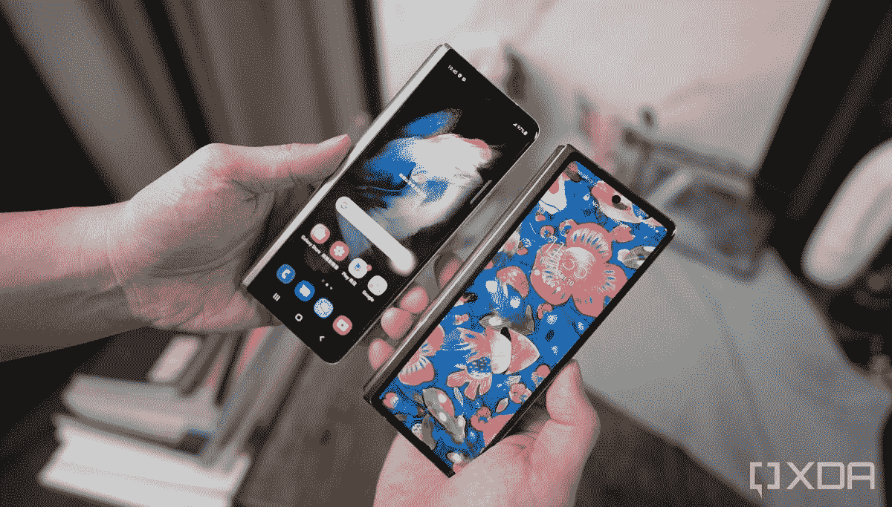

# 三星 Galaxy Z Fold 3 回顾-展现技术的未来

> 原文：<https://www.xda-developers.com/samsung-galaxy-z-fold-3-review/>

我一年中最喜欢的时间是八月或九月左右。这是我购买所有科技产品的时候——至少是手机——有点巧合的是，这也是三星推出 Galaxy Note 和/或最近推出下一代 Galaxy Z Fold 系列的时候。在过去的两年里，我买了 Galaxy Fold，在此之前的几年里，我买了 Galaxy Note。今年，我们有了 [Galaxy Z Fold 3](https://www.xda-developers.com/samsung-galaxy-z-fold-3/) 和 [Galaxy Z Flip 3](https://www.xda-developers.com/samsung-galaxy-z-flip-3/) ，后者将成为我今年最喜欢的手机(阅读我们正在进行的 [Galaxy Z Flip 3 评测](https://www.xda-developers.com/samsung-galaxy-z-flip-3-review/)了解更多)！

与 Galaxy Z Flip 3 不同——感觉像是从 Galaxy Z Flip 向前迈出的一大步 Galaxy Z Fold 3 带来的重大飞跃更少，迭代改进更多。然而，当你从一个已经是第二代的产品开始，并且绝对非常优秀的时候，这些迭代的改进会把你带到一个更好的地方。

Galaxy Z Flip 3 无疑偷走了我的心，但同样，Galaxy Z Fold 3 也是一款我离不开的设备。在三星新旗舰可折叠八天之后，这里是我们正在进行的 Galaxy Z Fold 3 评测的第一部分。

 <picture></picture> 

Samsung Galaxy Z Fold 3

##### 三星 Galaxy Z Fold 3

Galaxy Z Fold 3 是三星最新、最棒的可折叠手机。与之前的型号相比，它带来了几项改进，包括高刷新率显示器、屏幕下摄像头和顶级硬件。

## Galaxy Z Fold 3 硬件:小变化大不同

 <picture></picture> 

Fold 3 (top) and Fold 2 (bottom).

将 Galaxy Z Fold 3 与 Galaxy Z Fold 2 放在一起看，有一点很清楚:变化并不明显。是的，有很多，其中一些是第三代可折叠手机绝对需要的，但没有一个达到真正的技术飞跃的标志，即从 Galaxy Fold 到 Galaxy Z Fold 2。

然而，Galaxy Z Fold 2 已经是我用过的最精致的设备之一。在过去的 11 个月左右，它是我的第二个日常司机，也是一个我不需要以任何方式保护的司机。它融入了我的生活，改变了我使用智能手机的方式，同时也确保了我不会因为让其他一切都变得黯淡无光而转向其他东西。简而言之，它很特别，Galaxy Z Fold 3 延续了这种特别的趋势。

Galaxy Z Fold 3 是一种特殊类型的智能手机

如果你以前从未使用过 Galaxy Z Fold 系列，你绝对会喜欢上它。Galaxy Z Fold 3 近乎完美，将改变你的生活，就像最初的 Fold 对我所做的那样。如果你使用的是原来的 Galaxy Fold，这对你来说也将是一次不可思议的升级。如果你和我一样，是 Galaxy Z Fold 2 的用户，这仍然是一次不错的升级，但你可能会有点不满意。

然而，在我们进入为什么之前，让我们看看所有的改进。

最大的变化在显示屏上。它的尺寸和分辨率与去年相同，但 120Hz 刷新率的变化使 Galaxy Z Fold 3 成为绝对的使用乐趣。当我使用任何其他没有这个刷新率的手机时，与 Galaxy Z Fold 3 相比，它的屏幕感觉不和谐，不达标。特别是，华丽的主显示器以最高的刷新率看起来更好，很容易成为自己的一个类别。

Galaxy Z Fold 3 的显示屏独树一帜

封面显示器是同样华丽的 6.2 英寸显示器，看起来就像任何三星显示器一样。明亮、有力、奇妙，它可以放在世界上任何一部智能手机上。它还具有刷新率升级，这意味着无论您选择使用哪种屏幕，它都具有同等的功能。这是单手使用的正确宽度，虽然折叠时相当沉重，但它有一种坚实的手感，让人想起古老的诺基亚通讯器。

另一个特别受欢迎的改进是耐用性；特别是，IPX8 防水性能意味着 Galaxy Z Fold 3 可以承受突如其来的倾盆大雨。之前的两部 Fold 手机在第一次下雨时都让我充满了绝对的恐惧，谢天谢地，那些紧张的时刻将会被和平宁静所取代。阻止 Galaxy Z Fold 2 被用作你唯一的日常设备的最大因素之一是它对自然环境的敏感性，而增加防水性是迄今为止最受欢迎的改进之一。

对于以前没有使用过 Fold 系列的人来说，这些改进将是一个很长的列表上的附加复选标记。对于 Galaxy Z Fold 2 的用户来说，这些改进是伟大的可折叠体验的一个小演变，它最终依赖于两件主要事情:软件的小迭代改进和对 S Pen 的支持。

## Galaxy Z Fold 3 评论:软件，而不是硬件，占据了中心舞台

是的，有一些新的硬件变化，但毫无疑问，三星正在依靠其软件印章以及与开发商和主要公司的合作伙伴关系来创造一个全面的体验。

该公司已经在 Galaxy Z Fold 2 中充分完善了多任务处理等功能，因此 Galaxy Z Fold 3 的软件体验一如既往地好也就不足为奇了。拥有 Galaxy Z Fold 3 的主要原因是三星的多窗口功能，这是通过十年的 Galaxy Note 系列开发出来的，这也是它区别于其他产品的主要原因。

你可以同时运行三个应用程序，并在弹出的聊天窗口中运行更多应用程序。结果是终极的多任务处理体验，如果你曾经使用过 Galaxy Tab，你完全知道这里会发生什么。在窗口之间，您可以拖放内容，可以根据需要重新排列窗口，等等，我将在以后的文章中介绍。简而言之，三星是多任务处理之王，Galaxy Z Fold 3 是其宝座，该公司十多年来一直在打造的英雄设备。

Galaxy Z Fold 3 新增了一些 Labs 功能，可以让你调整窗口大小，并强制不支持的应用程序使用多窗口和特定分辨率，但这些功能可能会出现在老一代产品中。这就解决了一个巨大的问题，一些应用程序在可折叠内容上的体验最差，比如 Instagram，尽管它拥有最多的屏幕空间。在该公司能够让更多的开发者参与进来，为大屏幕体验进行优化之前，它希望尝试并强制应用程序，总体来说它做得不错。虽然一些应用程序肯定还在挣扎，但大多数都可以调整大小。

## Galaxy Z Fold 3s Pen:Galaxy Note 的自然进化？

至少在未来，实验室功能可能会出现在 Galaxy Z Fold 2 上，但有一个功能肯定不会是对 S Pen 的支持。实际上，支持两种不同的 S 笔，但只在主显示器上。这后一点最终抓住了我，因为我花了前 15 分钟用 S 笔试图在封面显示上使用它。

Galaxy Z Fold 3 和 S Pen 是有史以来最好的移动体验之一

为什么？这是 Galaxy Note 爱好者的自然使用案例。虽然我非常喜欢在主显示屏上使用 S Pen 的功能，但我已经非常失望，因为它没有出现在主显示屏上。鉴于离屏备忘录等功能的理想用例是使用翻盖显示屏，而不是需要打开手机，这似乎是一个疏忽，我们希望在下一代 Galaxy Z Fold(大概是明年的 Galaxy Z Fold 4)中得到解决。

用 S Pen 使用 Galaxy Z Fold 3 的主显示屏是我见过的最好的移动体验之一。像 Pen Up 这样的应用程序是为大屏幕设计的，让你能够将大屏幕作为画布来创作杰作。没有控件挡道，有足够的空间放大，同时仍然能够看到足够多的画布。

Screen write 适用于任何地方的创意专业人士，因为由于屏幕更大，您可以对页面、文档或其他项目进行更大的屏幕截图，并且仍然有足够的空间来注释您想要进行的更改。我可以想象很多专业人士会发现这个用例很有帮助，无论你是小企业主、个人、高管，甚至是公司的顾问。

Galaxy Z Fold 3 有两种 S Pen:S Pen Pro 和 S Pen Fold Edition。我在官方的 S Pen case 上使用了后者，它实际上只是一个带有 S Pen Fold Edition 外壳的皮套。外壳使用一个凹槽滑入，确保它与 Galaxy Z Fold 3 保持连接，但仍让您可以轻松拆卸外壳。如果你想让手机在打开时平放，你可以这样做。遗憾的是，没有办法确保 S Pen 留在外壳中，尽管我还没有遇到任何重大问题。

S Pen Pro 和 S Pen Fold Edition 的最大区别在于，前者可以在任何三星设备上使用——这是该公司为支持任何 S Pen 的任何设备提供的通用手写笔——而后者只能在 Galaxy Z Fold 3 上使用。S Pen Pro 还配有电池，因此可以通过蓝牙连接，用作蓝牙遥控器，并且由于板载内存，还可以在不同的 S Pen 设备之间复制和粘贴。我还没有使用过 S Pen Pro，但是一旦我使用了一段时间，我会在以后的文章中更新这篇评论。就目前而言，Galaxy Z Fold 3 和 S Pen Fold Edition 是天作之合。

## 仍然怀念那些神奇的触摸

有一个地方我预料会失望，但也确实失望了:相机的情况。虽然 Galaxy Z Fold 4 和更高版本可能会开始看到实质性的相机改进——主要是因为三星没有其他选择——但 Galaxy Z Fold 3 的相机并不惊人。它的相机硬件与 Galaxy Z Fold 2 相同，Galaxy Z Fold 2 的硬件与 Galaxy S20 相同。三个摄像头，都是 12MP，没有任何类似于大多数旗舰手机的变焦功能。

对大多数人来说，Galaxy Z Fold 3 是一项有价值的投资

这款相机与前几代相比没有太大变化，尽管自第一次出现成像以来，该行业已经走过了漫长的道路。每个人都知道那些带着 iPad 或平板电脑去婚礼拍照的人，因为他们认为更大的屏幕拍出的照片质量更好。Galaxy Z Fold 系列通过提供出色的相机体验，可以继续在价格方面获得显著的溢价。我将在下一期文章中深入探讨这款相机，但可以肯定地说，虽然它很有能力，但它不如 [Galaxy S21 Ultra](https://www.xda-developers.com/samsung-galaxy-s21/) 甚至去年的 Galaxy Note 20 Ultra。

**[银河 Z 折 3 论坛](https://forum.xda-developers.com/f/samsung-galaxy-z-fold3.12349/)**

说到溢价，Galaxy Z Fold 3 是一款昂贵的手机，但绝对物有所值。如果要在这个和 Galaxy Z Fold 2 之间选择，就买 Galaxy Z Fold 3。如果要在这款手机或普通手机之间做出选择，而这两款手机的价格存在巨大差异，那么答案仍然是购买 Galaxy Z Fold 3。但是，如果你是从 Galaxy Z Fold 2 升级到 Galaxy Z Fold 3，那么就值得考虑这些升级为你带来了多少价值。就我个人而言，我已经有了 Z Fold 2，但仍然购买了 Galaxy Z Fold 3，主要是因为增加了耐用性。能够在雨中使用 Z Fold 3 标志着它向成为我的完美手机迈出了一大步。

 <picture></picture> 

Samsung Galaxy Z Fold 3

##### 三星 Galaxy Z Fold 3

Galaxy Z Fold 3 是三星最新、最棒的可折叠手机。与之前的型号相比，它带来了几项改进，包括高刷新率显示器、屏幕下摄像头和顶级硬件。