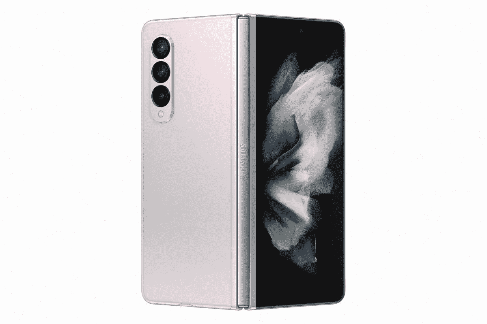

# 三星 Galaxy Z Fold 3 防水吗？它防水吗？

> 原文：<https://www.xda-developers.com/samsung-galaxy-z-fold-3-waterproof/>

三星刚刚结束了今年最大的活动，我们在 Galaxy Unpacked 2021 上看到了一些令人兴奋的新设备。该公司已经正式公布了新的 [Galaxy Z Fold 3](https://www.xda-developers.com/samsung-galaxy-z-fold-3/) 、 [Galaxy Z Flip 3](https://www.xda-developers.com/samsung-galaxy-z-flip-3/) 、 [Galaxy Buds 2](https://www.xda-developers.com/samsung-galaxy-buds-2/) 、 [Galaxy Watch 4 系列](https://www.xda-developers.com/samsung-galaxy-watch-4/)。Z Fold 3 是最受期待的产品，从外观上看，新的可折叠产品在设计方面非常精致，并包含一些非常好的硬件。

Galaxy Z Fold 3 配备了与 Galaxy Z Fold 2 类似大小的显示屏，这意味着你得到了 6.2 英寸的外部显示屏，而你得到了 7.6 英寸的内部折叠显示屏。然而，Z Fold 3 上的两个显示器现在都支持动态 AMOLED 2X 面板，支持 120Hz 的刷新率。内部显示屏也支持 S Pen，虽然三星不打算随智能手机一起发货，但你可以单独购买一个。

至于设计，整体尺寸或多或少是相同的，与它的前身相比，它的重量轻了一点。总的来说，它看起来好了很多，摄像头模块看起来干净一致，边角似乎更圆。三星使这款手机更加耐用，并在外部使用康宁大猩猩 Victus 的“装甲铝”，据称这是三星智能手机上最坚固的铝框架。

**Galaxy Z Fold 3 还具有防水功能，具有 IPX8 等级。**三星表示，Galaxy Z Fold 3 和 Z Flip 3 是世界上第一款防水的折叠智能手机，可以承受 1.5m 的淡水 30 分钟。这应该会让用户安心一些，尤其是当一个人在智能手机上花了这么多钱的时候。然而，请注意，小字说明仍然不建议在海滩上使用，因为这些手机无论如何都不具备防尘功能-防尘 IP 等级为“X”，表示“不适用”。

 <picture></picture> 

Samsung Galaxy Z Fold 3

##### 三星 Galaxy Z Fold 3

三星最新的 Galaxy Z Fold 3 配备了强大的硬件以及设计部门的改进，包括 IPX8 防水等级。

新款 Galaxy Z Fold 3 将于 2021 年 8 月 11 日开始接受预购，起价为 1799 美元。请确保您也查看了 Galaxy Z Fold 3 的[最佳交易](https://www.xda-developers.com/best-galaxy-z-fold-3-deals/)和[最佳案例](https://www.xda-developers.com/best-samsung-galaxy-z-fold-3-cases/)，以保护智能手机免受碰撞和刮擦。