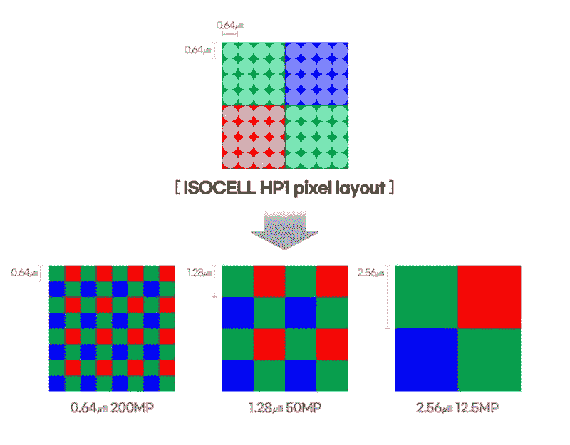
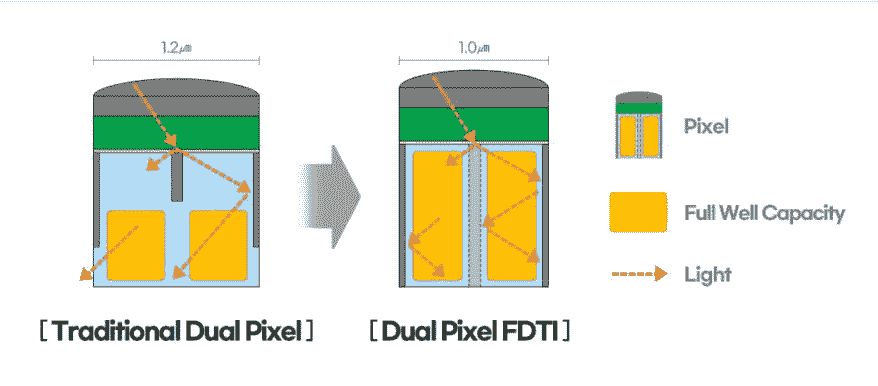

# 三星 isocell hp1 是一款 200mp 智能手机摄像头传感器

> 原文：<https://www.xda-developers.com/samsung-isocell-hp1-200mp-sensor-smartphones/>

在 6 月份推出业界首款 0.64μm 移动图像传感器 [ISOCELL JN1](https://www.xda-developers.com/samsung-isocell-jn1-sensor/) 之后，三星现在推出了首款 200MP 智能手机摄像头传感器。新的三星 ISOCELL HP1 也是基于三星的 0.64μm 大小的像素，它在一个小封装中提供了超高的分辨率。

三星 ISOCELL HP1 承诺终极低光性能，这要归功于全新的 ChameleonCell 像素宁滨技术。这允许传感器根据环境使用二乘二、四乘四或全像素布局。在弱光条件下，ISOCELL HP1 可以将 16 个相邻像素合并为一个 2.56μm 的大像素，提供 12.5MP 的有效分辨率。更大的像素有助于传感器捕捉更多的光，并拍摄更亮的照片。

 <picture></picture> 

Samsung ISOCELL HP1 pixel layout

就视频功能而言，ISOCELL HP1 可以以 30fps 的速度捕捉 8K 视频，视野损失最小。该传感器合并了四个相邻的像素，将有效分辨率降至 50MP，允许 8K 视频捕捉，而无需裁剪或缩小完整的图像分辨率。

除了 ISOCELL HP1，三星还宣布了 ISOCELL GN5。这是业界首款集成双像素 Pro 的 1.0μm 传感器，是一种全方位自动对焦技术。据三星称，这项技术*“在传感器的每个 1.0μm 像素内水平或垂直放置两个业界最小的光电二极管，以识别所有方向的模式变化。100 万个相位检测多方向光电二极管覆盖传感器的所有区域，ISOCELL GN5 的自动聚焦变得即时，在明亮或昏暗的环境下都能获得更清晰的图像。"*

 <picture></picture> 

Samsung ISOCELL GN5 Dual Pixel FDTI

ISOCELL GN5 还使用了三星专有的像素技术，该技术在行业内首次在双像素产品上应用了前深沟槽隔离(FDTI)。这项技术允许每个光电二极管吸收和保存更多的光信息，提高其全阱容量(FWC)并降低像素内的串扰。

目前，三星尚未透露我们何时可以在智能手机上看到这些新传感器的任何信息。该公司可能会在其即将推出的旗舰 Galaxy S22 系列中提供 ISOCELL HP1，但我们现在没有任何具体的证据指向这一点。一旦我们了解到更多情况，我们会尽快通知您。