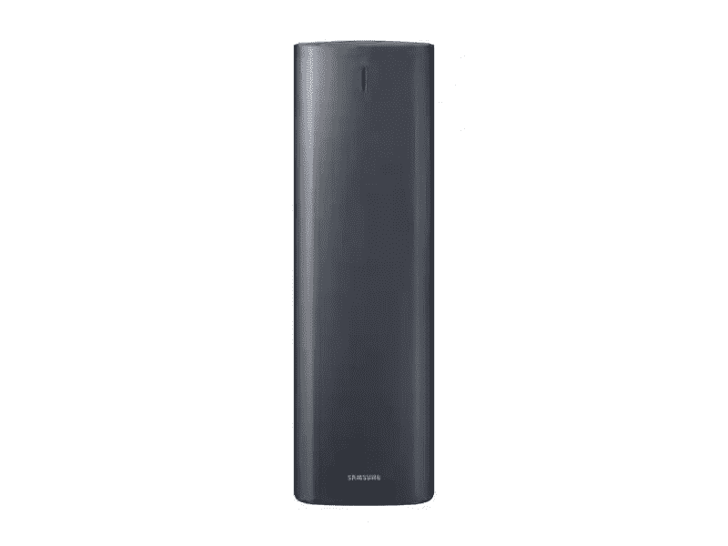

# 三星探索周当天的交易是三星 Jet 70 的 50%折扣！

> 原文：<https://www.xda-developers.com/samsung-jet-70-discover-week/>

终于春天了！天气转暖，现在终于到了打开窗户，卷起袖子，大扫除的时候了。当几天前的 [Air Dresser](https://www.xda-developers.com/samsung-air-dresser-discover/) 帮你整理衣服时，是时候用三星 Jet 70 和 Clean Station 清理你的房子了。

仅在今天，您就可以在三星 Jet 70 和三星 Clean Station 上享受 50%的优惠！如果你没有无绳吸尘器，相信我，你就错过了。虽然我没有 Jet 70，但我喜欢我的无绳吸尘器。大多数真空吸尘器都很重，很难找到其体积和电线之间的偏僻位置。这些吸尘器可以把你带到任何你需要的地方。

三星 Jet 70 就是这么做的。用这款吸尘器和附带的附件清洁地毯、地板，甚至天花板。真空吸尘器一次充电大约需要 40 分钟，足够多个房间使用，如果不是所有房间的话。你甚至可以将簸箕放入洗碗机中清洗。今天只有 Jet 70 才 200 美元。

说到清洁，三星清洁站也是半价。这种设备不仅能自动将三星 Jet 70 的垃圾桶，还能过滤空气，确保更少的灰尘回到空气中。非常好！这很简单，但很有效，清洁站目前只需 100 美元。

与所有三星发现周交易一样，这仅在当天结束前有效，所以不要延迟！如果你想要或需要这些，你现在就可以订购。

 <picture></picture> 

Samsung Jet 70 Cordless Vacuum

##### 三星 Jet 70 无绳真空吸尘器

使用三星 Jet 70 无绳吸尘器清洁任何地方的任何东西！作为三星探索周活动的一部分，您可以节省 50%的费用，仅限今天。

 <picture></picture> 

Samsung Clean Station

##### 三星清洁站

使用三星清洁站清洁 Jet 70，确保灰尘不会回到空气中。只有今天，它是五折的。

如果你想看到所有的三星发现周交易，请查看下面的交易页面。明天再来查看当天的下一笔交易！

 <picture></picture> 

Samsung Discover Week

##### 三星 Jet 70 无绳真空吸尘器

前往三星商店，看看这家零售商本周出售的所有商品。