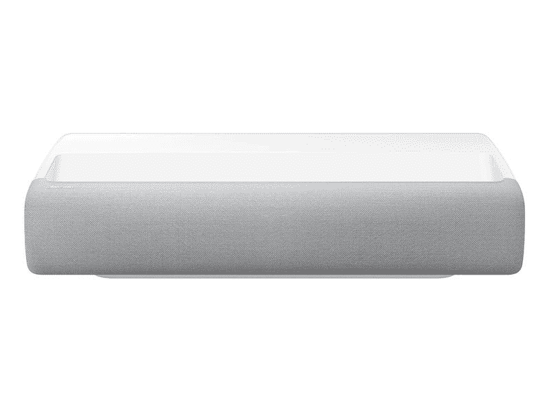

# 三星劳动节销售 2022:节省大量的电视，音箱，家电，等等！

> 原文：<https://www.xda-developers.com/samsung-labor-day-sale-tv-soundbar-home-appliances/>

三星宣布了其即将到来的劳动节储蓄活动，届时它将为其最新的可折叠产品提供一些[惊人的折价交易。此外，该公司还将对许多其他产品提供有吸引力的折扣，包括其 Neo QLED 8K 和 4K 电视、奥德赛游戏显示器、Q 系列条形音箱，甚至一些家用电器。如果你已经购买了三星最新的可折叠产品，并在市场上购买新电视、音箱或机器人吸尘器，你绝对应该看看以下三星 2022 年劳动节的交易。](https://www.xda-developers.com/samsung-labor-day-sale-galaxy-z-fold-4-galaxy-z-flip-4/)

## 三星电视、音箱和游戏显示器的劳动节优惠

在劳动节活动期间，购买三星 Neo QLED 8K 和 Neo QLED 4K 电视最高可节省 1500 美元。此外，三星的 65 英寸户外 QLED 4K 智能电视(被称为 Terrace)将在 8 月 29 日周一至 9 月 4 日周日期间提供最高 3000 美元的折扣。

 <picture></picture> 

Samsung Neo QLED 8K TV

##### 三星 QN900B 65 英寸 8K QLED 电视

三星的 Neo QLED 8K 电视折扣高达 1500 美元，可节省大量费用。

寻找能提供更多屏幕空间的东西？你可能想看看三星的“首款”LSP7T 4K 智能激光投影仪。超短焦投影仪有两种型号，120 英寸和 130 英寸，通常售价为 3500 美元和 6500 美元。但是，在劳动节期间，你可以以 3000 美元的价格买到 120 英寸的机型，以 5500 美元的价格买到 130 英寸的机型。

 <picture></picture> 

Samsung The Premiere 4K Smart Laser Projector

##### 三星首款 4K 激光投影仪(2020 年)

在劳动节节约活动期间，购买三星的超短焦 4K 智能激光投影仪可节省高达 1000 美元。

如果你想在购买电视/投影仪的同时拥有一个出色的音响系统，你还可以在三星的 Q 系列 soundbar 系列上节省一大笔钱。三星将在 9 月 5 日(周一)至 9 月 11 日(周日)期间为所有型号的产品提供高达 300 美元的折扣。最后，在活动期间，你可以在 49 英寸三星奥德赛 G9 游戏显示器上为[节省高达 400 美元。](https://shop-links.co/1784026082392159814?u1=d36c2383-efd3-4b76-8af0-f46b61360cce)

## 三星家电劳动节优惠

三星的劳动节节约活动还将包括一些大型家用电器的惊人交易，如冰箱、洗碗机、机器人吸尘器等。点击以下链接，节省这些产品的费用:

你是否喜欢其中的一些交易，并计划将价值 2999 美元或更多的产品带回家？三星将为您的购买额外提供 10%的折扣。当你购买三件或更多物品时，同样的优惠也适用。

*在劳动节节约活动期间，您打算购买哪些三星产品？请在下面的评论区告诉我们。*