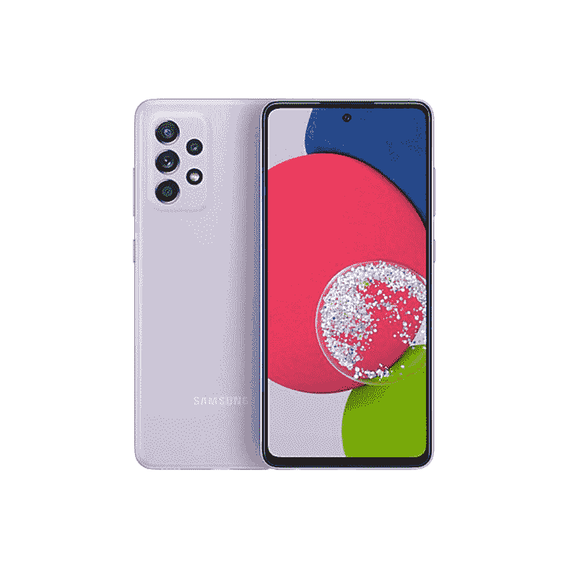

# 三星 Galaxy A52s 搭配骁龙 778G 在英国上市

> 原文：<https://www.xda-developers.com/samsung-launches-galaxy-a52s-5g/>

**更新(****09/01/2021****@****03:16****ET):**银河 A52s 5G 已经来到了印度。滚动到底部了解更多信息。下面保留了 2021 年 8 月 18 日发表的文章。

三星在今年 3 月推出了 Galaxy A52 5G 和 4G，六个月后，这家韩国智能手机制造商将对阵容进行中期更新。正如命名惯例所表明的那样，新的 Galaxy A52s 与现有型号没有太大的不同。它保留了相同的设计语言和尺寸，并与 Galaxy A52 5G 有许多相似的硬件。Galaxy A52s 的不同之处在于 SoC 和充电部门，因为它配备了更快的芯片组和充电器。

正如在[之前的泄露](https://www.xda-developers.com/samsung-galaxy-a52s-design-colors-leaked/)中看到的，Galaxy A52s 上的显示屏与 A52 5G 上的显示屏是相同的 6.55 英寸 AMOLED 120Hz 面板。相机也是如此，该设备包装了一个四摄像头设置，包括一个 64MP 主摄像头，一个 12MP 超宽摄像头，以及两个 5MP 深度和宏观传感器。但令人兴奋的部分来了:Galaxy A52s 取代了骁龙 750G，支持更快的[骁龙 778G](https://www.xda-developers.com/qualcomm-snapdragon-778g/) 芯片组，配备 4 个 ARM Cortex-A78 衍生的 Kyro 性能核心，Adreno 642L GPU 和骁龙 X53 调制解调器。举例来说，骁龙 778G 的 CPU 和 GPU 性能比骁龙 768G 快 40%，因此这是一个相当大的性能提升。

第二次升级是以更快的 25W 充电器的形式出现，比三星目前与 Galaxy A52 5G 和 4G 设备捆绑的不那么快的 15W 充电器更上一层楼。但除此之外，我们正在寻找一个非常熟悉的封装，包括 4500 毫安时电池、IP67 防水和防尘保护、显示指纹扫描仪、NFC 和 3.5 毫米音频插孔。

## 定价和可用性

三星 Galaxy A52s 5G 将于 8 月 24 日开始在英国接受预购，正式销售将于 9 月 3 日开始。这款手机单独的 6GB/128GB 版本售价为 410 英镑，将有四种颜色可供选择——炫白、炫黑、炫紫和炫薄荷。三星尚未透露任何在其他市场推出这款手机的计划。

* * *

## 更新:三星 Galaxy A52s 5G 在印度上市

三星今天在印度推出了 Galaxy A52s 5G。这款设备上个月在英国发布，采用了高通骁龙 778G 芯片，120Hz AMOLED 显示屏和 64MP 四摄像头设置。

Galaxy A52s 5G 将从今天开始通过三星的网站、线下零售店和领先的电子商务网站销售。6GB+128GB 版本在₹35,999 定价，8GB+128GB 版本在₹37,499 定价。两种款式都有三种配色——浅紫色、黑色和白色。如果你在市场上寻找一款新的中端手机，它提供了一些高级功能，如出色的显示屏和出色的摄像头，你可以通过下面的链接订购 Galaxy A52s 5G。

 <picture></picture> 

Samsung Galaxy A52s 5G

##### 三星 Galaxy A52s 5G

三星 Galaxy A52s 5G 是一款中档手机，内置骁龙 778G 芯片，120Hz AMOLED 显示屏和四摄像头设置。