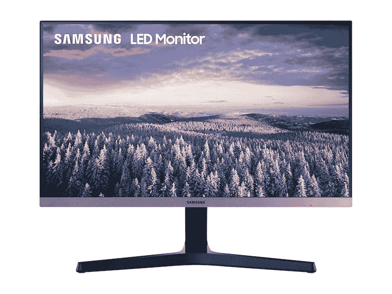

# 作为新年促销的一部分，购买三星显示器可节省高达 40%的费用

> 原文：<https://www.xda-developers.com/samsung-monitors-new-year/>

圣诞优惠？那是旧闻了。让我们改庆祝新年吧！三星商店领先于竞争对手，甚至在圣诞节之前就开始了新年销售！无论如何，你现在有机会利用这些交易！除了一笔不错的 [Galaxy Z Fold 2 折价交易](https://www.xda-developers.com/best-galaxy-z-fold-2-deals/)之外，这次销售中最令人印象深刻的交易之一？三星显示器节省高达 40%的费用！

就像他们的电视产品一样，你知道三星显示器总体上是高质量的。随着新年大减价，各种各样的显示器也在打折，所以不管你在找什么，你都能找到合适的。

引起我注意的显示器是简单的 24 英寸 SR24R 显示器。我不太喜欢大的超宽屏幕，更喜欢两个屏幕相邻，我可以根据需要倾斜。我喜欢两台显示器之间的物理边界！不过，不管你是想要一台还是两台显示器，SR24R 作为新年促销的一部分只要 100 美元。对于能够完成工作的基本显示器来说，可以节省 50 美元！

当然，也有超宽三星显示器出售。流行的 CHG90 QLED 游戏显示器便宜 150 美元，所以你可以花 750 美元买到它。这款曲面 HDR 显示器具有 1 毫秒的响应时间和 144Hz 的刷新率，因此您知道您会物有所值。

有十六种不同的三星显示器出售。如果上面两个不合你的口味，为什么不看看所有的选择呢？

 <picture></picture> 

Samsung Monitor Sale

##### 三星 CHG90 QLED 游戏显示器

三星有各种各样的显示器出售！从超宽游戏显示器到简单的生产力显示器，您一定会找到适合您需求的产品。

这些显示器销售只是[三星商店新年销售](https://shop-links.co/1727200874165851825?u1=f9ecd2a1-f0bc-4e54-a909-06179e2469bb)的一部分，所以一定要查看他们的交易页面，了解手机、电视和更多产品的折扣！