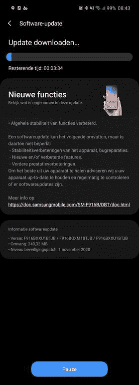

# 三星 Galaxy Z Fold 2 接收 2020 年 11 月安卓安全补丁

> 原文：<https://www.xda-developers.com/samsung-november-2020-security-patch-galaxy-z-fold-2/>

除了谷歌的通用 [Android 安全公告](https://source.android.com/security/bulletin) (ASB)，三星还维护了一个单独的公告，用于评估任何实际或潜在的安全漏洞对其生态系统的影响。快速浏览一下[三星的移动安全门户](https://security.samsungmobile.com/securityUpdate.smsb)就能发现所有已披露的安全漏洞，这些漏洞影响了闭源供应商组件、Android 中的底层 Linux 内核以及该公司迄今为止已经修复的各种操作系统框架。在撰写本文时，最新的每月安全补丁级别(SPL)仍然在谷歌和三星的公告中列出为 2020 年 10 月，但韩国 OEM 已经开始在一些地区为 Galaxy Z Fold 2 推出 2020 年 11 月的安全补丁。

**[三星 Galaxy Z 折 2 XDA 论坛](https://forum.xda-developers.com/samsung-galaxy-z-fold-2)**

新 build 的版本号为 **F916BXXU1BTJB** ，意为 Galaxy Z Fold 2 的全球变种(型号 **SM-F916B** )。增量更新包的大小约为 350MB，FOTA 目前在许多欧洲国家可用，包括但不限于德国和北欧地区。

 <picture></picture> 

Credit to XDA Senior Member [henklbr](https://forum.xda-developers.com/member.php?u=1586120) for the screenshot!

除了提升 Android 安全补丁级别，新版本还更新了 Galaxy Z Fold 2 的股票相机应用程序。但是，引导装载程序版本保持不变。因此，即使安装了此更新，用户理论上也可以执行降级并恢复到旧版本。我们仍然建议谨慎行事。

一如既往，OTA 更新正在批量推出。您可能需要等待几天，更新通知才会在您的设备上弹出。然而，如果你习惯于手动刷新，你可以跳过队列，使用像 [Frija](https://forum.xda-developers.com/s10-plus/how-to/tool-frija-samsung-firmware-downloader-t3910594) 或 [Samloader](https://www.xda-developers.com/samloader-download-updates-samsung-galaxy/) 这样的工具直接从三星更新服务器下载适合你的设备版本的固件。

三星继续以相当快的速度推出令人印象深刻的安全更新，通常先于谷歌。有关每月安全补丁的更多信息，[请务必阅读我们关于每月补丁流程如何工作的概述](https://www.xda-developers.com/how-android-security-patch-updates-work/)。