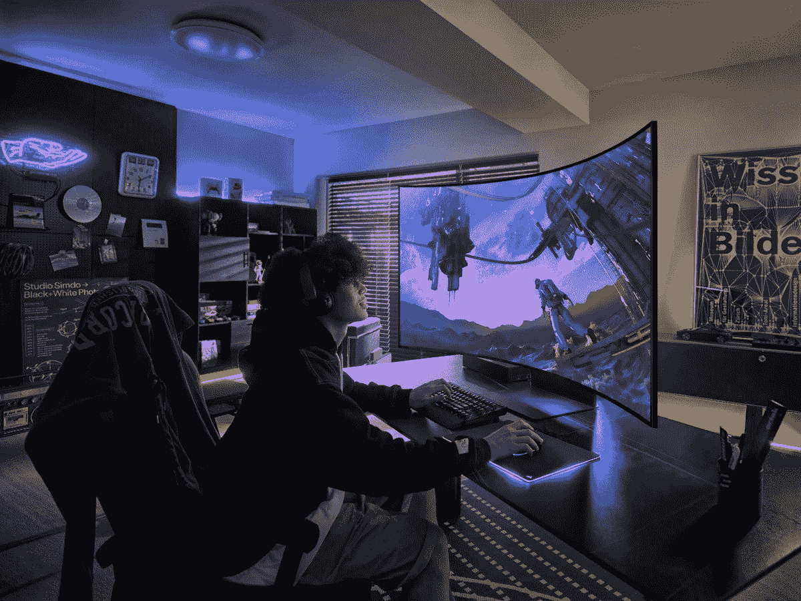

# 三星奥德赛方舟现在可以购买

> 原文：<https://www.xda-developers.com/samsung-odyssey-ark-now-avaialble-to-buy/>

三星的 55 英寸 1000R 曲面[奥德赛方舟显示器](https://www.xda-developers.com/samsung-odyssey-ark/)经过短暂的预订期后，现在可以以 3500 美元的价格购买。该显示器首次在 CES 2022 上亮相，并因其巨大的尺寸和垂直旋转的能力而成为头条新闻。目前在 Samsung.com、亚马逊和百思买都有售。

对于价格，有很多潜在买家可能会喜欢，即使这可能不是日常游戏玩家的设置。该显示器的超高清分辨率为 3，840 x 2，160，响应时间为 1 毫秒，并支持 AMD FreeSync Premium Pro。更重要的是，它还具有 165Hz 的刷新率，适合快节奏的游戏。在显示技术上，奥德赛方舟使用了三星的量子矩阵迷你 LED，创造出令人惊叹的逼真画质。它还搭配了哑光显示技术，增加了防眩光和防反射功能。

不过，奥德赛方舟的标志性特征是所谓的“驾驶舱模式”在这种模式下，整个显示屏会垂直旋转，允许您轻松查看网页等垂直内容，或者使用三星的多视图选项将各种窗口堆叠在一起。这可以通过走到显示器后面并使用高度可调支架来实现。还提供了一种灵活的移动屏幕模式，允许您调整提要的屏幕大小，并在 55 英寸的显示屏上随意移动。

由于这是一款奥德赛品牌的显示器，你会发现像三星游戏中心这样的功能，它可以让你进入 Xbox 云游戏，Nvidia GeForce now 和其他流媒体服务。三星在包装盒中包括一个“方舟转盘”，它有助于菜单导航，以获得该功能，并改变显示器上的各种设置。这是对 One Connect Box、遥控器和 HDMI 2.1 电缆的补充。

 <picture></picture> 

Samsung Odyssey Ark

##### 三星奥德赛方舟

三星奥德赛方舟是世界上第一款 55 英寸 1000R 旋转曲面游戏屏幕

**来源:** [三星](https://news.samsung.com/us/samsung-odyssey-ark-is-now-available/)