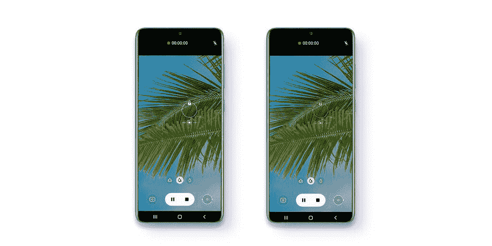

# Galaxy S20 和 Note 20 系列将推出一个 UI 3.1 更新

> 原文：<https://www.xda-developers.com/samsung-one-ui-3-1-update-galaxy-s21-features-older-smartphones/>

One UI 3.1 是三星定制皮肤的最新版本。它在 [Galaxy S21](https://www.xda-developers.com/samsung-galaxy-s21/) 系列中首次亮相，[随后在](https://www.xda-developers.com/samsung-galaxy-tab-s7-android-11-one-ui-3-1/)Galaxy Tab S7、Tab S7 Plus 和 [Galaxy S20 FE](https://www.xda-developers.com/samsung-galaxy-s20-fe-one-ui-3-1-update/) 中亮相。但三星并没有止步于此，它将一个用户界面的最新风格带到了更多的 Galaxy 手机上，包括 Galaxy S20 系列、Galaxy Note 20 系列、Galaxy Z Fold 2、Galaxy S10 等。

三星[在新闻稿中证实](https://www.samsungmobilepress.com/pressreleases/samsung-one-ui-3-1-update-brings-select-powerful-features-from-the-galaxy-s21-to-the-galaxy-s20-galaxy-note20-and-galaxy-z-series)已经开始向以下 Galaxy 设备推出稳定的 One UI 3.1:

*   银河 S20
*   银河 S20+
*   银河 S20 Ultra
*   Galaxy Note 20
*   Galaxy Note 20 Ultra
*   银河 Z 折 2
*   Galaxy Z 翻转
*   银河 S10
*   Galaxy Note 10
*   星系褶皱
*   银河 A71
*   A51 银河
*   银河 A90
*   银河 A80
*   银河 A70
*   银河 A50

One UI 3.1 并不是 One UI 3.0 的实质性升级，但它确实为相机体验带来了一些漂亮的补充。首先，有一个更新的单次拍摄功能，除了每秒捕捉更多帧，现在还可以让你拍摄慢动作片段。另一方面，对象橡皮擦可以轻松地从图像中删除不需要的对象，您只需点击您想要删除的区域或对象，该功能就会自动为您删除。

 <picture></picture> 

Object Eraser

然后是触摸自动对焦和自动曝光控制器，允许你在点击照片之前，只需在屏幕上向左或向右滑动即可调整焦距和编辑亮度。

 <picture></picture> 

Touch autofocus and exposure adjustment feature

除了以相机为中心的改进，One UI 3.1 还具有新的眼部舒适防护功能，该功能建立在之前的蓝光滤镜功能基础上。它现在有一个新的自适应模式，可以根据一天中的时间自动调整显示器发出的蓝光量。

要了解更多关于 One UI 3.1 的新功能，请务必[查看我们对新软件的深入评论](https://www.xda-developers.com/samsung-one-ui-3-1-features-changes/)。

**[One UI 3.1 vs One UI 3.0:以下是三星增加的新功能](https://www.xda-developers.com/samsung-one-ui-3-1-features-changes/)**

三星表示，新的 One UI 3.1 更新将从今天开始推广到上述设备。要检查 Galaxy 设备上的更新，请进入“设置”>“关于设备”>“软件更新”。