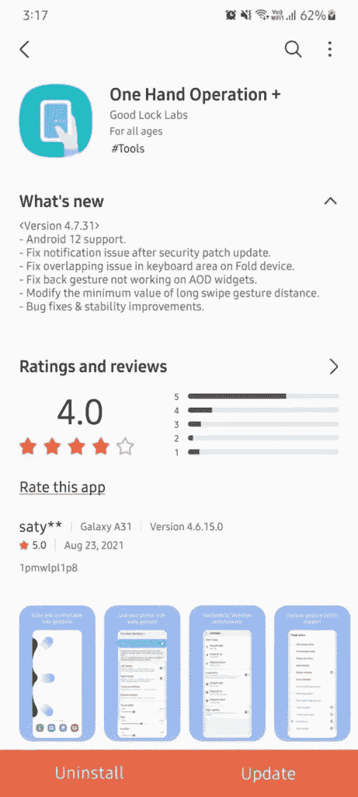

# 三星基于 Android 12 的 One UI 4.0 测试版可能很快就会推出

> 原文：<https://www.xda-developers.com/samsung-one-ui-4-0-beta-imminent/>

我们离 [Android 12](https://www.xda-developers.com/android-12/) 的公开发布已经不太远了。虽然一加、华硕、OPPO、中兴等原始设备制造商已经为其精选旗舰机型推出了 Android 12 测试版，但三星尚未加入 Android 12 测试版的行列。但看起来为 [Galaxy S21 系列](https://www.xda-developers.com/samsung-galaxy-s21/)推出基于 Android 12 的 One UI 4.0 测试版应该不会太远。

正如 [*SamMobile*](https://www.sammobile.com/news/time-to-get-excited-samsung-one-ui-4-0-beta-could-be-here-soon/) 所发现的，三星已经开始更新其一些第一方应用程序以支持 Android 12，暗示即将发布一个 UI 4.0 测试版。该公司最近在 Galaxy Store 上推出了单手操作+应用程序的更新，在其他变化中，最新的更新添加了 Android 12 支持。

 <picture></picture> 

Screenshot courtesy: *SamMobile*

这一消息是在三星[上个月在一个论坛帖子中正式确认](https://www.xda-developers.com/samsung-one-ui-4-beta-galaxy-s21/)基于 Android 12 的 One UI 4 beta 将用于 [Galaxy S21、Galaxy S21 Plus 和 Galaxy S21 Ultra](https://www.xda-developers.com/samsung-galaxy-s21/) 之后发布的。当时，该公司表示，用户可以通过注册三星会员应用程序来参与测试计划。然而，测试版推出的具体日期尚未公布。

另外，三星韩国(通过 [*Tizen Help*](https://www.tizenhelp.com/one-ui-4-0-beta-for-galaxy-s21-will-start-from-september/) )上个月末发布的一条横幅透露，该公司计划在 9 月至 10 月期间为 Galaxy S21 系列推出 Android 12 beta。

随着两周前推出的测试版 4，Android 12 达到了平台稳定性。这意味着谷歌已经完成了 API 和行为的改变，Android 12 的最终版本应该不会与我们现在的版本有太大的不同。

根据传言，One UI 4.0 将提供一些大的 UI 变化，包括更新的图标和颜色以及 Android 12 的材料元素。据称，此次更新还将为骁龙 888 和 Exynos 2100 驱动的设备带来优化，同时也改善了三星 Knox 和三星 Notes 应用程序。