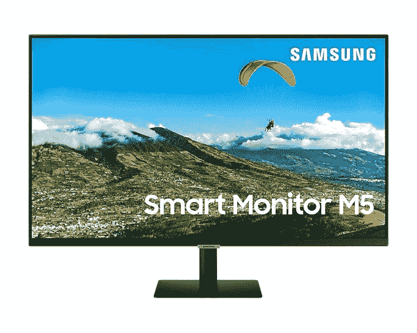
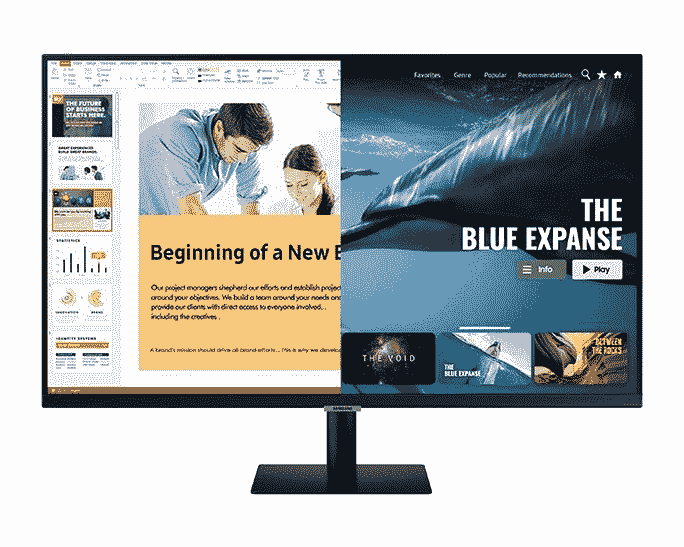

# 内置 OTT 应用和 Dex 的三星智能显示器在印度发布

> 原文：<https://www.xda-developers.com/samsung-smart-monitor-india-launch/>

随着疫情改变我们的生活和工作方式，三星在印度推出了一系列新的智能显示器。除了移动和 PC 连接选项之外，这些都带有内置应用程序。“全能”显示器包括网飞、YouTube、Apple TV 等应用程序，同时提供远程连接 PC 和使用微软 365 编辑文档的能力。

这些显示器配备了三星的 Smart Hub，建立在基于 Tizen 的智能电视平台上，并提供 OTT 内容。同时，这些显示器可以连接到笔记本电脑或台式电脑，您甚至可以通过 [Samsung DeX](https://www.xda-developers.com/galaxy-s21-wireless-support-samsung-dex-on-pc/) 连接三星智能手机。据[三星](https://news.samsung.com/in/samsung-launches-the-worlds-first-do-it-all-smart-monitor-for-work-learn-and-play-at-home)称，这些显示器配有三面无边框显示屏，采用先进的眼部舒适技术来减轻疲劳，无闪烁技术来消除任何屏幕闪烁，以及护眼模式来最大限度地减少发出的蓝光。

 <picture></picture> 

Samsung Smart Monitor M5 27-inch

"*疫情改变了我们的生活方式，工作、教育和娱乐已经转变为以家庭为中心的活动。如今，消费者看重那些既方便又能让他们无缝进行多任务处理的产品。在三星，我们相信带来有影响力的创新，我们新的智能显示器就是一个例子。消费者不再需要为各种用途在不同的屏幕之间进行选择，因为 Smart Monitor 将所有功能整合在一起，并提供了从工作和学习到娱乐的平稳过渡的灵活性*，”三星印度消费电子企业业务副总裁 Puneet Sethi 说道。

 <picture></picture> 

Samsung Smart Monitor M7 32-inch

新的三星智能显示器系列有两种型号——M7 配备了 32 英寸屏幕尺寸的 4K UHD 分辨率，以及支持 32 英寸和 27 英寸屏幕尺寸的全高清分辨率的 M5。根据官方规格，M7 和 M5 都采用 VA 面板，亮度为 250 尼特，并支持 HDR10。这些带有两个 HDMI 2.0 端口(一个支持 ARC)和两个 USB Type-A 端口。4K 型号配有三个 USB Type-A 端口和一个 USB-C 端口，可进行 65W 充电。有内置的 Wi-Fi 5 和蓝牙 4.2 以及内置的 10W 扬声器。你也可以使用遥控器内置的麦克风发出语音命令，尽管三星只列出了 Bixby 和 SmartThings，所以这里没有 Alexa 或谷歌助手。

这些产品将于 4 月 9 日开始在印度₹28,000 通过三星官方在线商店 Samsung Shop、亚马逊和所有领先的零售店销售。这款智能显示器将在有限的时间内以₹21,999 的入门价格出售。

 <picture></picture> 

Samsung Smart Monitor M5 27-inch

##### 三星智能显示器 M5 27 英寸

三星的新智能显示器系列兼作娱乐中心，这是最实惠的选择。

 <picture></picture> 

Samsung Smart Monitor M5 27-inch

##### 三星智能显示器 M5 27 英寸

M5 系列下的 32 英寸型号提供了与较小版本相同的功能，但屏幕更大。

 <picture></picture> 

Samsung Smart Monitor M7 32-inch

##### 三星智能显示器 M7

三星新智能显示器 M7 系列下的 32 英寸型号提供了更高的 4K UHD 分辨率和更多的 USB 端口。