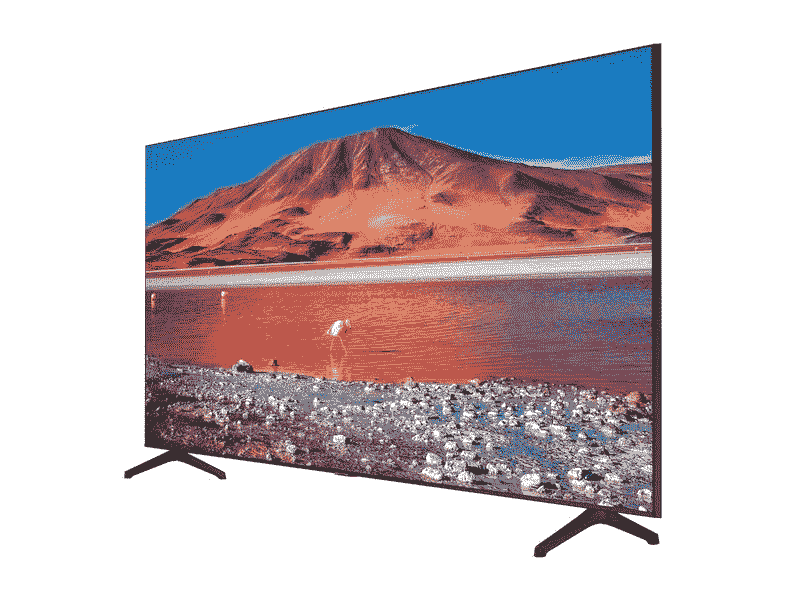

# 三星商店电视销售继续，4K 和 8K 台打折！

> 原文：<https://www.xda-developers.com/samsung-store-tv-deals/>

如果我必须诚实，我总是不喜欢试图在黑色星期五和网络星期一寻找一个新的电视。是的，有很多特价商品，但要找到一台符合我的空间和其他要求的电视，要走遍所有的零售商和所有的交易，实在是太难了。如果我最终找到了那台电视，它也很有可能会卖光，以疯狂的价格出售大约五分钟。买这么大一笔东西时，我宁愿慢慢来。谢天谢地，三星理解，他们的[三星商店电视销售](https://shop-links.co/1725418294055480758?u1=b039aaff-94c0-438c-89a5-efd1350392eb)继续，提供各种电视机的黑色星期五折扣。

在假日购物周末期间，我们已经报道了[框架](https://www.xda-developers.com/samsung-the-frame-black-friday/)和[水晶电视](https://www.xda-developers.com/samsung-crystal-smart-tv-deal-black-friday/)，这两款电视在这里仍然有折扣。估计终究不是最后挽回的机会吧！如果你正在寻找一台看起来一点也不像电视的电视机，框架是最佳选择。与此同时，水晶电视是基本但功能强大的 4K 智能电视，对于大多数寻找新电视的普通消费者来说，它们将是很好的选择。

但是，这些并不是三星商店电视销售的唯一一部分！还有肆罗电视，这是一款有趣的电视，可以在横向和纵向模式之间切换。它可以轻松地镜像你的智能手机屏幕，你可以节省 300 美元！

还有， [8K Q900TS 智能电视](https://shop-links.co/1725418294479905953?u1=46690088-d76c-4705-8a9a-a89e3388b30e)在售，这可能是市面上最先进的三星智能电视。购买 75 英寸的电视机，你可以省下令人难以置信的 2500 美元，这样总数就降到了 5000 美元。这仍然非常昂贵，但这是电视技术的前沿，所以这并不令人惊讶。

无论您正在寻找哪种电视，您都一定会在三星商店找到它，所以来看看吧！

 <picture></picture> 

Samsung Store TV Holiday Offers

##### 三星 Q900TS 75 英寸 8K QLED 电视

无论你在电视机中寻找什么，三星肯定有！看看他们在节日促销中挑选的电视，提前为自己买一份节日礼物。