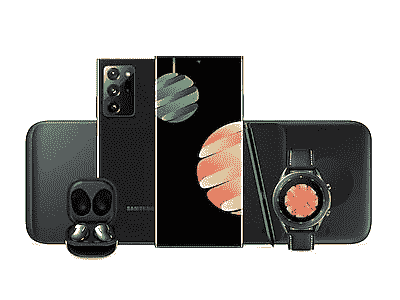

# 三星工作和健康套装是您所需的一切，价格更低

> 原文：<https://www.xda-developers.com/samsung-work-and-wellness-pack/>

# 使用三星的工作和健康套装获得成功所需的一切

谁有时间和精力为您挑选最佳移动体验所需的一切？购买三星工作和健康套装并享受优惠。

在这一点上，你真的开始削减它接近与假日购物。你现在订购的商品可能赶不上圣诞节，没有什么比错过一件最完美的礼物更糟糕的了。因此，当您可以获得三星工作和健康包时，为什么要冒险呢？

三星知道我们中的一些人在收到礼物时会拖延，所以加入工作和健康包。这个技术包几乎包括了最佳智能手机体验所需的一切:Galaxy Note 20 Ultra、Galaxy Buds Live、Galaxy Watch 3 和无线充电器 Pad Trio。老实说，有了这样一个包，你就可以一口气拥有所有的三星必需品。您只需[为您的新手机](https://www.xda-developers.com/best-galaxy-note-20-ultra-thin-cases/)挑选一个外壳即可！

更好的是，购买三星工作和健康套装将比单独购买这些物品获得更大的折扣。节省 498 美元听起来怎么样？这比 Galaxy Watch 3 本身的建议零售价还要节省！此外，你还将获得另外两项免费服务，即 6 个月的 Spotify Premium 和 4 个月的 YouTube Premium。

工作和健康套餐的总费用是 1650 美元，但你也可以按月付费，这样 36 个月的总费用可以降到 45.84 美元。在黑色包和青铜包之间挑选，准备好送给爱人(或你自己)的礼物！

 <picture></picture> 

Samsung Work and Wellness Pack

##### 三星 Galaxy Note 20 Ultra

有黑色包和青铜包可供选择，一气呵成地获得令人惊叹的 Galaxy Note 20 Ultra、耳塞、智能手表和无线充电器！使用工作和健康套餐，您还可以节省近 500 美元！

不需要整包？如果你只是在寻找一部新的智能手机，你可以看看我们的 [Galaxy Note 20 Ultra deals](https://www.xda-developers.com/best-galaxy-note-20-ultra-deals/) ！你也可以前往[三星商店的智能手机优惠](https://shop-links.co/1726281084301337735?u1=011c7525-f9ae-4aad-9fde-5a04d2f3700b)，看看通过适当的以旧换新可以节省多少钱。