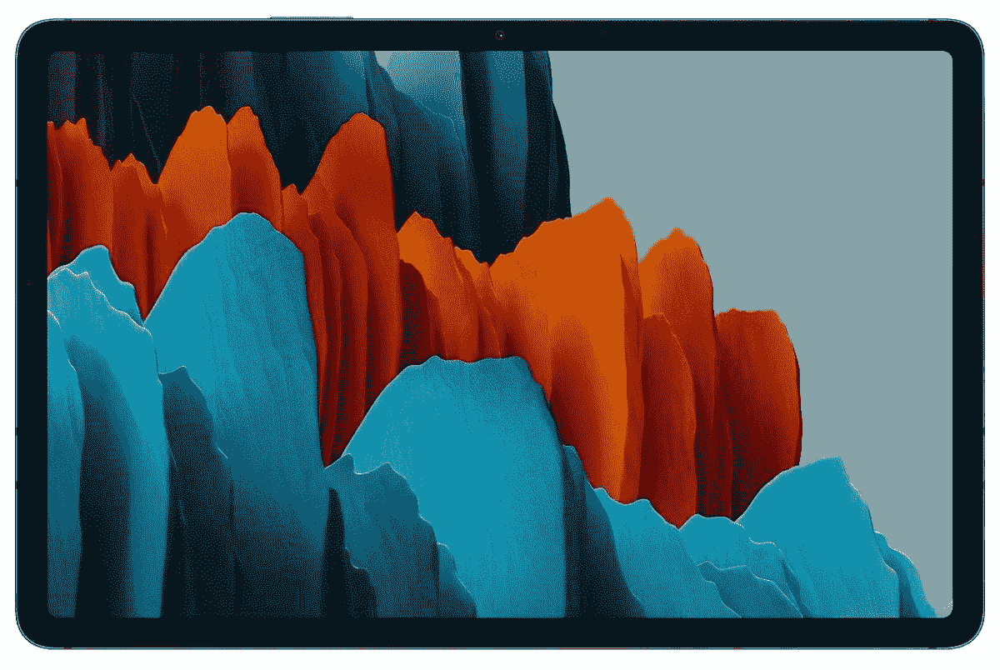

# 三星的 Galaxy Tab S7 现在仅售 530 美元

> 原文：<https://www.xda-developers.com/samsungs-galaxy-tab-s7-now-on-sale-for-just-530/>

# 三星的 Galaxy Tab S7 现在仅售 530 美元

三星的 128GB Galaxy Tab S7 最近一直在 560-580 美元左右徘徊，但现在微软只需 530 美元(比 MSRP 低 120 美元)。

三星最新的旗舰平板电脑是 Tab S7 和 S7+，分别旨在与苹果的 iPad Air 和 iPad Pro 竞争。入门级的 Tab S7 可能没有 Tab S7+提供的华丽的 AMOLED 屏幕，但它仍然是一个伟大的平板电脑，具有快速的硬件和内置的手写笔。微软易贝商店现在以 529.99 美元的价格出售 Tab S7，比原价节省了 120 美元。然而，这款平板电脑最近在亚马逊和其他零售商处的售价约为 560-580 美元。

Galaxy Tab S7 拥有 11 英寸 1600x2560 液晶屏，能够达到 120Hz，支持 HDR10。它还拥有骁龙 865 芯片组，128GB 的存储空间，6GB 的内存，双后置摄像头(1300 万主摄像头，500 万超宽摄像头)，一个 800 万前置摄像头和四个扬声器。在连接方面，你可以使用 UBS Type-C 3.2、Wi-Fi 6 和蓝牙 5.0。不幸的是，这里没有耳机插孔。Tab S7 包含在三星承诺的“三代”支持中，而且它已经[更新到 Android 11](https://www.xda-developers.com/here-are-the-new-productivity-features-added-in-the-samsung-galaxy-tab-s7s-one-ui-3-1-update/) ，所以它至少应该得到 Android 12 和 13。

 <picture></picture> 

Samsung Galaxy Tab S7 (Wi-Fi, 256GB)

##### 三星 Galaxy Tab S7

微软易贝商店的 128GB Galaxy Tab S7 售价为 530 美元，不过最终价格只有在结账时才会显示。

三星在盒子里包括一个 S Pen 手写笔，带有 S7 标签，但没有键盘附件——这将花费你 124 美元。你也可以只使用任何蓝牙或 USB 键盘。如果你持观望态度，请查看我们的 [Galaxy Tab S7 评论](https://www.xda-developers.com/samsung-galaxy-tab-s7-review/)。