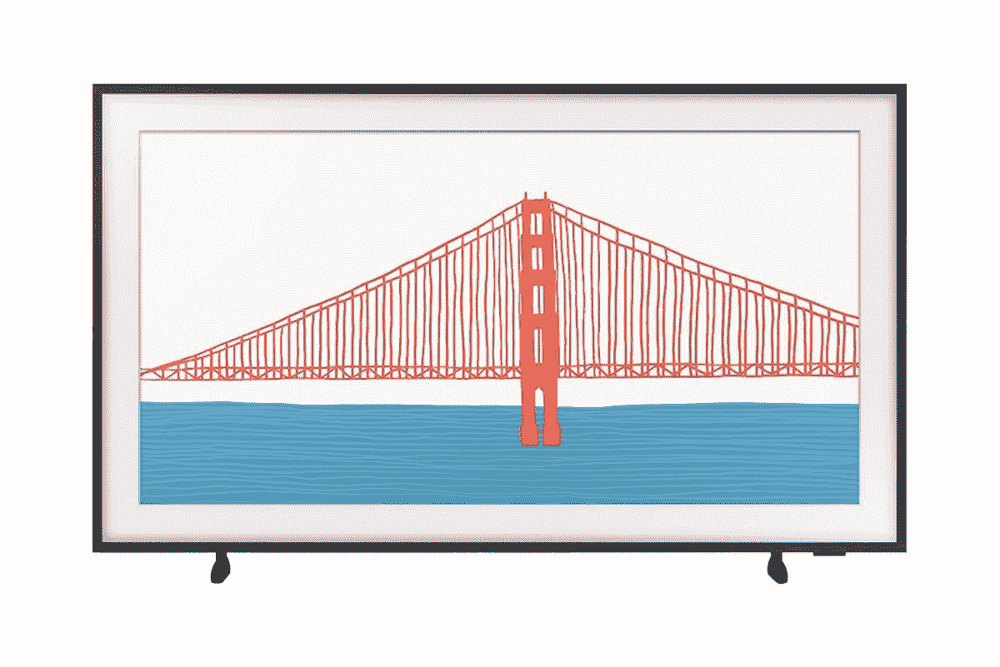

# 今天购买部分三星框架电视，最高可节省 300 美元！

> 原文：<https://www.xda-developers.com/save-300-samsung-frame-tv/>

三星本周将举办“发现三星”活动，在此期间，它将为其最新的平板电脑、电视和其他家用电器提供一些有吸引力的优惠。如今，该公司为部分三星框架电视提供高达 300 美元的折扣。所以，如果你想买一台新电视，现在是点击购买按钮的好时机。

三星[于今年 6 月推出了其最新的框架电视系列](https://www.xda-developers.com/samsung-frame-tv-2021-launch-india/)，具有 46%的更薄外形，独特的太阳能电池遥控器等等。2021 系列包括六种尺寸变体，从适中的 32 英寸到巨大的 75 英寸。今天，三星在所有六款机型上都提供了很大的折扣，以及价值高达 199.99 美元的免费定制边框。

 <picture></picture> 

Samsung Frame TV

##### 三星框架 65 英寸 4K QLED 电视(2021)

三星最新系列的框架智能电视最高可优惠 300 美元。每次购买也有资格获得一个免费定制的框架！

你可以通过点击上面的链接来获得这笔交易，32 英寸的三星框架电视可以优惠 70 美元，43 英寸的可以优惠 50 美元，50 英寸和 55 英寸的可以优惠 100 美元。65 英寸的框架电视(2021)目前以 200 美元的折扣出售，而三星的顶级 75 英寸型号则提供 300 美元的折扣。

今天购买的所有产品都将免费附赠一个标准黑色镜框和以下定制镜框之一:

*   现代棕色
*   现代柚木
*   现代白色
*   斜角白色
*   斜面砖红色

三星还提供购买所有框架电视的 21 天免费试用，每次购买精选条形音箱可享受高达 100 美元的折扣。此外，该公司将允许你以旧手机或平板电脑折价购买电视，以获得额外的折价。您还可以以 199.99 美元的起价为您的新电视购买一份延长的三星 Care+保护计划，并额外支付 120 美元获得专业安装服务。

三星将在本周提供更多这样的交易。所以，如果你不想错过任何即将到来的优惠，请继续关注我们的报道。