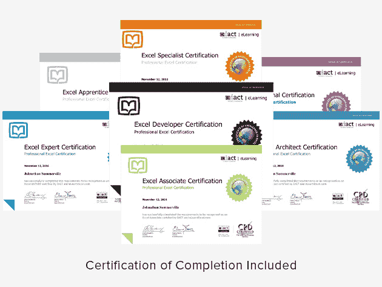
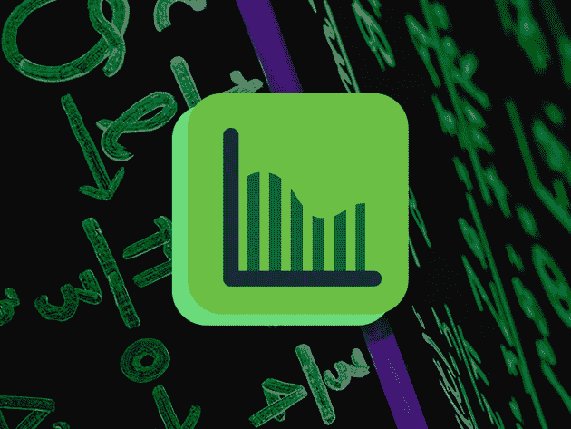

# 立即参加这些顶级 Microsoft Excel 课程，节省 90%以上的费用

> 原文：<https://www.xda-developers.com/save-over-90-on-these-top-microsoft-excel-courses-today/>

从财务预测到保存股票，微软的 Excel 有无数的用途。随着数据变得越来越重要，招聘人员正在寻找真正知道如何处理数据的人。如果您想更新您的技能或从头开始学习 Excel，请查看这些培训包，现在在 XDA 仓库可以享受 90%以上的折扣。

## **完整的 Excel 超越系列套装**

****

[这八门课程的集合](https://depot.xda-developers.com/sales/the-complete-excel-excellence-bundle?utm_source=xda-developers.com&utm_medium=referral&utm_campaign=the-complete-excel-excellence-bundle&utm_term=scsf-443095&utm_content=a0x1P000004Yb0kQAC&scsonar=1) 从基础开始，但是它帮助你获得一个专家商业分析师的技能。你总共要接受 47 个小时的培训，内容包括逻辑、Power Pivot、Power Query、VBA 等等。通常价值 648 美元，这些高评级课程是 [现在只要 39.99 美元](https://depot.xda-developers.com/sales/the-complete-excel-excellence-bundle?utm_source=xda-developers.com&utm_medium=referral&utm_campaign=the-complete-excel-excellence-bundle&utm_term=scsf-443095&utm_content=a0x1P000004Yb0kQAC&scsonar=1) 。

## **2020 年微软 Excel 大师& Power BI 认证捆绑**

****

Excel 通常与微软商务智能结合使用，以揭示关键见解。在 [这个捆绑包](https://depot.xda-developers.com/sales/the-2020-master-microsoft-excel-power-bi-certification-bundle?utm_source=xda-developers.com&utm_medium=referral&utm_campaign=the-2020-master-microsoft-excel-power-bi-certification-bundle&utm_term=scsf-443097&utm_content=a0x1P000004Yb0kQAC&scsonar=1) 中，您将学习如何充分利用这两个应用程序，并接受 28 小时的数据绘制、自动计算、宏、可视化等培训。这些课程价值 1592 美元，有数千个正面评价——它们现在只需 34.99 美元[。](https://depot.xda-developers.com/sales/the-2020-master-microsoft-excel-power-bi-certification-bundle?utm_source=xda-developers.com&utm_medium=referral&utm_campaign=the-2020-master-microsoft-excel-power-bi-certification-bundle&utm_term=scsf-443097&utm_content=a0x1P000004Yb0kQAC&scsonar=1)

## **完整的 2020 年微软 Excel 专家套装**

如果你想专注于 Excel， [这个捆绑](https://depot.xda-developers.com/sales/the-complete-2020-advanced-excel-expert-bundle?utm_source=xda-developers.com&utm_medium=referral&utm_campaign=the-complete-2020-advanced-excel-expert-bundle&utm_term=scsf-443098&utm_content=a0x1P000004Yb0kQAC&scsonar=1) 可以帮助你提高数据分析能力。通过四门课程，你从零开始学习 VBA，深入图表和图形，并发现权力支点的潜力。该阵容价值 275 美元，但您可以花 29.99 美元[获得今天所有 20 小时的培训。](https://depot.xda-developers.com/sales/the-complete-2020-advanced-excel-expert-bundle?utm_source=xda-developers.com&utm_medium=referral&utm_campaign=the-complete-2020-advanced-excel-expert-bundle&utm_term=scsf-443098&utm_content=a0x1P000004Yb0kQAC&scsonar=1)

## **eLearnExcel:2020 年 Excel 认证学校捆绑包**

****

为了向雇主证明你新获得的技能，你可能想获得一个被微软、脸书和毕马威信任的电子文凭。这八个课程的集合致力于认证，有 300 个视频和 60 个小时的内容。平时 999 美元， [终身访问现在只要 49.99 美元](https://depot.xda-developers.com/sales/the-2020-excel-certification-school-bundle?utm_source=xda-developers.com&utm_medium=referral&utm_campaign=the-2020-excel-certification-school-bundle&utm_term=scsf-443099&utm_content=a0x1P000004Yb0kQAC&scsonar=1) 。

## **高级微软 Excel 软件包。艾伦·贾维斯&克里斯·达顿**

****

涵盖所有主要功能， [这 10 门课程的捆绑](https://depot.xda-developers.com/sales/the-2020-ultimate-microsoft-excel-certification-training-bundle?utm_source=xda-developers.com&utm_medium=referral&utm_campaign=the-2020-ultimate-microsoft-excel-certification-training-bundle&utm_term=scsf-443100&utm_content=a0x1P000004Yb0kQAC&scsonar=1) 帮助您获得 Excel 的完整教育。培训来自克里斯·达顿(Chris Dutton)，他更为人所知的名字是 Excel Maven，以及评价很高的讲师艾伦·贾维斯(Alan Jarvis)。这些课程的总售价为 1732 美元，但你在这笔交易中只需 39.99 美元。

*价格随时变化*