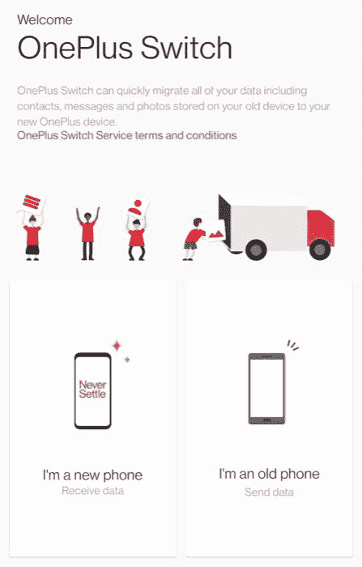

# 如何在 Android 智能手机上备份所有数据

> 原文：<https://www.xda-developers.com/search-result-data-made-easy-with-serpstack/>

得到一部新的智能手机会令人兴奋。从最新的硬件到闪亮的新功能，有很多值得期待的东西——当然还有开箱体验。但是，一旦拆箱的兴奋开始消退，你可能会发现自己面临着将所有重要数据从旧手机转移到新手机的任务。即使你是一个经验丰富的手机用户，将数据从一个设备传输到另一个设备的过程也可能是乏味且耗时的。

有几种方法可以在 Android 上备份数据，并在新手机上轻松恢复。即使你没有新手机，偶尔备份一下数据也是个好主意，这样可以确保万一发生意外，你不会丢失任何重要信息。不幸的是，Android 不像 iPhones 那样提供一键备份选项，可以完全备份你的所有数据，从应用程序和应用程序数据到照片和联系人。所以我们只剩下一些

因此，我们将讨论多种应用程序和解决方案，您可以使用它们来确保您所有的重要数据都已备份，并准备好在您的新手机上恢复。这可能是一个相当漫长的过程，需要安装一些应用程序，但这是确保所有数据安全的唯一方法。

## 如何在 Android 上迁移数据

在我们讨论如何在 Android 智能手机上备份数据，然后在新手机上恢复数据之前，让我们看看一些可以直接迁移/传输现有数据的解决方案，无论是通过有线连接还是无线连接，都可以节省您的时间。

### Android 的默认数据迁移服务

在设置新的 Android 手机时，你必须通过设置菜单，在那里你必须连接到你的 Wi-Fi 网络，登录到你的谷歌账户，等等。在此设置过程中，您会看到一个名为*的选项，复制应用程序和数据*。当你点击*下一个*时，你会得到从另一部安卓手机无线复制现有数据的选项。选择它并按照屏幕上的指示将您的所有数据从旧手机复制到新手机。

如果你买的新手机是谷歌 Pixel，你甚至可以选择通过 USB 线将其连接到旧手机来传输数据。

### 手机克隆应用

如果你的新手机来自一加、Oppo、Realme、Vivo、小米或华为，你会在设置过程中看到一个选项，让你使用各自的 OEM 应用程序克隆你的旧手机。你只需要在你的旧手机上安装应用程序，然后按照说明操作。你所有的数据包括照片，视频，甚至应用程序都将被复制到你的新手机上。

## 如何在 Android 上备份数据

如果你在买新手机时不打算带着旧手机，无论是因为你打算换一部新手机，还是因为你打算在买新手机前卖掉旧手机，在这种情况下，唯一的解决方案是备份你的数据，然后在新手机上恢复数据。这里告诉你如何用不同的方法做到这一点。

### 谷歌自己的备份和恢复功能

谷歌在每部安卓智能手机中都内置了自己的备份和恢复功能。这可以在*设置>系统>备份恢复*下找到。在你的旧手机上，打开这个设置，将数据备份到 Google Drive。给它一些时间来备份你的数据，一旦完成，你可以恢复备份，同时设置你的新手机。

选择选项*从云端*恢复备份，并使用您在旧手机上备份数据时使用的同一 Google 帐户登录。然后，您可以选择从旧手机中恢复您的应用程序、联系人、通话记录、短信和一些设置。

请注意，应用程序将从 Play Store 重新安装，因此整个恢复过程将需要一些时间，具体取决于您的互联网连接速度。使用这种方法，可以将旧手机的核心方面转移到新手机上。但是，像照片和视频、文件、应用程序数据等数据。不会被转移。

请继续阅读，了解如何备份这些文件。

### 使用三星和小米云进行备份和恢复

一些品牌，如三星和小米，提供自己的云解决方案来备份你的数据，与谷歌的实施相比，他们甚至做得更好。你可以备份你的应用程序、照片、文件、联系人、设置，甚至你的主屏幕布局，并在你的新手机上恢复它，基本上克隆了你旧手机的几乎每一个方面。

但是要使用这个选项，你的旧手机和新手机应该来自同一个制造商，并且你应该在你使用的云平台(三星云或小米云)上有足够的免费存储空间。

要使用此功能，请通过设置应用程序将旧手机上的所有数据备份到原始设备制造商使用的相应云服务器。一旦备份了所有数据，当您从同一家 OEM 安装新智能手机时，您将可以选择从云中恢复这些数据。如果您没有足够的存储来备份所有数据，您可能需要购买额外的云存储空间。

### 自定义恢复备份

这是为所有的爱好者和 OG XDA 人群在那里！例如，如果你有一部带有解锁引导程序和定制恢复功能的手机，比如 TWRP，你可以从恢复分区中备份你的系统和数据。这种方法在 modding 社区中被称为 NANDroid backup，它可以创建设备的完整副本，并在需要时将其恢复到以前的状态。它本质上让你保存和恢复你的手机的每一个方面。

自定义恢复备份是一个救命稻草时，尝试出血边缘[自定义 rom](https://www.xda-developers.com/how-to-install-custom-rom-android/)和 mods。如果出了问题，您最终得到了一个软砖设备，您可以简单地启动恢复并恢复您的备份，这将使一切恢复正常，就像什么都没有发生一样。

## 如何备份 Android 上的应用程序

如果你的互联网带宽有限，无法负担将所有数据备份到云中或从云中下载数百个应用程序，你可以在旧手机上本地备份应用程序，然后在新手机上恢复它们。以下是你如何做到这一点。

### 应用程序备份和恢复

[App 备份&还原](https://play.google.com/store/apps/details?id=mobi.infolife.appbackup)是一款流行已久的 App。它可以帮助你以 APK 文件的形式将所有应用程序备份到你的内部存储器或外部 SD 卡上。如果您的新旧手机都有 SD 卡插槽，我们建议您使用此选项，因为很容易将 SD 卡从一部手机换到另一部手机，并恢复备份。

如果您的手机没有外部 SD 卡插槽，您可以将数据备份到内部存储，然后将备份的文件传输到您的电脑或闪存驱动器。然后将这些文件复制到你的新手机上，并使用相同的应用程序恢复 apk。请注意，您只能使用此方法传输应用程序，而不能传输应用程序数据。

### 钛备份

如果你在 [XDA 论坛](https://forum.xda-developers.com/)呆过一段时间，你肯定知道[钛备份](https://play.google.com/store/apps/details?id=com.keramidas.TitaniumBackup)。这个应用可以让你备份所有的应用，包括有数据的系统应用，在处理数百个应用时，可以节省你很多时间。然而，你需要 root 访问才能做到这一点，所以这是另一个很好的工具，当你切换 rom，并希望通过一个按钮恢复所有的应用程序和数据。

* * *

传输完应用程序后，接下来要做的重要事情是将旧手机中的所有联系人传输到新手机中。虽然有几种方法可以做到这一点，但最简单的方法是使用谷歌自己的同步功能。对于储存在手机存储器或 SIM 卡中的通讯录，您可以将其导出到新手机中。

默认情况下，你保存在智能手机上的每个新联系人都会同步到你的谷歌账户。你只需在旧手机上导航至*设置>账户>选择你的谷歌账户>同步*并选择*联系人*。等待它完成同步。现在，当你在新手机上使用同一个谷歌账户登录时，你的联系人会自动同步并在后台恢复。

### 导出为 VCF 文件

如果您的手机本地存储或 SIM 卡上存储了联系人，并且您希望将这些联系人转移到您的新手机上，请在您的旧智能手机上打开 *Phone* 应用程序，进入*设置、*并选择*导出联系人*。这个选项可能出现在不同手机的不同位置，但你会在*设置*下找到它，所以稍微挖掘一下。然后选择您想要导出的联系人，您的手机将创建一个. vcf 文件，然后您可以将该文件传输到您的新手机。

在你的新手机上，进入*手机*应用，在*设置*中，选择*导入联系人*选项。当被要求选择。vcf 文件来恢复联系人，选择一个你从你的旧手机导入。您的联系人现在将被恢复。

## 如何在 Android 上备份短信

对很多人来说，这是另一个重要的方面。您可能有不想丢失的重要短信，因此最好备份您的对话，并在新手机上恢复它们。你可以在谷歌 Play 商店上找到几个应用程序来做到这一点，但我们已经试过并可以担保的是[短信备份&恢复](https://play.google.com/store/apps/details?id=com.riteshsahu.SMSBackupRestore)。

### SMS 备份和恢复

这是备份你的短信和旧手机通话记录的最佳应用之一，我们甚至将其列入了我们的[最佳短信应用](https://www.xda-developers.com/best-text-messaging-apps-android/)名单。这款应用可以免费下载，而且非常简单。只需点击一个按钮，您就可以在本地或云端(我们推荐)备份您的所有邮件线索。一旦你备份了所有东西，你只需要在你的新手机上安装相同的应用程序，并用相同的凭据登录，这样应用程序就可以访问你选择的云存储来恢复备份。

* * *

## 如何在 Android 上备份 WhatsApp 消息

WhatsApp 是全球大多数人使用的最流行的即时通讯服务之一。不过，WhatsApp 的问题在于，与 Telegram 不同，它不是一款基于云的消息应用。所以你所有的对话和信息都存储在你的手机上。这意味着每次你在新设备上注册 WhatsApp 时，你的聊天记录不会自动转移。

然而，好消息是 WhatsApp 允许你从应用程序本身备份聊天记录。你可以将备份存储在本地或我们推荐的 Google Drive 上，因为在新手机上恢复更容易。为此，前往 *WhatsApp >设置>聊天>聊天备份*，选择*备份*选项。如果你以前没有这样做过，你必须选择你希望你的聊天备份到哪个谷歌帐户。选择后，请稍等片刻，您的聊天记录将会备份。

现在，当你在新手机上使用 WhatsApp 上的电话号码注册时，你会自动获得一个从 Drive 恢复备份的选项，前提是你已经使用旧手机上的同一 Google 帐户登录。如果你从 iPhone 升级，请参考我们的指南[如何将你的 WhatsApp 数据从 iPhone 转移到 Android](https://www.xda-developers.com/how-to-migrate-whatsapp-data-iphone-android/) 。

* * *

## 如何在 Android 上备份照片和视频

一般来说，照片和视频等媒体文件占据了手机存储空间的很大一部分。如果你想备份这些文件，并在你的新手机上无线恢复它们，最好的方法是使用谷歌照片。虽然谷歌照片过去一直提供照片和视频的无限制免费备份，直到 2021 年 6 月 1 日，但备份现在会消耗你的谷歌驱动器上的空间。

如果你只是备份你的照片，直到你在新手机上恢复它们，然后删除备份以释放空间，这应该不是一个问题。

### Google 相册

要备份所有照片和视频，请打开旧手机上的 Google 相册应用程序，等待所有文件同步。现在，在你的新手机上打开照片应用程序，如果你用同一个谷歌帐户登录，你应该可以看到你所有的媒体文件。

然而，如果你不想让这些文件继续占用你的硬盘存储空间，最好将所有照片和视频下载到你新手机的内部存储空间，然后从 Google 相册中删除它们。

* * *

## 如何在 Android 上备份文档和其他文件及文件夹

如果您已经备份了所有重要数据，而唯一剩下的文件是内部存储器上的一些文档和文件夹，备份这些文件的最佳方式是将它们复制到您的外置 SD 卡上(如果您的手机支持的话)。你也可以把文件上传到云端，然后下载到你的新手机上。

备份这些文件的另一个好方法是通过 OTG。如果你有一根 OTG 线和一个笔驱动器，你可以把它连接到你的旧手机上，然后把所有你想要的数据复制到笔驱动器上。

如果谷歌硬盘上没有足够的存储空间，这种连接闪存驱动器、外部硬盘或 SSD 的方法甚至可以用来复制照片和视频等媒体文件。你可以使用任何文件管理应用程序来做到这一点。大多数手机都有内置的文件管理应用程序，但如果你的手机没有，我们推荐谷歌的[文件。](https://play.google.com/store/apps/details?id=com.google.android.apps.nbu.files)

通过遵循每一节中概述的步骤，您现在应该已经安全地备份了所有重要数据，并准备好传输到您的新设备。虽然谷歌确实提供了备份和恢复功能，但它不像苹果的 iCloud 那样无缝。

我们希望 Android 将来会推出一个更强大的备份和恢复工具，甚至可以帮助您恢复应用程序数据、主屏幕布局、应用程序的登录凭据等。