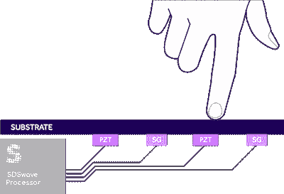

# Sentons 超声波摄像头可以将手机边框变成缩放滑块

> 原文：<https://www.xda-developers.com/sentons-sds-camerabar-ultrasound-announced/>

智能手机是令人难以置信的多功能便携式电脑，但由于大多数设备上只有少数几个物理按钮，所以大多数事情都必须依赖触摸屏控制。当玩游戏或使用相机应用程序时，你必须在许多不同的屏幕按钮和滑块之间周旋，由于有限的屏幕空间和笨拙的手部人体工程学，导致体验不佳。一家名为 Sentons 的公司希望通过引入他们所谓的“软件定义的表面”(SDS)来取代物理按钮，从而改变这一现实。今天，他们推出了 CameraBar，这是一种新的 SDS，使用超声波检测手机框架上的点击和滑动，以模仿传统相机上的物理快门和变焦按钮。

通过 CameraBar，用户可以利用虚拟快门和变焦控制，而无需通过触摸屏幕来遮挡视线。CameraBar 的默认配置是在右侧轻按以设置焦点，在右侧重按以拍摄照片，在左侧滑动以变焦以进行光学变焦。下面嵌入的视频演示了 CameraBar 在零售的华硕 ROG Phone 3 设备以及定制开发硬件上的运行。

上面视频中显示的 ROG 手机 3 可能正在运行定制固件，以允许 Sentons 的定制相机应用对传感器的输入做出反应，因为华硕 ROG 手机上的 AirTriggers 功能目前无法映射到华硕相机应用中的任何动作。为了让这一功能进入 ROG 手机，华硕必须通过软件更新来增加对它的支持。

虽然 ROG Phone 3 在技术上可以支持这次演示中显示的手势，但 Sentons CTO Sam Sheng 告诉 XDA，配备 CameraBar 的理想设备将有更大的滑动区域，以便更精细地控制缩放水平。目前市场上没有这种设备，尽管 Sentons 正在与几家未透露姓名的合作伙伴进行谈判，他们将很快将这项技术投入生产。该公司正在为原始设备制造商提供推荐的传感器拓扑结构、如何设计该模块的指导以及如何将其作为股票相机应用程序的一部分来实施的参考软件。OEM 可以定制手势激活区域，如果他们选择这样做，他们也可以将相同的定制选项扩展到消费者。

最终，据信制造具有[全屏设计和“瀑布”显示屏](https://www.xda-developers.com/opinion-waterfall-displays-are-the-future-of-the-glass-slab-smartphone/)的新智能手机的原始设备制造商将率先采用 Sentons 的新 CameraBar 技术，尽管如前所述，实施了 Sentons 现有 GamingBar 技术(包括 ROG Phone 3 和联想 Legion Phone Duel)的智能手机可以继承 CameraBar 的功能。

## 用超声波代替按钮

按键是智能手机的常见故障点，也是实现真正全屏设计的障碍，因此智能手机制造商试图摆脱它们是有意义的。唯一的问题是找到一个有价值的物理按钮的替代品，我们在过去已经看到了一些取代它们的平庸尝试。[华为的 Mate 30 Pro](https://www.xda-developers.com/huawei-mate-30-pro-rs-porsche-design-specifications-features-pricing-availability/) 使用了音量摇杆[的“隐形”触摸按钮，一些用户很难触发](https://www.reddit.com/r/Huawei/comments/dbjs7k/removing_the_volume_buttons_on_mate_30_pro_is_a/)。HTC 的 U12+采用了人造按钮，这些按钮[同样让一些评论者](https://www.theverge.com/2018/6/12/17451622/htc-u12-plus-review-specs-price-android-smartphone#qkgYp4:~:text=The%20faux%20buttons%20on%20the%20HTC%20U12%20Plus%20were%20a%20problem)感到沮丧。虽然华为试图用电容实现音量键，但 HTC 使用了 Sentons 的超声波传感器，尽管我听说 HTC 使用了简单的应变传感器。相比之下，华硕的 ROG 手机型号可以感应到轻得多的触摸，低于 5 克力。虽然我还没有机会亲自测试 HTC U12+,但我对 ROG 手机 3 及其可定制的 AirTriggers 手势的体验基本上是积极的，所以我很期待看到 Sentons 的技术不仅可以取代手机上的按钮，还可以增强它们的功能。

那么，原始设备制造商实际上是如何用 Sentons 的技术替换一个按钮的呢？使用超声波复制智能手机上的物理按钮需要结合压电和应变传感器。Sentons 将其技术比作声纳，声纳使用超声波进行回声定位。压电传感器产生的振动场的飞行时间用于唯一地确定用户手指的位置，手指和振动的基板的耦合用于确定来自振动声波的力。换句话说，超声波有助于确定位置，而应变传感器则确定施加的力的大小。

 <picture></picture> 

Source: Sentons

因此，这项技术背后的原理并不新鲜，但 Sentons 向原始设备制造商出售的是其系列的 [SDSwave 力触式处理器](https://www.sentons.com/products/)，其机器学习算法可以从点击和手势中剔除错误的触摸，以及其超声波应变传感器。不过，压电传感器可以是现成的，这使得它们可以非常便宜地集成到智能手机设计中。只要智能手机机身使用的材料足够坚硬，从而允许超声波传播，它就可以变成一个虚拟的触摸传感器。

Sentons 表示，其超声波传感器可以通过玻璃，塑料，甚至几毫米厚的铝来识别手指点击，这意味着传感元件可以安装在手机的中板上，而不是在手指应该放置的地方的正后方。然而，需要注意的是，这只能在智能手机制造商希望替换音量或电源按钮等“低性能”按钮时才能实现——复制需要更高精度的手势，如滑块，通常需要将传感元件安装在接触点后面的侧壁上。据说这些传感元件非常非常小，可以很容易地插入天线元件之间(例如放置在 5G 智能手机机身周围的毫米波天线)，由于没有电线，天线性能不会有任何下降。

小尺寸的传感传感器甚至可以用于像智能手表和助听器一样小的设备中(如真正的无线耳塞)。对于智能手表，超声波手势可以用来取代物理旋转表冠或触摸感应电容表圈。对于真正的无线耳塞，超声波可以为我们带来更好的音乐控制点击和手势检测。Sentons 目前正在试验在更多的外形中实现他们的技术，甚至可以在汽车上使用，但还没有任何商业产品(除了智能手机)使用他们的技术。但是 Sentons 远不是唯一一家使用机器学习来分析虚拟智能传感器中使用的超声波的公司——还有 [Elliptic Labs](https://www.ellipticlabs.com/) 与多家智能手机制造商合作开发超声波邻近检测技术——所以超声波很有可能会继续存在，并被更广泛地采用。