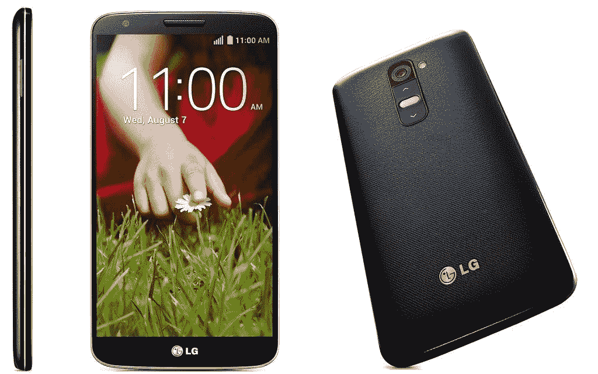
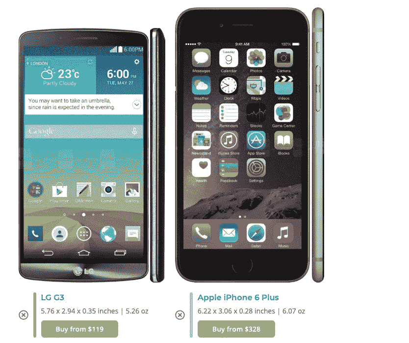

# LG 开创并被其他公司模仿的 7 种智能手机趋势

> 原文：<https://www.xda-developers.com/seven-smartphone-trends-lg-pioneered/>

经过数周的传言，LG 电子正式宣布关闭手机业务。虽然不祥之兆已经出现了一段时间——LG 的移动业务一直是这家韩国科技巨头的赔钱业务——但它仍让许多美国手机爱好者感到悲伤。

对我来说，可旋转的双屏 LG Wing 是一款非常优秀和智能的设备，为一款新型手机带来了真正的实用性，正如我们的首席内容官 Nirave 在 Twitter 上分享的那样，LG 的移动团队在其他品牌安全行事时尝试了许多东西。

LG 尝试的一些东西完全失败了，比如 LG G5 的模块化概念，或者 [LG G8](https://www.xda-developers.com/lg-g8-thinq-review-video/) 的手部静脉扫描，但是还有更多功能不仅被证明是有用的，而且已经成为行业规范。以下是 LG 智能手机开创的七大趋势——按重要性排序——这些趋势如今已成为现代智能手机的普遍预期特征。

## 电容式触摸屏

毫无疑问，最初的 iPhone 是一款突破性的设备，改变了智能手机行业的进程。但是，它几乎为智能手机时代重新发明了触摸屏的说法并不完全准确。

LG 普拉达(在某些地区代号为 LG KE850)实际上比第一代 iPhone 早几个月推出，它也采用了电容式触摸屏。这使得 LG 普拉达成为第一款使用触摸屏的智能手机。当然，苹果的多点触控提供了捏放等手势，更加精致，但如果我们纯粹谈论谁先到达那里，那是 LG，而不是苹果。

## 超广角摄像机

超广角摄像头是当今任何价格区间的所有智能手机的必备功能，很难相信 LG 是唯一一个提供该功能的智能手机品牌。超宽镜头于 2016 年春季在 LG G5 上首次亮相，直到 2018 年秋季，下一个 Android 品牌(华为)才采用该镜头。三星和苹果分别在 2019 年春季和秋季加入了超宽潮流。

## 移除较薄挡板的前端硬件按钮

如今，每部智能手机——即使是经济型手机——都有一个几乎完全是屏幕的脸。它并不总是那样:还记得智能手机有巨大的挡板，里面有物理按钮，按今天的标准看起来超级笨重吗？

 <picture></picture> 

LG G2

2013 年 9 月发布的 LG G2 是第一款为了更简洁的外观而取消正面物理按钮的主要产品。三星和苹果直到 2017 年才会分别推出 Galaxy S8 和 iPhone X。

这里有一个个人轶事:我从 2007 年一直是 iPhone 用户，直到 2014 年秋天，当我升级到更大的 5.5 英寸屏幕的 iPhone 6 Plus 时，我讨厌手机的大尺寸。我看到了我朋友的 LG G3，注意到它的屏幕尺寸和我的 iPhone 一样，但包装要小得多——因为边框更薄。第二天，我卖掉了 iPhone 6 Plus，买了一台 LG G3，从那以后我就成了安卓用户。

 <picture></picture> 

The LG G3 and the iPhone 6 Plus side-by-side courtesy of PhoneArena's size comparison tool

## 手动/专业相机模式

一个好的智能手机相机应该允许用户不假思索地指向并拍摄，并在大多数时间里拍出好照片。这正是苹果和谷歌赖以生存的哲学，因此他们的基本的，几乎是最基本的相机应用程序。但也有一些爱好者想要更多的控制，这就是 LG 在 G3 中加入“手动模式”时的想法，该模式让用户能够调整白平衡、ISO、快门速度和对焦区域等设置。一年多后，LG 在 V10 中也为视频拍摄添加了手动控制。

手动模式，现在可能更为人所知的是“专业模式”，几乎可以在所有安卓智能手机中找到，当然 Pixel 除外。

## 四高清分辨率显示屏

在过去的两年里，大多数 Android 品牌都参与了显示器分辨率的军备竞赛，各品牌都在推动 WQHD+分辨率(以及 120Hz ),这极大地影响了电池寿命。好吧，不管是好是坏，LG 是第一个倡导牺牲电池寿命来增加屏幕像素的品牌。当手机屏幕达到 1080p 时，LG G3 是第一款提供四高清分辨率(1440 x 2560)的手机。这导致电池续航时间一般，但那个屏幕看起来*哦，如此清晰*回到 2014 年，我无论如何都忍受了它，就像我忍受一加 9 Pro 的中等电池续航时间一样，因为 WQHD+和 120Hz 看起来如此，如此流畅。

## 更长/更高的长宽比

2010 年代中期，智能手机屏幕尺寸开始变得越来越大，以至于 Nexus 6、iPhone 6 Plus 和 LG 自己的 V10 等手机很难用一只手舒适地握住。这使得 LG 在 2017 年的 G6 上采用更高/更窄的 18:9 纵横比(而不是长期以来的 16:9)的决定变得非常重要，因为它允许手机屏幕保持向上缓慢移动，而不会因为太宽而无法握住。三星的 Galaxy S8 也因推动 18:9 的纵横比而值得称赞，但 LG G6 比三星的设备早几周推出。

## 双击以唤醒/锁定

因为 LG 从 G2 开始将 home 键从手机正面移开，所以它必须为用户提供一种更简单的方式来唤醒手机屏幕。他们的解决方案至今仍是我最喜欢的软件功能之一:双击屏幕唤醒或锁定。它比按下侧面安装的电源按钮更快，需要的手指更少，而且比苹果的单次点击唤醒(iPhone X 推出)更难意外触发。在 LG G2 之前，定制 rom 确实有一些相同功能的不同实现，但 LG 作为 OEM 厂商采用了它。

* * *

## LG 总是愿意尝试新事物——不管是好是坏

LG 智能手机业务的消亡有无数原因。它的市场营销可能会时好时坏(还记得坚持在他们的手机名字前加“ThinQ”吗？)而且它有一些不幸的硬件故障，比如 G4 的 bootloop 问题。但最终我认为 G5 模块化实验的巨大失败，以及之前提到的手部静脉扫描等其他小众实验，导致消费者和媒体认为 LG 手机是“噱头”。LG 还收回了其硬件决定，这并不能给你建立一个长期生态系统的信心。

LG 退出智能手机市场是不幸的，因为对于每一个失败的噱头，都有三四个真正有用的功能留了下来。当然，正如我在开头所说的，我认为 LG 的翅膀真的很有用。

我会想念 LG 在手机领域的表现——他们不害怕在一个有时充满无聊的模仿者的行业中尝试新事物——我感谢他们给移动行业带来的东西。谢谢你，LG，谢谢你给我们的一切。