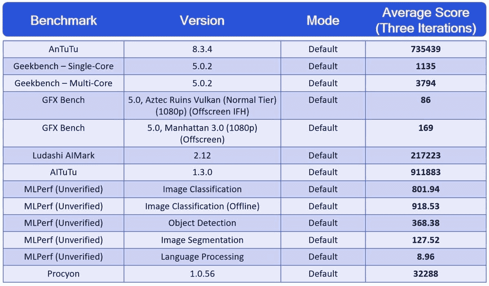

# 高通骁龙 888 基准:以下是 2021 年的旗舰 5G 手机将如何表现

> 原文：<https://www.xda-developers.com/snapdragon-820-debut-qualcomms-comeback-packs-a-big-punch/>

本月早些时候，高通邀请记者参加虚拟的骁龙科技峰会，会上他们宣布了骁龙 888 移动平台。高通最新的 8 系列 SoC 为图像处理和机器学习带来了重大改进，但对 CPU 和 GPU 性能的改善甚微。为了了解高通最新的芯片组到底有多强大，我们通常有机会在它的参考硬件上运行基准测试。然而，由于新冠肺炎的原因，高通无法安排一次面对面的基准测试会议，因此，他们向我们发送了一段预先录制的视频，展示了一台高通骁龙 888 参考设备运行所有流行的基准测试。

在骁龙 888 参考设备上，高通运行了一个整体基准(AnTuTu)、一个以 CPU 为中心的基准(Geekbench)、一个以 GPU 为中心的基准(GFXBench)和几个 AI/ML 基准(AIMark、AITuTu、MLPerf 和 Procyon)。每个基准测试运行三次，所以公司共享了三次迭代的平均结果。此外，该公司表示，他们使用骁龙 888 参考设计的默认设置运行每个基准，这意味着他们没有启用任何高性能模式。但是，因为基准分数是为我们提供的，所以我们无法为自己验证结果或测试条件。一旦我们得到了高通骁龙 888 的商业设备，我们将重新运行这些基准。

如果你有兴趣阅读高通骁龙 888 移动平台的所有规格和功能，那么我推荐阅读本月早些时候发表的 Idrees Patel 关于骁龙 888 的精彩讲解。他的文章详细介绍了高通对 CPU、GPU、调制解调器、连接子系统、ISP、AI 引擎、DSP 和其他所有组件的改进。为了快速参考，我整理了一张图表，比较了高通骁龙 888 参考设备与本次基准比较中使用的其他两种设备的关键规格:骁龙 865 供电的参考设备和我在去年的基准会议中使用的骁龙 855 供电的 Pixel 4。您可以在基准测试结果之前找到下面的图表。

## 高通骁龙 888 基准测试结果

### 测试设备的规格

|  | 

高通骁龙 855(谷歌像素 4)

 | 

高通骁龙 865(高通参考装置)

 | 

高通骁龙 888(高通参考装置)

 |
| --- | --- | --- | --- |
| **CPU** | 

*   1 个 Kryo 485(基于 ARM Cortex A76)Prime core @ 2.84 GHz，1 个 512KB L2 高速缓存
*   3 个 Kryo 485(基于 ARM Cortex A76)性能内核@ 2.42GHz，3 个 256KB L2 高速缓存
*   4 个 Kryo 385(基于 ARM Cortex A55)高效内核@ 1.8GHz，4 个 128KB L2 高速缓存
*   2MB L3 快取记忆体

 | 

*   1 个 Kryo 585(基于 ARM Cortex A77)Prime core @ 2.84 GHz，1 个 512KB L2 高速缓存
*   3x Kryo 585 (ARM Cortex A77-based) Performance cores @ 2.4GHz, 3x 256KB L2 cache
*   4 个 Kryo 385(基于 ARM Cortex A55)高效内核@ 1.8GHz，4 个 128KB L2 高速缓存
*   4MB 三级高速缓存

 | 

*   1 个 Kryo 680(基于 ARM Cortex X1)Prime core @ 2.84 GHz，1 个 1MB L2 缓存
*   3 个 Kryo 680(基于 ARM Cortex A78)性能内核@ 2.4GHz，3 个 512KB L2 高速缓存
*   4 个 Kryo 680(基于 ARM Cortex A55)高效内核@ 1.8GHz，4 个 128KB L2 高速缓存
*   4MB 三级高速缓存

 |
| **GPU** | 肾上腺素 640 | 肾上腺素 650 | 肾上腺素 660 |
| **显示** | 

*   2280 x 1080 分辨率
*   60Hz 刷新率

 | 

*   2880 x 1440 分辨率
*   60Hz 刷新率

 | 

*   2340 x 1080 分辨率
*   120 赫兹刷新率

 |
| **艾** | 

*   具有六边形矢量扩展和六边形张量加速器的六边形 690
*   第四代人工智能引擎
*   最多 7 个

 | 

*   六边形 698 与六边形矢量扩展和新的六边形张量加速器
*   第五代人工智能引擎
*   高通传感中心
*   最多 15 个

 | 

*   带融合人工智能加速器架构的 Hexagon 780
*   第六代人工智能引擎
*   高通传感中心(第二代)
    *   新型专用人工智能处理器
    *   Hexagon DSP 的任务减少 80%
    *   5X 更多处理能力同比增长
*   16 倍大的共享内存
*   标量加速器快 50%，张量加速器快 2 倍
*   最多 26 个

 |
| **内存** | 

*   6GB LPDDR4
*   3MB 系统级缓存

 | 

*   12GB LPDDR5
*   3MB 系统级缓存

 | 

*   12GB LPDDR5
*   3MB 系统级缓存

 |
| **存储** | 64GB UFS 2.1 | 128GB UFS 3.0 | 512GB UFS 3.0 |
| **ISP** | 

*   双通道 14 位 Spectra 380 ISP

 | 

*   双通道 14 位 Spectra 480 ISP
*   每秒 2.0 千兆像素吞吐量

 | 

*   三路 14 位 Spectra 580 ISP
*   每秒 27 亿像素吞吐量

 |
| **制造过程** | 7 纳米(TSMC 的 N7) | 7 纳米(TSMC 的 N7P) | 5nm(三星的 5LPE) |
| **软件版本** | 安卓 10 | 安卓 10 | 安卓 11 |

### 基准概述

*输入来自[马里奥·塞拉费罗](http://www.xda-developers.com/author/mario-serrafero/)*

*   [**安图图**](http://www.antutu.com/en/index.htm) :这是一个整体基准。AnTuTu 测试 CPU、GPU 和内存性能，同时包括抽象测试和最近的相关用户体验模拟(例如，涉及滚动 ListView 的子测试)。最终得分根据设计者的考虑进行加权。
*   [**【geek bench】**](https://www.geekbench.com/):以 CPU 为中心的测试，使用多种计算工作负载，包括加密、压缩(文本和图像)、渲染、物理模拟、计算机视觉、光线追踪、语音识别和对图像的卷积神经网络推理。分数细分给出了具体的指标。最终分数根据设计者的考虑进行加权，重点是整数性能(65%)，然后是浮点性能(30%)，最后是加密(5%)。
*   [**GFXBench**](https://gfxbench.com/result.jsp) :旨在使用最新的 API 模拟视频游戏图形渲染。大量的屏幕效果和高质量的纹理。较新的测试使用 Vulkan，而遗留测试使用 OpenGL ES 3.1。输出是测试期间的帧数和每秒帧数(本质上是另一个数除以测试长度)，而不是加权分数。
    *   阿兹特克废墟:这些测试是 GFXBench 提供的计算量最大的测试。目前，顶级移动芯片组无法支持每秒 30 帧。具体来说，该测试提供了非常高的多边形计数几何图形、硬件镶嵌、高分辨率纹理、全局照明和大量阴影贴图、丰富的粒子效果，以及 bloom 和景深效果。这些技术中的大多数将强调处理器的着色器计算能力。
    *   曼哈顿 ES 3.0/3.1 :鉴于现代游戏已经达到了其提出的图形保真度并实现了相同类型的技术，这项测试仍然具有相关性。它采用了复杂的几何体，包括多个渲染目标、反射(立方体贴图)、网格渲染、许多延迟光源，以及后期处理过程中的高光和景深。
*   **[ml perf Mobile](https://mlcommons.org/en/):**ml perf Mobile 是一款测试移动 AI 性能的开源基准。它是由 MLCommons 创建的[，这是一个非盈利的开放工程联盟，旨在“为比较 ML 系统、软件和解决方案提供透明和公平的竞争环境。”MLPerf Mobile 的第一次迭代为一些计算机视觉和自然语言处理任务提供了推理性能基准。有关更多信息，请参考论文“](https://mlcommons.org/en/news/mlcommons-launch/) [MLPerf 移动推理基准测试:为什么移动 AI 基准测试很难以及如何应对。](https://www.researchgate.net/publication/346668830_MLPerf_Mobile_Inference_Benchmark_Why_Mobile_AI_Benchmarking_Is_Hard_and_What_to_Do_About_It)”
    *   **图像分类:**该测试包括推断应用于输入图像的标签。典型的使用案例包括照片搜索或文本提取。使用的参考模型为 MobileNetEdgeTPU，参数为 4M，数据集为 ImageNet 2012 (224x224)，质量目标为 FP32 的 98%(76.19% Top-1)。
    *   **图像分割:**该测试包括将输入图像分割成标记对象。典型的用例包括自动驾驶或遥感。使用的参考模型是带 2M 参数的 DeepLab v3+，数据集是 ADE20K (512x512)，质量目标是 FP32 的 93%(0.244 mAP)。
    *   **对象检测:**该测试包括在对象周围绘制边界框，并为这些对象提供标签。典型的使用案例涉及摄像机输入，例如用于危险检测或驾驶时的交通分析。参考模型为 SSD-MobileNet v2，参数为 17M，数据集为 COCO 2017 (300x300)，质量目标为 FP32 的 97%(54.8% mIoU)。
    *   语言处理:这个测试包括口语化地回答问题。典型的用例包括在线搜索引擎。参考模型为 MobileBERT，参数为 25M，数据集为 mini Squad(斯坦福问答数据集)v1.1 dev，质量目标为 FP32 的 93%(93.98% F1)。

### 安图图结果

从 AnTuTu 开始，我们可以看到高通骁龙 888 参考设备的得分比骁龙 865 参考设备高近 17，000 分，比骁龙 855 驱动的 Pixel 4 高近 350，000 分。当您查看 CPU、GPU、内存和 UX 子分数(此处未显示)时，我们可以看到性能的最大提升来自 GPU 和内存。骁龙 888 QRD 在安图图的 GPU 子测试中的得分比骁龙 865 QRD 高出约 45.56%。同样，骁龙 888 QRD 在安图图记忆测试中的得分比骁龙 865 QRD 高出 52.08%。与骁龙 855 驱动的 Pixel 4 相比，888 QRD 在 GPU 和内存子测试中的得分分别高出 98.42%和 117.58%。

与此同时，骁龙 888 QRD 在 AnTuTu 的 CPU 子测试中分别比骁龙 865 QRD 和骁龙 855 驱动的 Pixel 4 高出约 30.05%和 90.28%。UX 的 subscore 很难比较，因为每台设备运行的 Android 操作系统版本不同(去年我对 Pixel 4 和骁龙 865·QRD 进行基准测试时，它们运行的是 Android 10，而 888 QRD 运行的是 Android 11。)

内存性能的大幅提升非常有趣。865 QRD 和 888 QRD 都配备了 12GB 的 LPDDR5 内存，尽管我们不知道内存的主频是多少。值得注意的是，865 支持高达 16GB 的 2750 MHz lpddr 5 RAM，而 888 支持高达 16GB 的 3200 MHz lpddr 5 RAM。CPU 和 GPU 性能的提升略高于我们的预期，正如高通所说，骁龙 888 的 CPU 和 GPU 同比分别增长了 25%和 35%。然而，接下来的更多以 CPU 和 GPU 为中心的基准测试显示，收益更符合我们的预期。

### Geekbench 结果

在 Geekbench 5.0 中，高通骁龙 888 在单核和多核测试中的性能分别比骁龙 865 高出 22.17%和 9.97%。与骁龙 855 相比，888 的性能分别提高了 89.17%和 51.82%。

高通说，骁龙 888 比骁龙 865 的 CPU 性能提高了 25%。CPU 的独立 ARM Cortex-X1 Prime 内核的时钟频率为保守的 2.84GHz，与上一代 ARM Cortex-A77 Prime 内核的时钟速度相同，因此我们有可能在不可避免的年中骁龙 888“Plus”更新中看到 3+GHz 的时钟速度。如果是这样的话，我们可以期待 CPU 性能进一步提高，虽然现在，公平地说，收益是稳固的，但仅仅是增量。

因此，如果你是从两年前的旗舰产品升级，888 应该会带来 CPU 性能的重大改进。如果你是从一年前的旗舰机升级，这些收益要小得多。我个人很高兴看到骁龙 888 设备如何处理控制台仿真。

### GFXBench 结果

高通还没有透露骁龙 888 中 Adreno 660 GPU 的核心数量或最高频率，所以除了性能方面的收益，我们对 GPU 没有什么好说的。在 GFXBench 的 Manhattan 测试中，使用 OpenGL ES 3.0 API 并在屏幕外渲染 1080p 场景，骁龙 888 的平均帧率为 169fps，比骁龙 865 和 855 分别高出约 34.13%和 83.7%。在 GFXBench 的阿兹特克废墟测试中，使用 Vulkan graphics API 并在屏幕外渲染 1080p 场景，骁龙 888 的平均帧率为 86fps，比骁龙 865 和 855 分别高出约 38.71%和 95.45%。

没有多少游戏需要大量的 GPU 马力(最近的【Genshin Impact 是一个例外)，但改进的 GPU 性能不仅仅是对游戏有用。但是，游戏绝对是人们关心这些基准测试结果的最大原因，骁龙 888 的图形渲染速度肯定比去年快 35%，能效提高 20%。然而，这些结果只展示了 GPU 的最高性能，因此我们必须重新访问 gfx bench——一旦我们接触到商业硬件——以便运行基准的长期性能测试。

### MLPerf 结果

也许最有趣的收获是在人工智能性能方面。高通通常每年都会在人工智能性能上有巨大的飞跃，但今年的进步最令人印象深刻。骁龙 888 的人工智能引擎拥有 26 TOPS 的性能，比骁龙 865 的 15 TOPS 性能和骁龙 855 的 7 TOPS 性能有所增加。高通将这一成就归功于 Hexagon 780 DSP 的新融合人工智能加速器架构，融合了标量、矢量和张量加速器，以消除物理距离和池内存，从而高效地共享和移动数据。

然而，我们很难证明这种性能上的飞跃到底有多重要。我们在采访[高通的 Travis Lanier](https://www.xda-developers.com/qualcomm-travis-lanier-snapdragon-855-kryo-485-cpu-hexagon-690-dsp/) 、 [Gary Brotman 和 Ziad Asghar](https://www.xda-developers.com/qualcomm-gary-brotman-ziad-asghar-ai-snapdragon-855-hexagon-690-dsp/) 时深入讨论了人工智能基准测试的困难。好消息是，自从我们与高通高管讨论以来，人工智能基准领域已经取得了重大进展。

在本文的开头，我们提到高通在骁龙 888 参考设备上运行了 4 个不同的 AI 基准:AIMark、AITuTu、MLPerf 和 UL 的 Procyon。也许这些基准中最有前途的是 MLPerf Mobile，这是一个即将发布的开源移动 AI 基准，由多家 SoC 供应商、ML 框架提供商和模型制作商支持。它的第一批移动推理结果[是公开的](https://mlcommons.org/en/inference-mobile-07/)，所以我们用那些结果与骁龙 888 进行比较。该结果仅涵盖 3 款设备:采用联发科天玑 820 处理器的小米 Redmi 10X 5G、采用高通骁龙 865+处理器的华硕 ROG Phone 3 和采用 Exynos 990 处理器的三星 Galaxy Note 20 Ultra 5G。高通没有提供延迟结果——只有吞吐量数字——所以我们没有将供应商提交的全部结果绘制为[供 MLCommons 验证。](https://mlcommons.org/en/inference-mobile-07/)

在这些精选的计算机视觉和自然语言处理推理基准测试中，我们可以看到高通骁龙 888 参考设备在所有四项测试中都获得了最高分。在 3 个上一代芯片组中，联发科的 Dimensity 820 在对象检测方面优于骁龙 865+和 Exynos 990，而 Exynos 990 在 NLP 方面优于骁龙 865+和 Dimensity 820。高通的骁龙 865+普遍具有竞争力，在图像分割方面得分与 Dimensity 820 不相上下，在自然语言处理方面超过了它。在这些特定模型和数据集的特定推理测试中，骁龙 888 胜过了 3 个最新一代芯片组。

看看开发人员和原始设备制造商利用骁龙 888 的人工智能能力能创造出什么样的应用和功能，将会很有趣。计算机视觉将在我们很可能在 2021 年看到的许多人工智能增强的视频功能中发挥特别重要的作用，而改进的自然语言处理性能同样可以影响视频的相邻方面，如音频记录。

然而，我们应该注意到，骁龙 888 的结果未经 ml commons*验证*,因为该组织的部分验证过程要求该设备在商业上可用(高通的参考设备不通过运营商或作为解锁手机出售)。此外，性能取决于选择什么样的 ML 模型、数字格式和 ML 框架，以及有什么样的 ML 加速器可用。

## 结论

高通的骁龙 888 再次带来了 CPU 和 GPU 性能的增量改进，但图像处理和人工智能的大规模改进。从两年前的设备升级的人不会注意到 CPU 和 GPU 的改进(除非他们计划运行模拟器或玩像 Genshin Impact 这样的游戏)，但他们肯定会注意到移动技术的其他进步。如今，设备具有更高的刷新率显示器，更多具有更高分辨率图像传感器的相机，支持 5G 连接，等等。普通用户不会注意到人工智能性能的巨大进步，但高通新芯片组带来的可能性令人兴奋地思考。实时人工智能视频增强、多摄像头流等更多功能将在明年出现，谷歌等公司继续通过训练机器学习模型支持的功能发布惊喜。

不过，高通并不是唯一一家改进其 SoC 产品线的公司。三星即将为 Galaxy S21 推出的 Exynos 2100 据说将带来重大的性能改进。还有华为新的海思麒麟 9000 和联发科不断增长的移动 SOC 产品线。我希望一旦我们有了至少一款采用三星、华为和联发科下一代芯片的顶级设备，就能重新审视这些基准。

## 高通骁龙 888 基准测试演示

我在本文开始时提到，高通与我们分享了一段预先录制的视频。如果你感兴趣，我已经把那个视频上传到 YouTube 上了。它显示了骁龙 888 运行我上面分享的所有基准，以及我没有展示的其余人工智能基准。

同时，下面是高通提供给我们的总结骁龙 888 性能指标评测结果的表格:

 <picture></picture> 

Benchmark results from a Qualcomm Snapdragon 888 reference device. Source: Qualcomm