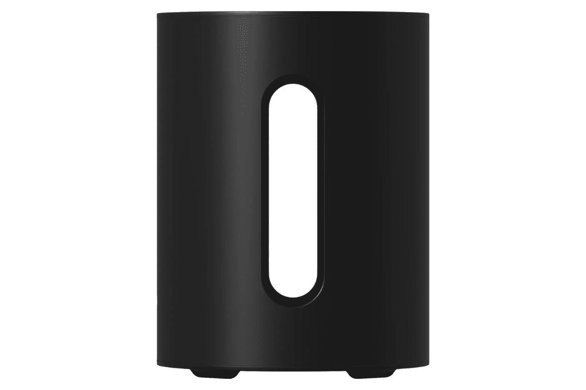

# Sonos 推出了 Sub Mini，这是一款小巧而强大的无线低音炮

> 原文：<https://www.xda-developers.com/sonos-introduces-the-sub-mini/>

# Sonos 推出了 Sub Mini，这是一款小巧而强大的无线低音炮

Sonos 已经宣布了一个新的无线产品，以其阵容与超迷你。紧凑型无线低音炮集力量与时尚于一身。

Sonos 以其简单、强大、设计优雅的声音产品而闻名。虽然有传言称[即将推出设备](https://www.xda-developers.com/leak-shows-off-sonos-optimo-2/)，但该公司现在已经宣布了其最新产品，一款被称为 Sub Mini 的无线低音炮。Sub Mini 在小包装中提供大声音，连接到现有的 Sonos 产品以提供额外的深度。

尽管尺寸很小，Sonos Sub Mini 还是包含了很多技术。尽管一些无线音频产品可能会出现音频延迟，但迷你低音炮可以与 Sonos Beam 或 Ray 配对，并使用 5Ghz Wi-Fi 连接来提供清晰、强劲和准确的声音。尽管设计紧凑，Sonos 有一个双低音扬声器设置，可以产生低沉而有力的低音。该公司还表示，由于超重低音扬声器面向内，可以抵消失真，用户不会体验到任何类型的失真或嘎嘎声。此外，Sub Mini 将提供 Trueplay 调谐技术，允许低音炮根据房间进行自我调谐，尽可能提供最佳音频体验。

也许最好的是，像大多数 Sonos 产品一样，它很容易安装，只需要一根电源线。Sub Mini 还可以自动调节音频，但如果你喜欢定制自己的声音，你可以通过 Sonos 应用程序来实现。Sub Mini 可以与 Beam 和 Ray 配对，也可以与 One 和 One SL 配对。Sub Mini 有两种颜色，黑色和白色，售价 429 美元。该公司目前正在接受预订，零售发布日期定在 10 月 6 日。如果您有兴趣，现在可以使用下面的链接直接从索诺预订 Sub Mini。如果你仍然犹豫不决，你可以随时查看我们对 2022 年最好的智能扬声器的深入对比。

 <picture></picture> 

Sonos Sub Mini

##### Sonos 超迷你

Sonos 的无线低音炮

* * *

**来源** : [Sonos](https://www.anrdoezrs.net/links/100122946/type/dlg/sid/UUxdaUeUpU43536/https://www.sonos.com/en-us/newsroom/introducing-sub-mini)