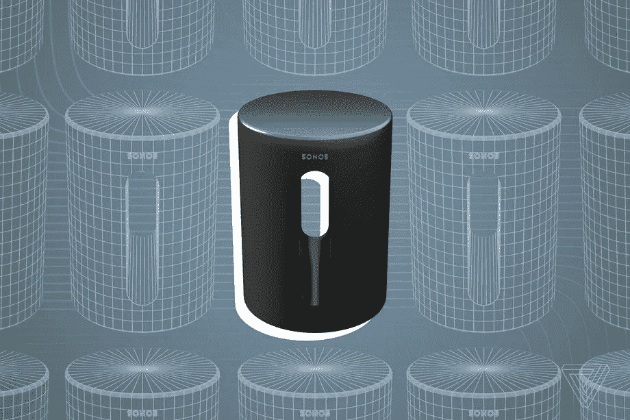

# Sonos 泄漏继续与即将到来的第一次微型照片

> 原文：<https://www.xda-developers.com/sonos-sub-mini-leak/>

# Sonos 泄漏继续与即将到来的第一次微型照片

最近 Sonos 泄露的最新产品是 Sub Mini，这是一款更实惠的低音炮，可与 Sonos Ray 条形音箱搭配使用。

Sonos 的漏桶还没有接近修复，因为《The Verge》报道了另一个正在开发的新产品。随着 Sonos Ray soundbar 的泄露和随后的发布，下一款显然是 Sub Mini。你可能会猜到，这是一个低音炮。而且还是个小的。

不过，这很有道理。Sonos Ray 是该公司迄今为止价格最低的音箱，但要用它构建一个完整的系统，目前需要相当昂贵的 Sonos Sub。这两者真的不像是一个很好的组合，所以更便宜的选择肯定会更好，Sonos Sub Mini 可能会填补这一空白。

 <picture></picture> 

Sonos Sub Mini render generated by The Verge

上面的渲染图是由在 *The Verge* 看过真实交易图像的人放在一起的，它肯定不同于 squared Sonos Sub。Sub Mini 首先泄露了 Sonos 应用程序中一些不小心放置的信息，但最近的泄露告诉了我们更多一点。就像这样，它将成为新的 Sonos Ray、Arc 和 Beam 的无线伴侣。据报道，它的内部产品名称也是 S37，它是 S36 的下一个产品，最终以 Ray 的名义推出。

目前还没有关于价格、实际尺寸或发布时间表的细节，只是先看看实际设备和名称。同一份报告还详细描述了 Sonos 内部对最近破坏新产品发布的泄露数量的不满。Sonos 语音控制提前泄露以及射线。当谈到 Sonos Roam 便携式扬声器的新颜色时，嗯，Sonos 在没有任何外部帮助的情况下做得很好。

**来源:** [濒临](https://www.theverge.com/2022/5/16/23073977/sonos-sub-mini-affordable-subwoofer-design-preview)