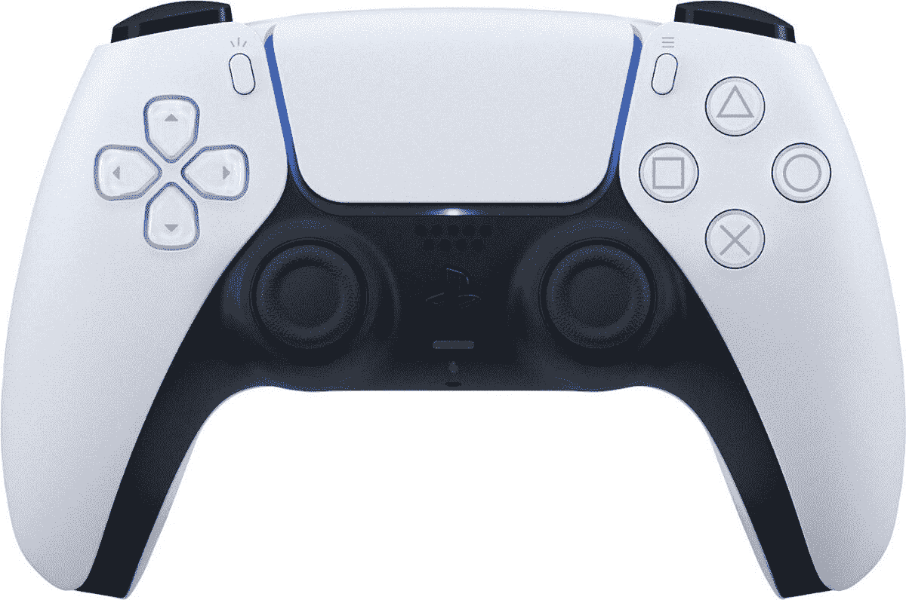

# 索尼的 DualSense 控制器现在可以与苹果设备上的 PS Remote Play 配合使用

> 原文：<https://www.xda-developers.com/sony-dualsense-controller-support-ps-remote-play-apple-devices/>

# 索尼的 DualSense 控制器现在可以与苹果设备上的 PS Remote Play 配合使用

索尼的 PS Remote Play 游戏流媒体应用程序现在支持安装了 iOS 14.5 的苹果设备上 PlayStation 5 的新 DualSense 控制器。

PS Remote Play 最初是索尼 Xperia Z 系列的独家产品，允许 Xperia Z3 等特定设备连接到同一网络上的 PlayStation 4 游戏主机，并将主机游戏传输到智能手机。您可以使用 DualShock 4 控制器或使用屏幕上的按钮来玩游戏。早在 2019 年 10 月，远程播放就向所有 Android 和 iOS 设备开放，一年后 [PlayStation 5](https://www.xda-developers.com/playstation-5-restocks/) 支持。但在 8 个月的大部分时间里，用户只能使用 DualShock 4 控制器，即使他们正在下载 PlayStation 5。索尼现在终于解决了这个问题，在苹果设备上支持 PS 远程播放的 [DualSense](https://www.xda-developers.com/sony-dualsense-wireless-controller-preview/) 。

新索尼 PlayStation 5 附带的新 DualSense 控制器现在在所有运行最新 [iOS 14.5](https://www.xda-developers.com/apple-ios-14-5-download-available/) 更新的苹果设备和运行 macOS Big Sur 11.3 的 MAC 上支持 PS Remote Play。

正如 [*TheVerge* 发现](https://www.theverge.com/2021/5/10/22429291/sony-ps5-remote-play-dualsense-apple-mac-iphone-ipod-ipad-apple-tv)的那样，苹果设备上的 DualSense 控制器与自适应触发功能一起工作，这是新控制器的突出功能之一。然而，没有触觉反馈，麦克风、耳机插孔和扬声器也不工作，如果你在游戏机和苹果设备上切换体验，所有这些都可能有点不和谐。切换设备还需要再次手动配对 DualSense，这很快就会变得很累。

 <picture></picture> 

Sony DualSense Controller

##### 索尼 PlayStation 双感控制器

索尼新推出的 DualSense 控制器是 PlayStation 5 的亮点之一。它具有改进的触觉和自适应触发器，为优化的标题提供了一个额外的沉浸层。

你必须评估这些限制是否会影响你的体验，看看是否值得切换到新的遥控器进行远程播放，或者你是否愿意继续使用旧的 PS4 DualShock 控制器。远程播放应用程序是免费的，所以如果你已经有一个 PlayStation 5，就试试吧。