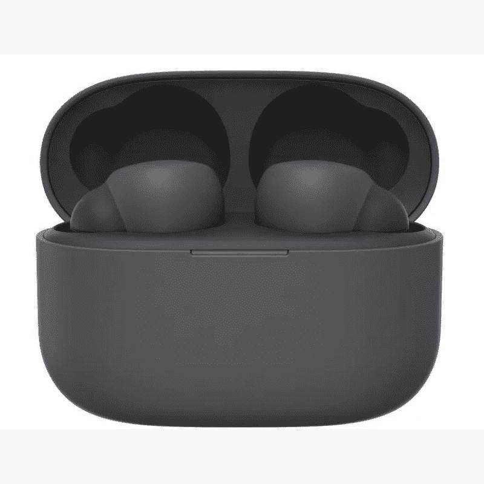

# 索尼新推出的 200 美元的 LinkBuds S 无线耳塞现已正式上市

> 原文：<https://www.xda-developers.com/sony-linkbuds-s-earbuds-launch/>

几天前，[泄露的索尼 LinkBuds 的渲染图出现在互联网上](https://www.xda-developers.com/sony-link-buds-s-features-pricing-leak/)，让我们第一次看到了耳塞，并突出了一些功能。既然秘密已经泄露，索尼决定正式发布这款耳塞。新的索尼 LinkBuds S 现在可以在美国以 200 美元的价格预订。你可以买到黑色、白色和百思买独家的“沙漠之沙”配色，所有这些都有一个颜色匹配的充电盒。

虽然新款 LinkBuds S 耳塞与今年早些时候的 [LinkBuds](https://www.xda-developers.com/sony-linkbuds-wfl-900-launch/) 拥有相同的官方品牌，但它的设计更为传统。耳塞结构紧凑，每个重 4.8 克。尽管体积很小，但索尼已经设法在耳塞中装入了大量的功能。

LinkBuds S 的一个亮点是它具有一种环境模式，又称透明模式，可以让你听到周围的声音，从而让你将数字生活与现实的声音“联系”起来。此外，LinkBuds S 还支持主动噪音消除和该公司的 LDAC 蓝牙编解码器。

索尼表示，你可以在日常生活中全天佩戴 LinkBuds 的耳塞。耳塞可以播放自动音频，这意味着在你放入它们后，它们会自动拾取你喜欢的 Spotify 播放列表。或者，你可以调整设置，让耳塞在工作会议结束后立即播放轻松的音轨。索尼的一系列常见功能，如自适应声音控制，也可用于 LinkBuds S。它可以让你定制环境声音，基于活动的噪音消除水平等。另外值得一提的是，LinkBuds S 通过了 IPX4 防水认证。

索尼 LinkBuds S 在 ANC 开启的情况下，一次充电可提供 6 小时的收听时间。如果你考虑到充电外壳的电池寿命，索尼说耳塞可以持续 20 小时。遗憾的是，充电保护套不支持无线充电，考虑到这个价格范围内有多少耳塞提供无线充电支持，这是相当令人惊讶的。我们建议你看看我们收集的[最佳真无线耳塞](https://www.xda-developers.com/best-wireless-earbuds/)来寻找一些支持无线充电的很好的替代品(甚至更便宜的)。

索尼的新款 LinkBuds 将于 5 月 20 日开始销售，售价 200 美元。您可以使用下面的链接来击败队列，并立即预购您的设备。

 <picture></picture> 

Sony LinkBuds S

##### 索尼 Linkbuds S

索尼 LinkBuds S 采用了更传统的入耳式设计。您还可以获得对 ANC、环境声音、IPX4 等级等的支持。