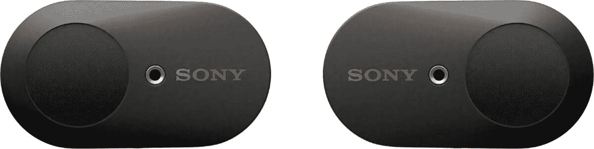

# 质量上乘的索尼 WF-1000XM3 耳塞在百思买仅售 158 美元！

> 原文：<https://www.xda-developers.com/sony-wf-1000xm3-deal-best-buy/>

当人们谈论索尼耳机时，他们通常谈论的是永远优秀的索尼 WH-1000XM4 耳机。说真的，谁能责怪他们呢？它们绝对是神奇的无线耳机。但是，这些并不是索尼创造的唯一优质蓝牙产品...而且不仅仅是那些被出售的。现在在百思买，你可以只花 158 美元买到一副索尼 WF-1000XM3 降噪耳塞。这比建议零售价低 72 美元！

为什么选择索尼 WF-1000XM3 耳塞，而不是苹果 Airpods Pro 或 Galaxy Buds Live？有了索尼品牌，你知道你会得到更好的音质。毕竟，这是索尼建立业务的基础！WF-XM3s 有一个 QN1e 噪音消除处理器。它会淹没周围的声音，提供一个伟大的，不间断的音频体验...而且开机用不了多少电！

这些耳塞也将持续很长时间，电池方面。索尼 WF-1000XM3s 将持续六个小时，但充电外壳将存储足够三次完全充电的电量。有了这个，你就可以整天听音乐了！最后，通过蓝牙 5.0 芯片，你知道你的耳塞不会与你的手机或设备断开连接。没有挫折！

只需 158 美元，当竞争品牌类似或更贵时，这些耳塞真的不会错。

 <picture></picture> 

Sony WF-1000XM3 In-Ear Headphones

##### 索尼 WF-1000XM3

索尼 WF-1000XM3 耳塞有黑色和银色两种颜色，是锻炼和旅行的最佳伴侣。从索尼获得您期望的所有录音室质量，而没有大多数耳机的笨重！

顺便说一下，那些神奇的 WH-1000XM4 耳机也在出售！它们也降价 72 美元，使建议零售价降至 278 美元。如果你喜欢完整的耳挂式耳机，这是绝对不会错的。

 <picture></picture> 

Sony WH-1000XM4

##### 索尼 WH-1000XM4

在百思买只需 278 美元，你就可以买到三种颜色之一的索尼 WH-1000XM4 耳机！你不能要求更好的音频体验。

这些交易是百思买最后一秒节约活动的一部分，该活动将于周四结束。不要睡在上面，否则它们可能在你去取之前就卖光了！如果你所在的地区有百思买，你也可以报名去店里挑选你的新耳机或耳塞，你就有了一份完美的圣诞礼物！