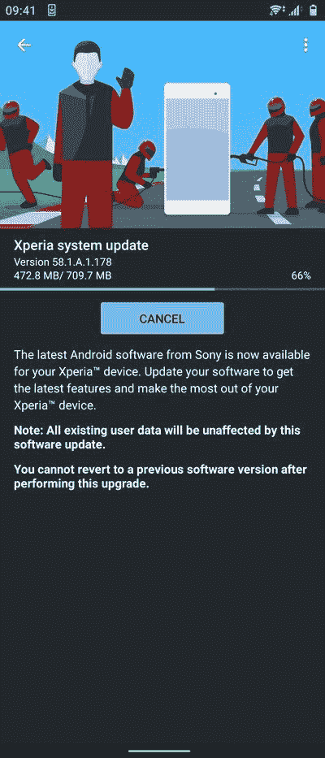

# 索尼开始向 Xperia 5 II 推出稳定的 Android 11 更新

> 原文：<https://www.xda-developers.com/sony-xperia-5-ii-android-11-update/>

# 索尼开始向 Xperia 5 II 推出稳定的 Android 11 更新

索尼现在已经开始为 Xperia 5 II 推出稳定的 Android 11 更新，其中包括许多令人兴奋的新功能。请继续阅读！

继上周在 Xperia 1 和 Xperia 5 上推出稳定的 Android 11 之后，索尼现在正在为其当前的紧凑型旗舰产品 Xperia 5 II 带来最新版本的 Android。根据[索尼的官方更新时间表](https://www.xda-developers.com/android-11-sony-xperia-phones-release-date/)，日本 OEM 厂商预计在一月底之前发布 Xperia 5 的“Mark 2”版本的稳定 Android 11 版本。该公司信守承诺，现在已经开始在选定的地区推出更新。

**[索尼 Xperia 5 II XDA 论坛](https://forum.xda-developers.com/c/sony-xperia-5-ii.11551/)**

携带软件版本 **58.1.A.1.178** 的更新目前可分别用于俄罗斯和东南亚的欧洲( **XQ-AS52** )和亚洲( **XQ-AS72** )双 SIM 卡手机。软银日本独家的单一 SIM 型号( **A002SO** )也[加入了](https://www.softbank.jp/mobile/info/personal/software/20210119-01/)名单，尽管其 Android 11 更新被标记为 **58.1.D.0.331** 。至于对新软件的期望，更新的固件带来了许多令人兴奋的功能和谷歌在 Android 11 中引入的改进。

 <picture></picture> 

Thanks to Reddit user [u/bak112552](https://www.reddit.com/user/bak112552/) for the screenshot!

我们应该会看到 Xperia 5 II 的 Android 11 OTA 在未来几天和几周内到达更多国家。虽然你可能会尝试摆弄 [Xperia Companion](https://www.sony.com/electronics/support/articles/00236877) 实用程序来为你的手机下载更新，但 XDA 社区开发的工具，如 [XperiFirm](https://forum.xda-developers.com/t/tool-xperifirm-xperia-firmware-downloader-v5-4-0.2834142/) 和 [Newflasher](https://forum.xda-developers.com/t/tool-newflasher-xperia-command-line-flasher.3619426/) 可以更容易地跳过等待队列，直接从公司的更新服务器下载新版本进行手动刷新。

值得一提的是，Xperia 5 II 还没有在索尼的开放设备计划中获得一席之地，这意味着售后开发社区无法获得所需的低级软件二进制文件，以便毫不费力地编译 AOSP 11.0 的功能版本。然而，考虑到索尼对开发者的友好，我们希望该公司将很快发布更新的[内核源代码](https://www.xda-developers.com/sony-xperia-5-ii-motorola-razr-5g-kernel-source-code/)，并为这款智能手机提供普通的 AOSP 设备配置。