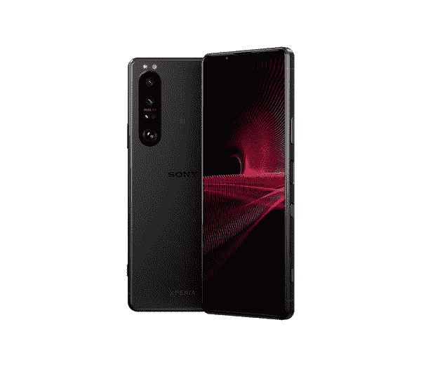
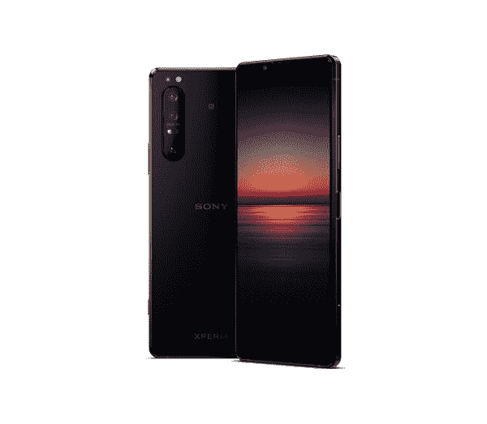
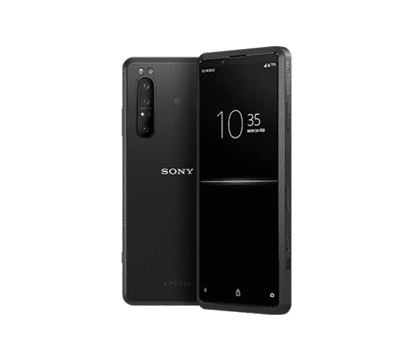
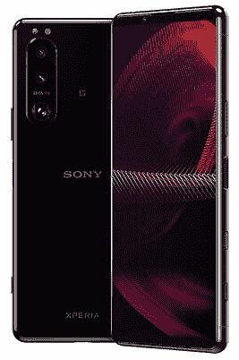
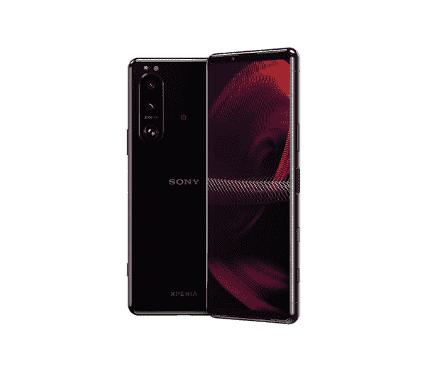
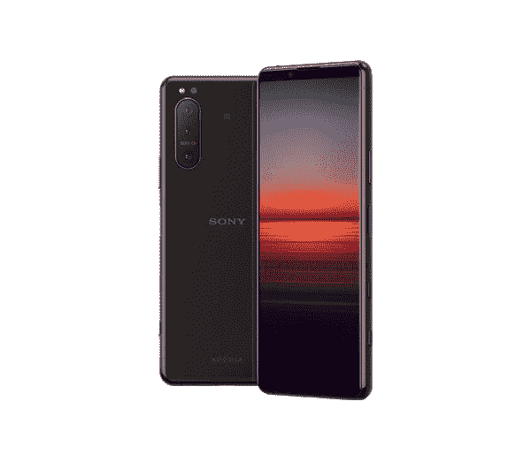
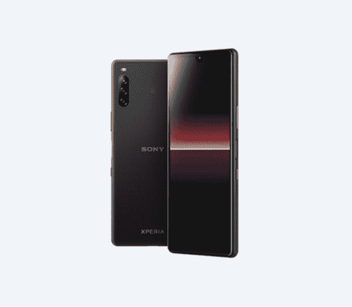
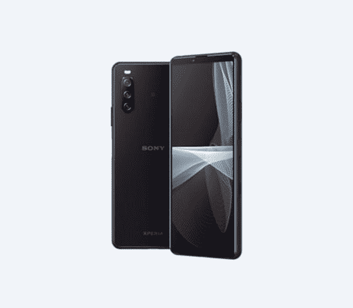
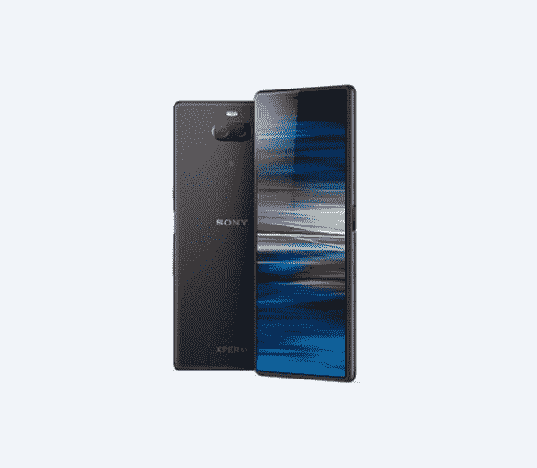

# 2023 年最值得购买的索尼手机

> 原文：<https://www.xda-developers.com/sony-xperia-tx-unofficial-cyanogenmod-12/>

虽然索尼不再是智能手机领域的主导者，甚至已经退出了全球几个市场，但该公司仍然拥有忠实的粉丝。它的手机以其出色的摄像头、时尚的设计和完美的显示屏吸引了各种各样的小众受众。它们还为创作者提供了一些有价值的功能，如 Camera Pro 和 Cinema Pro 应用程序，这些应用程序在智能手机上提供了类似索尼 Alpha 的体验。如果你重视这些功能，并且想买一部全新的索尼 Xperia 手机，那么你来对地方了。在本帖中，我们将看看 2022 年你能买到的各种价位的最好的索尼手机。

## 最佳索尼手机:索尼 Xperia 1 III

索尼最新的旗舰智能手机 Xperia 1 III 无疑是你今天能买到的最好的索尼手机。它基于去年的 Xperia 1 II，并有几项重大改进。这款手机采用了高通的骁龙 888 芯片，一个出色的 6.5 英寸 4K 有机发光二极管显示屏，支持 120Hz 的刷新率，一个更大的 4,500mAh 电池，支持 30W 快速充电，背面有一个令人印象深刻的三摄像头设置，带有 3D iToF 传感器。

虽然这些变化在纸面上看起来并不多，但 Xperia 1 III 比 Xperia 1 II 强大得多。这是今年索尼产品线中功能最丰富的手机，因此，它是我们评选的最佳索尼手机。

 <picture></picture> 

Sony Xperia 1 III

##### 索尼 xperia 1 III

新的索尼 Xperia 1 III 是 2021 年你能买到的最好的索尼手机。它装有高通的骁龙 888 芯片，华丽的 6.5 英寸 4K 高刷新率显示屏，支持快速充电的 4500 毫安时电池，等等。

## 也很棒:索尼 Xperia 1 II

如果你想要旗舰体验，但你不愿意在下一部手机上花太多钱，那么去年的索尼 Xperia 1 II 对你来说仍然是一个不错的选择。与较新的 Xperia 1 III 非常相似，它提供了一个 6.5 英寸的 4K 有机发光二极管显示屏，没有凹口，背面有一个 12MP + 12MP + 12MP 三摄像头系统，以及你在较新型号上找到的大多数软件功能。不过，它有一个更小的 4,000mAh 电池，支持更慢的 18W 充电，显示屏的刷新率更低。

Xperia 1 II 还采用了去年的骁龙 865 芯片，外加 8GB 内存和 256GB 存储空间。虽然这意味着它在性能方面不会像 Xperia 1 III 那样出色，但对大多数用户来说应该还是绰绰有余的。

 <picture></picture> 

Sony Xperia 1 II

##### 索尼 Xperia 1 II

对于大多数买家来说，索尼 Xperia 1 II 仍然是一个很好的选择，因为它具有一些非常强大的硬件，而且比新的 Xperia 1 III 更便宜。

## 最佳索尼相机手机:Xperia Pro-I 5G

 <picture></picture> 

Sony Xperia Pro-I 5G

Xperia Pro-I 是为那些不介意花钱购买高级硬件的严肃相机爱好者设计的。这是世界上第一款配备 1 英寸图像传感器的手机，与索尼成熟的 RX 100 相机上的传感器相同。如果你是一名专业摄影师，想要大传感器带来的优势，如更多的光线，更窄的景深等。，这是一款值得考虑的坚固手机。

除了摄像头，手机的其他部分也很强大，与 2021 年的大多数旗舰产品不相上下。它有一个骁龙 888 SoC，一个 6.5 英寸 21:9 4K 120Hz 显示屏，使其成为任何智能手机上最清晰的屏幕，相机有蔡司光学系统。主 1 英寸传感器配有一个超宽镜头和一个长焦镜头。如果你愿意花 1800 美元，这是创作者的终极拍照手机。

 <picture></picture> 

Sony Xperia Pro-I 5G

##### 索尼 Xperia PRO-I 5G

索尼 Xperia Pro-I 5G 是相机爱好者的梦想。它有一个 1 英寸的传感器，这是你在配有蔡司光学系统的智能手机上能找到的最大的传感器。手机的其余部分也是旗舰级的，这使它成为摄影和摄像的绝佳选择，前提是你愿意花 1800 美元购买这种硬件。

## 专业人士最佳索尼手机:索尼 Xperia Pro 5G

索尼 Xperia Pro 5G 是 Xperia 1 II 的升级版，为专业人士提供了一些有用的新功能。虽然它 2，499 美元的价格有点荒唐，但它提供的额外功能可能会为一些买家提供合理的价格。这些功能包括毫米波和低于 6GHz 的 5G 支持，一个额外的微型 HDMI 端口，以及将手机用作 4K 相机监视器的能力。

虽然这些附加功能可能对普通买家没有吸引力，但如果你是一名专业摄影师或移动内容创作者，这些功能真的可以派上用场。不过，在你购买手机之前，请注意它内部装有最新一代的硬件，所以你可能会考虑购买更新的 Xperia 1 III。除非你真的需要微型 HDMI 端口和摄像头监控功能。

 <picture></picture> 

Sony Xperia Pro 5G

##### 索尼 Xperia PRO 5G

索尼 Xperia Pro 5G 是 Xperia 1 II 的升级版，为专业人士提供了一些附加功能。它肯定有点贵，但对于专业摄影师和移动内容创作者来说，这是一个很好的选择。

## 大多数人的最佳索尼手机:索尼 Xperia 5 III

 <picture></picture> 

Sony Xperia 5 III

索尼 Xperia 5 III 是 Xperia 1 III 的一个更小、更实惠的版本，在性能方面很容易赶上其旗舰对手。然而，它缺乏 Xperia 1 III 上的一些高级功能。例如，它有一个更小的 6.1 英寸 FHD+120 赫兹 OLED 面板，而不是 4K 面板，它配有 8GB 内存和 128GB 存储空间，而且它没有 3D iToF 传感器。

如果你能忍受这些妥协，那么 Xperia 5 III 是最适合你的索尼手机。它拥有高通旗舰产品骁龙 888 芯片，与 Xperia 1 III 相同的后置三摄像头设置，以及支持 30W 快速充电的 4,500mAh 电池。而且最赞的是比旗舰机型便宜几百块。

 <picture></picture> 

Sony Xperia 5 III

##### 索尼 Xperia 5 III

索尼 Xperia 5 III 是旗舰 Xperia 1 III 的精简版。它包含了旗舰机型的大部分高级功能，但价格更实惠。

## 也很棒:索尼 Xperia 5 II

就像索尼 Xperia 1 II 一样，去年的索尼 Xperia 5 II 对大多数人来说也是一个不错的选择。这是 Xperia 1 II 的精简版，除了几个例外，它提供了旗舰机型的大多数功能。它有一个略小，分辨率较低的 6.1 英寸 FHD+ OLED 面板，一个更小的 4000 毫安时电池，8GB 内存，128GB 存储和高通的骁龙 865 芯片。

在摄像头方面，Xperia 5 II 采用了与 Xperia 1 II 相同的后置 12MP 三摄像头设置和相同的 8MP 自拍相机。虽然有些人可能认为它的硬件有点过时，但这款手机在 2021 年仍然是一个不错的选择，特别是如果你想买一部便宜的索尼手机，提供几乎优质的体验。

 <picture></picture> 

Sony Xperia 5 II

##### 索尼 Xperia 5 II

对于那些想要一款紧凑的智能手机，提供旗舰体验而不损坏背部的人来说，索尼 Xperia 5 II 是一个很好的选择。虽然它从去年就开始组装硬件，但在 2021 年，它仍有资格成为一款好手机。

## 最实惠的索尼手机:索尼 Xperia L4

 <picture></picture> 

Sony Xperia L4

当然，不是每个人都想花几百美元买一部智能手机；许多人只是想要一些负担得起的、能完成工作的东西。如果你符合这一类别，你会喜欢索尼 Xperia L4。

Xperia L4 是索尼的一款经济型智能手机，提供 6.2 英寸 1680 x 720 显示屏，三摄像头设置，800 万像素前置摄像头，3GB 内存，64GB 内部存储，高达 512GB 的可扩展存储，3580mAh 电池，Android 9 和许多其他出色的功能。

 <picture></picture> 

Sony Xperia L4

##### 索尼 Xperia L4

寻找一款价格实惠的索尼智能手机？看看 Xperia L4 就知道了，它有 6.2 英寸 1680 x 720 的显示屏，三摄像头，3580 毫安时电池，以及许多其他优秀的功能。

## 最佳中端索尼手机:索尼 Xperia 10 III

 <picture></picture> 

Sony Xperia 10 III

索尼在提供市场上最好的旗舰 Android 智能手机方面可能有着令人印象深刻的记录，但 Xperia 10 III 证明了它也可以制造出色的中端手机。

在功能方面，Xperia 10 III 拥有 6 英寸 21:9 有机发光二极管显示屏，分辨率为 2520 x 1080 像素，IP68 防水，12MP + 8MP + 8MP 三摄像头设置，骁龙 690 SoC，6GB 内存，128GB 内部存储，高达 1TB 的可扩展存储，4,500mAh 电池，Android 11 等等。

 <picture></picture> 

Sony Xperia 10 III

##### 索尼 Xperia 10 III

新的索尼 Xperia 10 III 是索尼最好的中端智能手机之一。它具有 6 英寸有机发光二极管显示屏，背面有三个摄像头，高通的骁龙 690 SoC 和 4500 毫安时电池。

## 最佳中端索尼大显示屏手机:索尼 Xperia 10 Plus

 <picture></picture> 

Sony Xperia 10 Plus

如果你想要一部大显示屏的中档索尼手机，你会想看看 Xperia 10 Plus。关于这款手机，你首先会注意到的是它巨大的 6.5 英寸 FHD+显示屏。除了尺寸大以外，Xperia 10 Plus 的显示屏还提供了 2520 x 1080 像素的分辨率和康宁大猩猩玻璃 5 保护。

在其他功能方面，Xperia 10 Plus 提供了双摄像头、800 万像素前置摄像头、4K 视频录制、高达 6GB 的内存、64GB 的内部存储、高达 512GB 的可扩展内存、骁龙 636 处理器、3000mAh 电池、Android 9 等等。

 <picture></picture> 

Sony Xperia 10 Plus

##### 索尼 Xperia 10 Plus

Xperia 10 Plus 是索尼的另一款出色的中端智能手机。它最好的功能包括 6.5 英寸 FHD+显示屏，双摄像头，骁龙 636 处理器，3000 毫安时电池等等。

* * *

这就是我们列出的 2022 年你能买到的最好的索尼手机。正如你所看到的，索尼提供了各种价位的相当广泛的手机，所以你应该很容易根据你的预算和使用情况选择一款。如果你问我，我可能会选择新的索尼 Xperia 5 III，因为它以更紧凑的形式提供了 Xperia 1 III 的大多数旗舰功能。由于它有一个 FHD+显示屏，它应该比旗舰机型提供更好的电池寿命。

如果你不喜欢这个列表中提到的任何一款手机，请查看我们的 2022 年最佳安卓手机列表，看看其他制造商的更多选择。